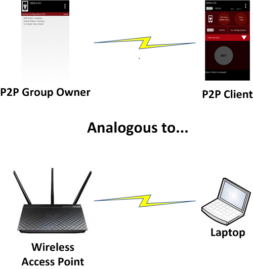
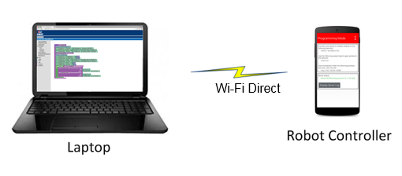
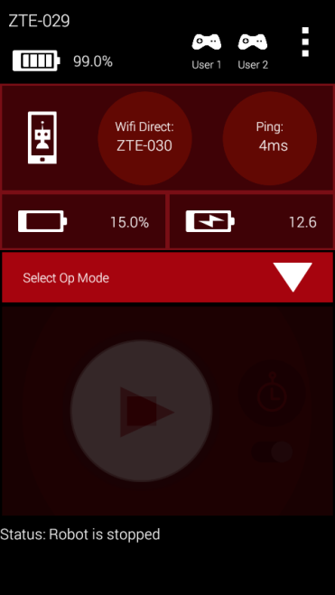

Wi-Fi Technology and Direct Connections
========================================

The Driver Station and Robot Controller are Android devices that run special
*FIRST* Tech Challenge apps to create a unique and secure wireless connection
between the two devices. For this connection, the REV Control Hub uses
Wireless Access Point (WAP) technology, while a standalone phone-based Robot
Controller uses Wi-Fi Direct (P2P) technology. There are some minor, subtle
differences between how these two technologies connect the devices together
wirelessly. Note that the FTC Driver Station app is able to connect to both
types of Robot Controllers.

Wi-Fi Direct Group Owner
-------------------------

For a Wi-Fi Direct P2P connection, one of the peer-to-peer devices acts like
a Wi-Fi access point and is referred to as the group owner. The group owner
establishes a Wi-Fi Direct group that the other devices can connect to. The
other peer-to-peer device is referred to as the client device. For the
*FIRST* Tech Challenge application, the Robot Controller phone is the device
that acts as the group owner for the P2P connection. The Driver Station
device is the client device, and it connects to the Wi-Fi Direct group
through the FTC Driver Station app using Android's P2P technology. A Wi-Fi
Direct connection requires that a user manually accept (using the P2P group
owner's touch screen) the initial connection request from a P2P client.

   The P2P group owner is analogous to a Wi-Fi access point.

Wireless Access Point
-----------------------

A Control Hub is slightly different from a phone-based Robot Controller. A
Control Hub acts as an actual wireless access point. A Driver Station device
connects to the Control Hub's Wi-Fi network like it would to any other Wi-Fi
network. The user only needs to provide the correct password in order to
access the wireless network -- no manual acceptance step on the access point
is required.

Programming Laptop
--------------------

During a typical *FIRST* Tech Challenge match, only a team's Driver Station
is connected to the Wi-Fi Direct group or the wireless access point (WAP)
that is established by the team's Robot Controller. Away from the
competition field, however, a team might have additional devices connected
to this Wi-Fi Direct group. For example, when a team edits an :term:`OpMode` using
the FTC Blocks Development Tool or the FTC :term:`OnBot Java` Development Tool, their
developer's laptop will also be connected to the Robot Controller's wireless
network.

   A team might also have a developer's laptop connected when they are away
   from the competition field.

Note that the wireless connection between the developer's laptop and the
Robot Controller does not violate the prohibition in the :term:`Competition Manual`
on teams setting up their own wireless network. For this case, the
developer's laptop is connected to the existing Wi-Fi Direct group or
wireless access point that is also used by the Driver Station to communicate
with the Robot Controller.

Configuration Activity
------------------------

The Android operating system has a built-in configuration screen, or
activity, that can be used to view and configure the Wi-Fi Direct settings.

.. note:: For the *FIRST* Tech Challenge apps, you typically do NOT want to
   use the Android Wi-Fi Direct menu to pair your devices. Instead, you
   should use the Pair with Robot Controller activity that is available from
   the Settings menu of the FTC Driver Station app to pair/unpair your
   devices.

It is useful to be familiar with Android's Wi-Fi Direct configuration
activity. As an FTA/CSA you might need to use this screen to check on the
configuration of an Android device, and to clear/erase remembered groups or
do other tasks to help get a robot back in action.

Accessing the Wi-Fi Direct Configuration Activity
^^^^^^^^^^^^^^^^^^^^^^^^^^^^^^^^^^^^^^^^^^^^^^^^^^

.. list-table::
   :class: borderless

   * - On your Android device, launch the Settings activity then click on
       the Wi-Fi item.
     - .. figure:: images/android-home-settings.jpg
          :alt: Android home screen with the Settings app icon circled.

          Launch the Settings menu.
     - .. figure:: images/wifi-settings-item.jpg
          :alt: Android Settings screen with the Wi-Fi menu item circled.

          Click on "Wi-Fi".

.. list-table::
   :class: borderless

   * - To access the Wi-Fi Direct menu, touch the three dots in the top
       right-hand corner of the screen to display a short pop-up menu.
       Select Advanced from the pop-up menu.
     - .. figure:: images/wifi-list-3-dots.jpg
          :alt: Wi-Fi network list screen with the three-dot overflow menu icon circled in the top right corner.

          Click on the 3 dots.
     - .. figure:: images/wifi-menu-advanced.jpg
          :alt: Wi-Fi overflow menu with the Advanced option circled.

          Choose Advanced.

.. list-table::
   :class: borderless

   * - In the Advanced Wi-Fi menu, select Wi-Fi Direct. Note that the
       screenshots in this document were generated using a Moto e4 phone
       running Android 7.1.1. The screen images and menu text might vary
       from device to device.
     - .. figure:: images/advanced-wifi-direct.jpg
          :alt: Advanced Wi-Fi menu with the Wi-Fi Direct option circled.

          Select Wi-Fi Direct.

This screen shows the Wi-Fi Direct group name, if any, along with any
connected device(s) and remembered group(s). When troubleshooting, it is
usually best to clear all the items that this screen will allow. Sometimes
the "connections" listed here have become corrupted. Clearing connections
here, and re-establishing later (from the FTC Driver Station app), is a
fast, simple, and reliable way to ensure good communications.

.. important:: The Wi-Fi Direct group cannot be renamed at this stage. All
   connections must be cleared first. Also, you should request and be
   granted permission from the team before you clear any Wi-Fi Direct
   groups.

.. list-table::
   :class: borderless

   * - To begin, touch one of the remembered group names, then click OK to
       forget that group. Repeat for any other remembered groups listed.
     - .. figure:: images/wifi-direct-groups.jpg
          :alt: Wi-Fi Direct screen with a remembered group name circled.

          Touch any group name(s).
     - .. figure:: images/forget-group-dialog.jpg
          :alt: "Forget this group?" confirmation dialog with the OK button circled.

          Forget each group.

.. list-table::
   :class: borderless

   * - Next, do the same thing with any peer devices and the created group.
     - .. figure:: images/wifi-direct-peer-device.jpg
          :alt: Wi-Fi Direct screen with a connected peer device circled.

          Peer Devices.
     - .. figure:: images/created-group.jpg
          :alt: Wi-Fi Direct screen with the created group entry circled.

          Created Group.

.. list-table::
   :class: borderless

   * - Touching either of these items brings up the following
       "Disconnect?" screen -- select OK. If one of these items cannot be
       disconnected after several tries, continue with the other items. A
       persistent item like this will generally not cause a problem later.
       When the disconnecting is complete, the screen will list only the
       device name, which was also the Wi-Fi Direct group name.
     - .. figure:: images/disconnect-dialog.jpg
          :alt: "Disconnect?" confirmation dialog with the OK button circled.

          Select OK to disconnect.
     - .. figure:: images/wifi-direct-cleared.jpg
          :alt: Wi-Fi Direct screen showing only the device name with no peer devices or remembered groups.

          All clear.

.. list-table::
   :class: borderless

   * - In this disconnected state, the device name can be changed. Touch the
       3 dots again at the top right corner. Now the Configure Device
       selection is live and can be clicked. Device naming must follow the
       rules described in the Competition Manual. At this screen, Motorola
       phones offer three features not present on previous FTC phone
       models.
     - .. figure:: images/configure-device-menu.jpg
          :alt: Overflow menu with the Configure device option enabled and circled.

          Configure Device.
     - .. figure:: images/rename-device-dialog.jpg
          :alt: Rename device dialog with a text field for the device name plus options for broadcast band, device limit, and inactivity timeout.

          Rename Device.

.. list-table::
   :class: borderless

   * - The maximum number of connections can be specified, ranging from 2 to
       8. A smaller number is safer and more efficient, while a larger
       number could allow (for example) multiple Blocks or OnBot Java
       programmers to access a single shared Robot Controller device. Users
       must be very careful to avoid conflicts in sharing and editing. The
       other two items allow selection of a Wi-Fi Direct inactivity timeout,
       and whether or not to automatically connect to a remembered Wi-Fi
       Direct group when discovered. You can make selections here, but in
       general, the FTC apps will manage connections as needed.
     - .. figure:: images/wifi-direct-options.jpg
          :alt: Rename device dialog with the Wi-Fi Direct inactivity timeout dropdown set to Never disconnect.

          Optional Settings.

Click Save when done and return to the home screen. Make new connections
only from the FTC Driver Station app, as described in the following section.

Troubleshooting Wi-Fi Direct Connections
------------------------------------------

Ideally, teams should be able to use the Pair with Robot Controller activity
of the FTC Driver Station app to pair to the target FTC Robot Controller.
Once the devices have been paired through the FTC Driver Station app, they
should automatically reconnect to each other when both devices are turned on
and both devices have their respective FTC apps running.

   When the Driver Station is connected, it displays useful status info.

When your Driver Station is able to connect to the Robot Controller
successfully, it will display useful status information (see the figure
above) on its screen, including the name of the device that it is connected
to, the average ping time between the Driver Station and Robot Controller,
and voltage info for the Robot Controller smartphone (if used) and the main
robot battery.

Is the Robot Controller On?
^^^^^^^^^^^^^^^^^^^^^^^^^^^^

For problems connecting to the Robot Controller, check the following basic
items:

- Is the Robot Controller device turned on?
- Is the Robot Controller smartphone in Airplane mode with Wi-Fi enabled?

Smartphone specific:

- Is the Robot Controller device running the FTC Robot Controller app?
- Is the FTC Robot Controller app in the foreground (and NOT minimized)?

The Robot Controller device must be powered on and have the FTC Robot
Controller app running before the Driver Station can connect to it.

Are Both FIRST Tech Challenge Apps Installed?
^^^^^^^^^^^^^^^^^^^^^^^^^^^^^^^^^^^^^^^^^^^^^^

If you are having problems pairing the Android devices, please make sure
that you do not have the FTC Driver Station app and the FTC Robot Controller
app installed at the same time on a single Android device. The apps have
the potential to cause Wi-Fi Direct conflicts if they are both installed.
Make sure neither device has both apps installed at the same time.

Do Both FTC Apps Have the Same Version Numbers?
^^^^^^^^^^^^^^^^^^^^^^^^^^^^^^^^^^^^^^^^^^^^^^^^

If you have verified that the Robot Controller and the Driver Station are
turned on and have their respective FTC apps running, verify that the apps
have compatible version numbers. If you select the About menu item for each
app, a new screen should appear on the Android device with version
information about the app.

.. list-table::
   :class: borderless

   * - .. figure:: images/rc-about-screen.png
          :alt: About screen listing App Version 1.75, Robot Wi-Fi Protocol Version v4, and Wi-Fi Direct group owner info for device motog-002.

          About screen for an app acting as the Wi-Fi Direct group owner.
     - .. figure:: images/ds-about-screen.png
          :alt: About screen listing App Version 1.75, Robot Wi-Fi Protocol Version v4, and no active Wi-Fi Direct connection for device XT1063_864b.

          About screen for an app with no active Wi-Fi Direct connection.

It is most important that the "Robot Wi-Fi Protocol Version" numbers of the
FTC Robot Controller app and the FTC Driver Station app match. For example,
if the Robot Controller has a "Robot Wi-Fi Protocol Version" number of v4
but the Driver Station only has a "Robot Wi-Fi Protocol Version" number of
v3.5, then the two apps might be unable to connect and communicate with
each other, due to the difference in the versions.

If the "Robot Wi-Fi Protocol Version" numbers do not match, then one of the
apps should be downgraded or upgraded so that the numbers will match. Often
it is advisable to upgrade, however, in some instances, a team might feel
more comfortable downgrading to a previous, stable version of the app.
Minimum required levels of FTC app versions are specified in the Competition
Manual and its updates. The Competition Manual specifies a minimum required
app version level, and the major and minor version numbers for the DS and RC
apps must be the same.

Is Either Device Also Connected to Another Network?
^^^^^^^^^^^^^^^^^^^^^^^^^^^^^^^^^^^^^^^^^^^^^^^^^^^^

For *FIRST* Tech Challenge competitions, we recommend that the Driver
Station and Robot Controller devices are not connected to any other
networks other than each other. It is possible, and sometimes desirable, to
connect your Android device to an alternate wireless network:

- Teams like to use the wireless :term:`ADB` mechanism to debug their apps.
- Teams might need to connect to a wireless network to download something
  to their phone from the internet.
- Teams might have used the Android device to check their e-mail or look up
  something on the internet (we do not recommend doing this).

We also recommend that teams forget any other Wi-Fi or Wi-Fi Direct network,
except for the primary Wi-Fi Direct connection between the Driver Station
and Robot Controller (this applies only when using a smartphone as the
Robot Controller).

If a team's Driver Station is having trouble connecting to the Robot
Controller, check the following:

- Check to see if either Android device is connected to another Wi-Fi or
  Wi-Fi Direct device.
- If either Android device is connected to another wireless network,
  disconnect the device from the other network, forget the other network,
  and restart the Driver Station and Robot Controller apps.

Are There Lots of Devices Trying to Pair Simultaneously?
^^^^^^^^^^^^^^^^^^^^^^^^^^^^^^^^^^^^^^^^^^^^^^^^^^^^^^^^^

Before an Android device can connect to another device, it will scan the
wireless spectrum to determine what Wi-Fi Direct enabled devices are
available in the vicinity. This discovery process can be negatively
affected if there is a high concentration of Wi-Fi Direct devices in the
vicinity that are also scanning the spectrum for available devices. For
instance, if there are many devices in the vicinity, the target device that
you are trying to connect to (for example, "12345-A-RC") might not be
visible in your list of available Wi-Fi Direct devices on your Android
phone.

If you are at an event and the Android devices are consistently unable to
find each other, or if the devices have trouble establishing a connection,
it could be due to the presence of so many other Wi-Fi Direct enabled
devices. If this is the case, one option would be to remove the pair of
devices that you are trying to connect away from the crowd, and pair the
two devices further away so that the other devices do not interfere with
the discovery and pairing process.

Another option is to turn off the Android devices in the vicinity, and then
have the teams turn on and pair their devices in successive small groups of
no more than four teams or eight devices at a time. A wait time of a few
minutes between each small group is recommended.

Once the devices are connected, they can withstand a reasonable amount of
wireless traffic and noise and still operate reliably. This means that once
a team has been able to pair/connect its Android devices, the team should
be able to use the devices, even if there are a relatively high number of
other devices operating in the vicinity.

For help diagnosing wireless problems once you're at an event, see
:doc:`/control_system_troubleshooting/troubleshooting_wireless_at_events/troubleshooting-wireless-at-events`.
