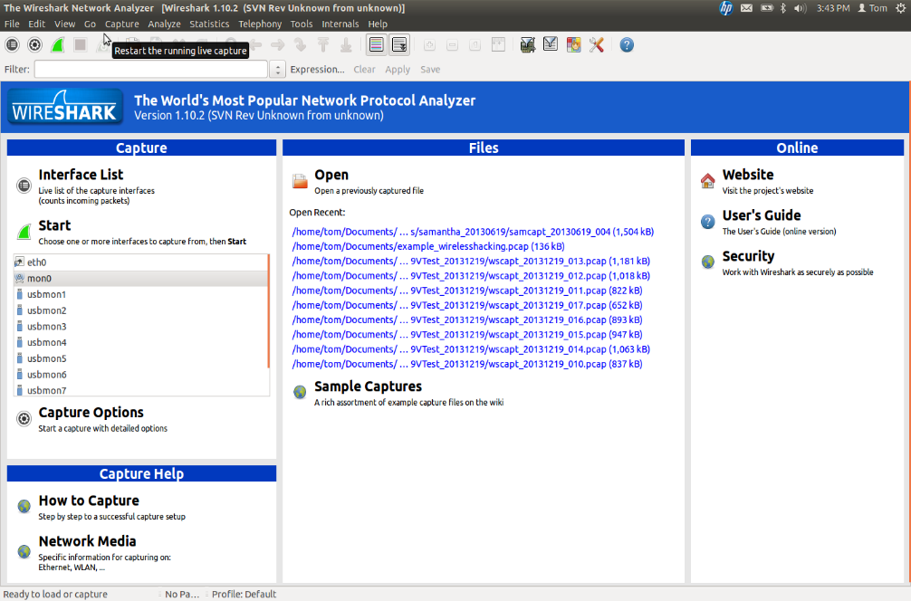
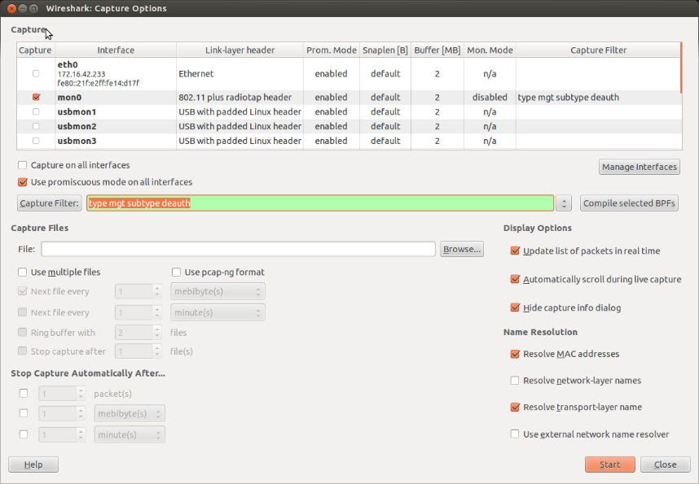
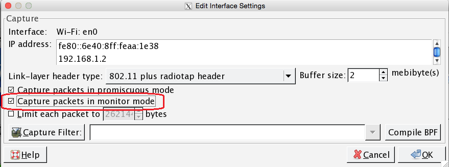
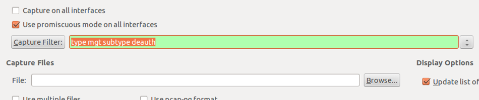
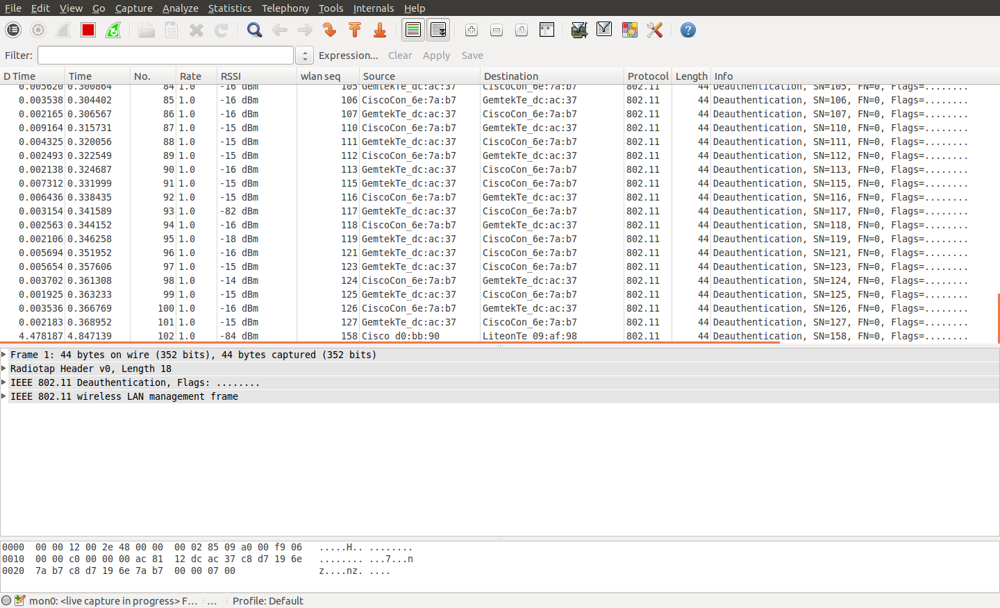
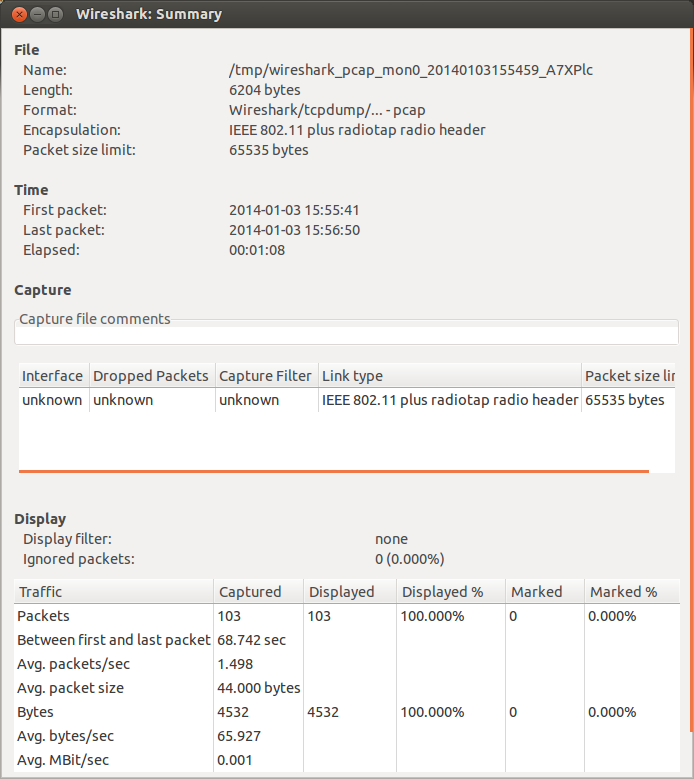
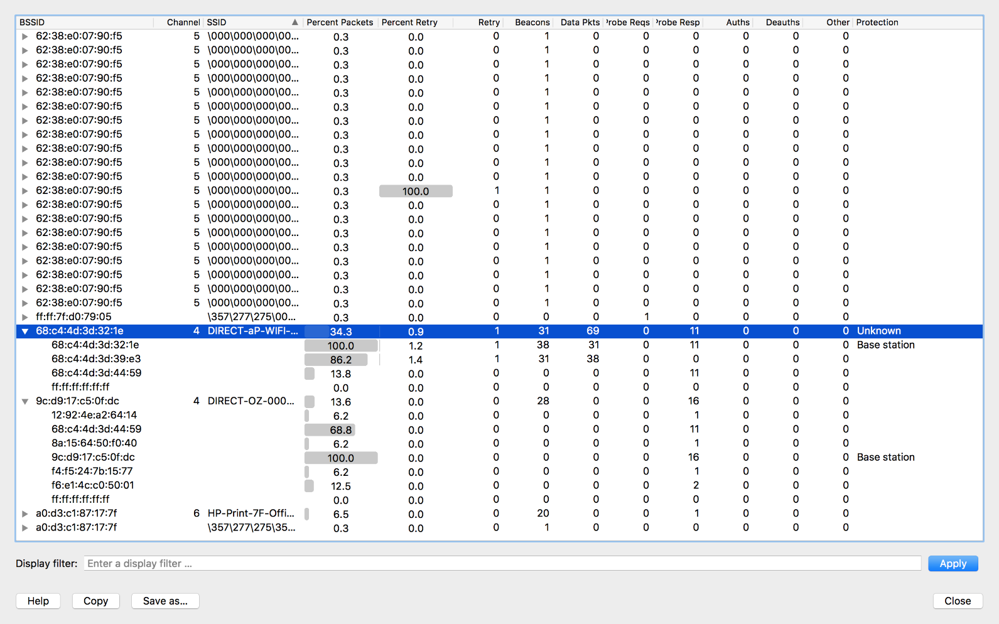

Using Wireshark for Packet Capture
===================================

`Wireshark <https://www.wireshark.org/>`__ is a free, open-source network
protocol analyzer. This page walks through a couple of narrow, practical
examples of using Wireshark to investigate specific wireless issues at a
*FIRST* Tech Challenge event. It is not a general Wireshark tutorial —
detailed Wireshark usage is beyond the scope of this guide. For full
documentation, visit the `Wireshark website <https://www.wireshark.org/>`__.

This page assumes you're already familiar with the general-purpose monitoring
tools covered in
:doc:`/control_system_troubleshooting/monitoring_wireless_environment/monitoring-wireless-environment`,
and are looking for a deeper packet-level diagnostic technique.

Creating a Capture Filter for DEAUTH Packets
----------------------------------------------

This section demonstrates how to create a Wireshark capture filter that
captures 802.11 deauthentication (DEAUTH) packets on a wireless channel. It is
possible for a person to spoof (masquerade as) the MAC address of a device to
disrupt that device's wireless communication. If you have access to a machine
running Wireshark, you can use it to look for DEAUTH packets in your
vicinity.

Download and install the most current release of Wireshark from the
`Wireshark website <https://www.wireshark.org/>`__, following the
installation instructions there.

To examine wireless data with Wireshark, you need a device whose wireless
adapter supports monitor mode. A Mac running a recent version of macOS can
generally use its built-in wireless adapter in monitor mode. For Linux
devices, consult the Wireshark and Linux documentation to determine whether
your computer's wireless adapter supports monitor mode.

.. note:: Some configurations require Wireshark to be run as a super user.
   If your setup requires super user status, it is possible to modify your
   Wireshark installation's permissions so that it no longer needs to run as
   a super user. Consult the official Wireshark documentation for details.

Once Wireshark is installed and you have verified that your wireless adapter
can run in monitor mode, launch Wireshark. The following screenshot shows the
Wireshark user interface (version 1.10.2, Linux):

   Wireshark user interface.

Click the **Capture -> Options** menu item (or the button that looks like a
small gear, second from the left on the button bar) to open the capture
options window:

   Make sure you select the adapter that is running in monitor mode.

Make sure the wireless adapter running in monitor mode is selected as the
capture interface. In the screenshot above, ``mon0`` is the device running in
monitor mode. Mac users can double-click the wireless adapter in the list and
check **Capture packets in monitor mode** to place the selected adapter into
monitor mode:

   Mac users can select the Capture packets in monitor mode option.

In the Wireshark Capture Options window, there is a text box next to a
button labeled **Capture Filter**. Enter your capture filter in this text
box. The capture filter limits the capture session to only packets matching
the filter criteria. In this case, specify the filter as
``type mgt subtype deauth`` (do not type the quotation marks, just the text
itself). If the filter syntax is correct, the text box's background turns
green:

   Specify the capture filter ``type mgt subtype deauth`` in the text box.

When you are ready to start the capture, click the **Start** button. If the
capture filter is applied properly, the Wireshark packet list will display
only packets of type ``mgt`` and subtype ``deauth``. The following image
shows DEAUTH packets captured by Wireshark:

   DEAUTH packets captured by Wireshark.

You can run this capture, with the filter applied, during a *FIRST* Tech
Challenge event, and it will display only DEAUTH packets. It is normal for
some DEAUTH packets to occur, but seeing several DEAUTH packets in a row
during a specific window of time might indicate an intentional DEAUTH
attack.

.. note:: DEAUTH packets occur normally, so a Wireshark capture might contain
   several benign DEAUTH packets. If you suspect a DEAUTH attack occurred at
   an event, note the approximate time of the attack and the team numbers of
   the affected robots. You can then check whether Wireshark captured any
   DEAUTH packets around that time, and cross-reference the source address
   of those packets against the addresses of the robots that lost wireless
   connectivity. During a DEAUTH attack, an attacker spoofs the MAC address
   of the target Robot Controller, pretends to be that Robot Controller, and
   sends DEAUTH packets to devices (such as the Driver Station) connected to
   its wireless network.

To stop the capture, click the red square icon. Use **File -> Save** to save
the captured data to disk.

You can also use the **Statistics -> Summary** menu item to get basic
statistics about the capture data. Remember that if you applied the DEAUTH
capture filter, only DEAUTH packets were captured. The following image shows
the Statistics -> Summary window; in this example, 103 DEAUTH packets were
captured during the session:

   103 packets were captured in this example.

Viewing WLAN Traffic Statistics
-----------------------------------

Wireshark can also show Wi-Fi statistics for your captured data. If you
disable any existing capture filters (to make sure you capture all available
data) and run Wireshark in monitor mode, you can capture and quickly review
the data to get some basic information about your wireless environment. With
wireless data captured in monitor mode, select **Wireless -> WLAN Traffic**
from Wireshark's menu to view statistics about the captured data:

   The WLAN Traffic screen provides useful statistics about the captured data.

In the example shown above, the captured data is sorted by SSID. Looking
closely, the network called ``DIRECT-aP-WIFI-A-RC`` has a BSSID (MAC
address) of ``68:c4:4d:3d:32:1e``, which is also the MAC address of the
"Base station" (the Robot Controller).

That network accounts for 34.3% of the captured data. Expanding the entry for
this network lets you review statistics for each device associated with it.

The WLAN Traffic view is useful for troubleshooting your wireless network. If
your capture shows that a device, whether a Robot Controller or a Driver
Station, has a high number of retries, you can check whether something is
degrading that device's radio performance. You can also check whether other
devices on the same channel show similar issues.

You can also use the WLAN Traffic view to determine which device is putting
out the most data on a channel — useful when trying to identify sources of
heavy Wi-Fi traffic on a wireless channel.
