HuskyLens Intro for *FIRST* Tech Challenge
==========================================

Introduction
------------

This is a simple tutorial to introduce the use of
`HuskyLens <https://www.dfrobot.com/product-1922.html>`__ in *FIRST* Tech
Challenge (`FTC <https://www.firstinspires.org/robotics/ftc>`__), for
teams that **already decided** to explore its potential.

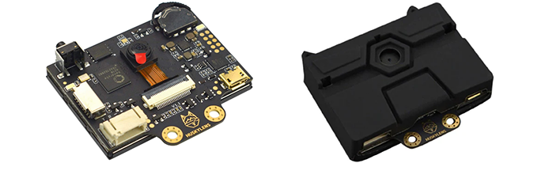

   DFRobot HuskyLens

Basic support for this **vision sensor** was added to the FTC SDK
version 9.0 in September 2023 with the CENTERSTAGE robot game kickoff.

HuskyLens uses **on-board programming** to perform AI-assisted learning,
vision processing and recognition. It plugs into an **I2C sensor port**
of a REV Control Hub or REV Expansion Hub.

HuskyLens is **not a USB webcam**, and **does not use** the FTC
:ref:`VisionPortal <apriltag/vision_portal/visionportal_overview/visionportal-overview:VisionPortal Overview>`
software or the 
:ref:`FTC Machine Learning <ftc_ml/index:*FIRST* Machine Learning Toolchain>`
software.

Electrical Connection
---------------------

You will need a **custom adapter cable** to connect the HuskyLens to an
I2C port on a REV Control Hub or Expansion Hub. The 4 wires/pins of the
HuskyLens connector are not in the same order/position as the 4 pins on
the REV Hub.

Three of the wires have **the same color** as wires in the REV sensor
cable. Your custom cable should connect **red to red**, **black to
black**, and **blue to blue**. This leaves only the HuskyLens **green
wire**; connect it to the REV **white wire**. Simple!

This tutorial does **not** cover the (many) ways to:

-  modify an existing cable (change pin order in one connector), **OR**
-  fabricate a custom cable, with:

   -  soldering
   -  crimped connectors
   -  lever nuts (example below)

FTC `Game Manual 1 <https://www.firstinspires.org/resource-library/ftc/game-and-season-info>`__
allows this work, but teams must ensure high quality for robot competition all
season.

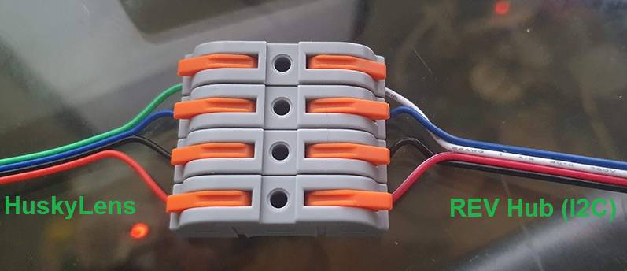

   image credit: @texasdiaz

To confirm these wiring instructions are correct, you could study the
`HuskyLens
documentation <https://wiki.dfrobot.com/HUSKYLENS_V1.0_SKU_SEN0305_SEN0336#target_3>`__
and the `REV Hub
documentation <https://docs.revrobotics.com/duo-control/sensors/i2c#wiring>`__.
You will see the following “pinout” info: 

- HuskyLens **green** wire 1 (“T”) SDA or data == REV Hub **white** wire 3
  “SDA” or data 
- HuskyLens **blue** wire 2 (“R”) SCL or clock == REV Hub **blue** wire 4 “SCL”
  or clock 
- HuskyLens **black** wire 3 (“-”) GND or ground == REV Hub **black** wire 1
  “GND” or ground 
- HuskyLens **red** wire 4 (“+”) VCC or +3.3-5VDC == REV Hub **red** wire 2
  “3.3V” or Vcc

.. figure:: images/070-ports.png
   :align: center
   :width: 85%
   :alt: Ports

   image credit: @texasdiaz

Configuration
-------------

Plug the HuskyLens into a REV Hub I2C port, using your new adapter
cable. The I2C connections labeled **Bus 1, 2 or 3** are suggested, to
avoid (unlikely) overload of data traffic.

The label 0 (zero) is I2C Bus 0, which likely has a **built-in IMU** on
its Port 0. An I2C Bus can contain multiple I2C Ports, sharing traffic.

On the Driver Station, touch the three-dots menu, and
``Configure Robot``.

Edit an existing (correct) configuration, or touch ``New``. Touch
``Scan``, then navigate (through the Portal level) to the specific
``Expansion Hub`` or ``Control Hub`` with the HuskyLens plugged in.

Select ``I2C Bus 3`` or whichever Bus number has the HuskyLens plugged
in.

[[/images/120-DS-config.png]]

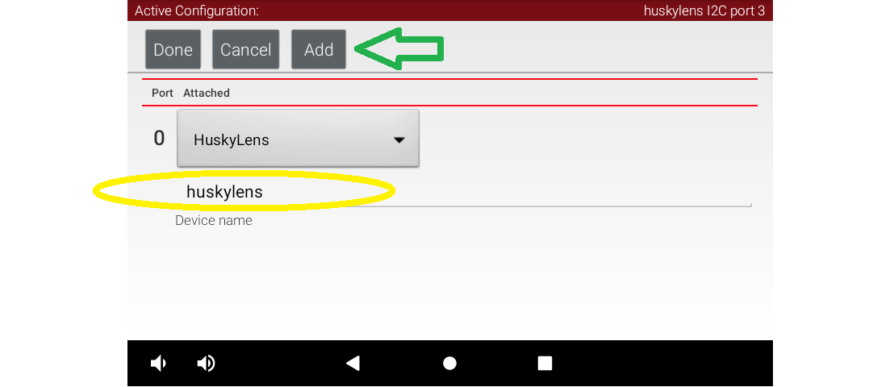

   Driver Station Config

Touch ``Add``, and select device “HuskyLens” from the drop-down list for
Port 0 (or first available port). Type the device name “huskylens”, as
expected by the Sample OpMode.

Touch ``Done`` several times, then ``Save``, to save and name/rename
this updated robot configuration. Touch the DS “Back” arrow, returning
to the DS app’s home screen.

Confirm that your new configuration is shown on-screen as the active
configuration.

Sample OpMode
-------------

Connect your programming computer to the Robot Controller, and open the
programming software. This tutorial uses **FTC Blocks**.

.. note::
   **OnBot Java** and **Android Studio** users can easily follow along, since
   the Java Sample OpMode uses the same programming logic and is well
   commented.

In FTC Blocks, create a new OpMode using the sample called
“SensorHuskyLens”:

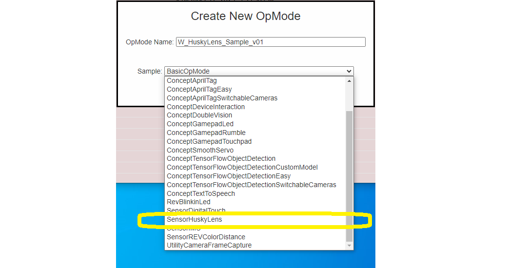

   HuskyLens Blocks Sample

Change the OpMode type from ``TeleOp`` to ``Autonomous``, since this
sample does not use the gamepads.

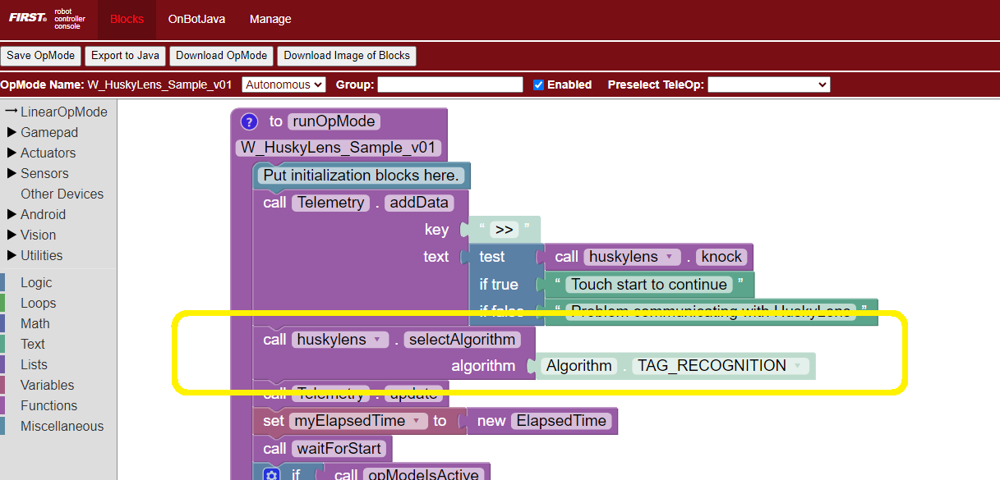

   HuskyLens Blocks Algorithm

Notice the default algorithm here is ``TAG_RECOGNITION``, which simply
detects any (common) AprilTags in the sensor’s field of view. This
recognition is unrelated to the FTC game CENTERSTAGE and its 10
AprilTags with metadata. Instead, this is a simple built-in, generic
function of HuskyLens, used here only to validate the sensor’s
operation.

For AprilTag recognition and navigation, FTC teams may find much more
value from a UVC webcam and the FTC
:ref:`VisionPortal <apriltag/vision_portal/visionportal_overview/visionportal-overview:VisionPortal Overview>`
software. An FTC robot may use HuskyLens **and** USB webcams.

Click ``Save OpMode``, then select and run this OpMode from the Driver
Station. After touching the Start arrow, point the HuskyLens at any
AprilTag from the common 36h11 family:

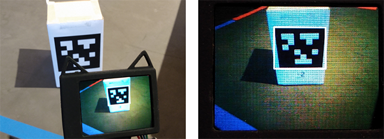

   Uncategorized AprilTag Detected

The HuskyLens’ small screen will show the recognized AprilTag,
surrounded by a thin white Bounding Box.

Here’s the corresponding DS Telemetry:

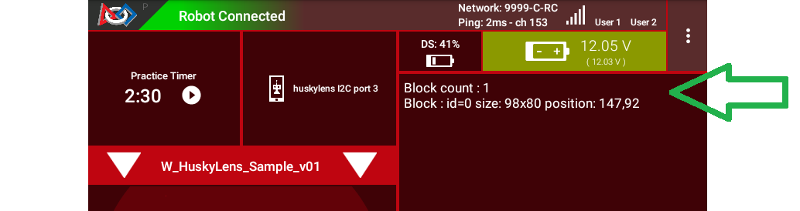

   AprilTag Telemetry

The data includes: 

- number of objects (called “blocks”) detected 
- ID code of object (might not be correct or meaningful) 
- size of Bounding Box, in pixels 
- center position of Bounding Box, in pixels, with (X, Y) origin at the top left

The HuskyLens device screen is 320 x 240 pixels, with center at position
(160, 120).

**Congratulations!** At this point, you have validated the HuskyLens
device, its connection to the REV Hub, and the Sample OpMode program.

AprilTag Detection
------------------

Now you can test whether the HuskyLens can detect the AprilTag’s
position on the CENTERSTAGE Spike Marks. This is not a real game
scenario, since a Team Prop (Team Game Element) cannot use an AprilTag.
This simply verifies whether your robot could aim the HuskyLens to “see”
2 or 3 Spike Marks in a single view.

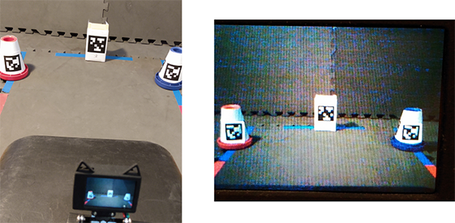

   HuskyLens Viewing 3 Uncategorized Tags

Here the HuskyLens was placed in a feasible position, about 10 inches
from the mat, near the middle of the foam tile before the Spike-Mark
tile. The view **does include** the middle of all three Spike Marks.

All three AprilTags were recognized:

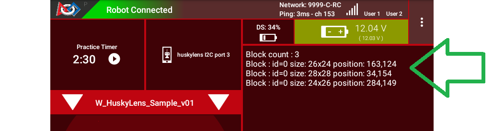

   Telemetry Showing 3 Blocks

This validates the possibility that HuskyLens could recognize a trained
object in one of various known positions – useful for the Autonomous
phase of the CENTERSTAGE game.

Single Color Training
---------------------

Soon you will try a different algorithm called ``COLOR_RECOGNITION``.
But first you need the HuskyLens to “learn” a single color, using its
built-in AI feature.

Choose any object, about 3 to 4 inches in size, that’s completely one
color – any color. Here we use a flat square beverage coaster (LEGO!),
with a uniform **red color**.

Place this object in the position and lighting that you expect to use
for detection. This could be on a CENTERSTAGE Spike Mark, if available.

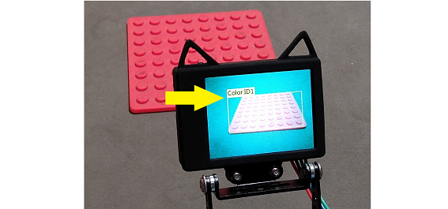

   Red Color ID

In the above image, the trained color is shown as **``Color:ID1``** with
a rectangular Bounding Box. The following steps describe how to do this
training.

The **HuskyLens instructions** for learning a color are `posted
online <https://wiki.dfrobot.com/HUSKYLENS_V1.0_SKU_SEN0305_SEN0336#target_19>`__.
You could try to follow those, or use the equivalent description here.
Some practice may be required!

On the top of the HuskyLens, the wheel at the left side is called the
**Function button** (actually a dial and button). At the right side is
the small **Learning button**.

Dial the Function button to the right or left until **“Color
Recognition”** is displayed at the bottom of the screen.

This is Step 1 only, under ``Operation and Setting`` of the HuskyLens
instructions. For now, do not try to “learn” more than one color with
Steps 2-4.

Point the plus-sign “+” icon in the center of the HuskyLens screen at
your object’s main color area. A white frame appears on the screen,
targeting the main color. Aim the HuskyLens so the white frame includes
only the target color.

This is Step 1 of ``Learning and Detection``. Next comes Step 2, Color
Learning.

With the main color framed, **long press** (press and hold) the small
**Learning button** (right side). A yellow frame is displayed on the
screen, indicating that HuskyLens is learning the color. During this
long press, move the HuskyLens while pointing at the color area, to let
HuskyLens learn the color from various distances and angles. Then,
release the Learning button to complete learning that color. Do not
press the button again (ignore the prompt); allow the 5-second time-out
to finish.

The long-press learning period can last for just a few seconds. After
releasing the Learning button, you allowed the training to time-out – no
more colors to learn. Training is done!

As shown above, the trained color will be shown on-screen as
**``Color:ID1``** with a rectangular Bounding Box. This “block” (of
color) will be reported in the Sample OpMode (next step).

If you want to do this over again, short-press the Learning button, then
short-press again to **Forget** the learned color(s). This will make the
plus-sign “+” icon appear again. Aim the plus-sign at the center of the
color area, and repeat the learning (long-press the Learning button).
Release and let the time-out finish.

This section showed how to train a single color. After completing this
tutorial, you may wish to train **two colors** (e.g. a Red shade and a
Blue shade). This is described near the end of this tutorial.

HuskyLens documentation refers to the color zone as a “block” of color.
This is not the same as a physical block or cube. HuskyLens uses the
same word “block” for recognitions.

Note the official warning:

.. warning:: 
   “Color recognition is greatly affected by ambient light. Sometimes
   HuskyLens may misidentify similar colors. Please try to keep the
   ambient light unchanged.”

Single Color Detection
----------------------

Aim the HuskyLens at one or more of your color-trained objects.

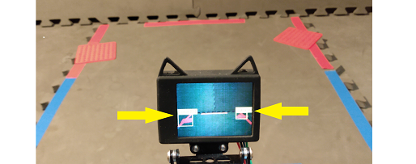

   HuskyLens Detecting Two Red Objects

As shown above, the HuskyLens should recognize and label your colored
objects with **``Color:ID1``**. Here, both red objects are identified
(yellow arrows).

In the programming software (same OpMode), now select a different
algorithm called ``COLOR_RECOGNITION``:

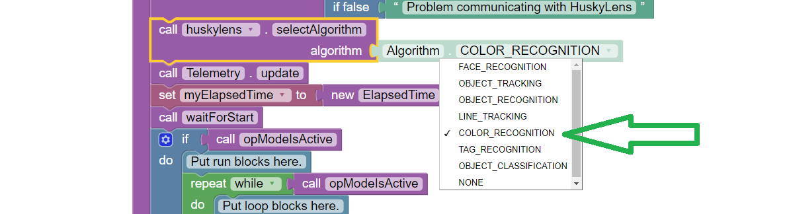

   Selecting COLOR_RECOGNITION algorithm

In the Java sample OpMode, change the algorithm selection as follows:

.. code:: java

   huskyLens.selectAlgorithm(HuskyLens.Algorithm.COLOR_RECOGNITION);

Save this OpMode, then select and run it on the Driver Station. Make
sure the active configuration includes the HuskyLens.

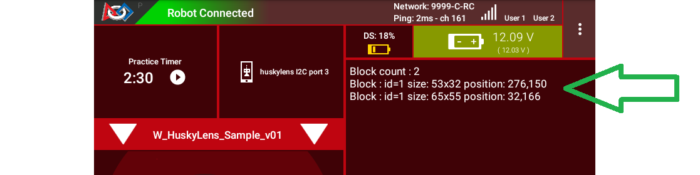

   DS Telemetry Two Objects

As shown above, the OpMode provides the size and location of the white
Bounding Boxes (called “blocks”). This is done in a **FOR loop**;
multiple recognitions are processed one at at time.

In the Java sample OpMode, **inside the FOR loop**, you could save or
evaluate **specific** info for the currently recognized Bounding Box:
``blocks[i].width``, ``blocks[i].height``, ``blocks[i].left``,
``blocks[i].top``, and (for the Box’s center) ``blocks[i].x`` and
``blocks[i].y``. The Color ID ``blocks[i].id`` is always 1 here, for
single-color detection. These values have Java type ``int``.

Even if your Team Prop’s color closely matches the color of the red or
blue Spike Mark, you could write OpMode code to reject the narrow shape
(aspect ratio) of an empty Spike Mark’s Bounding Box.

Here’s an example with a trained **blue object**:

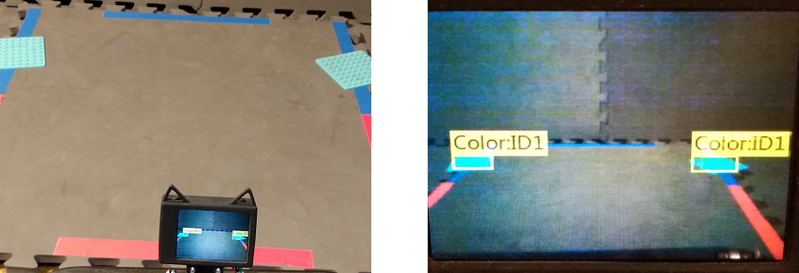

   HuskyLens Two Blue Objects

Both blue objects were recognized by the OpMode:

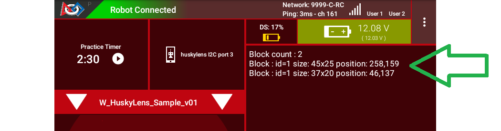

   Telemetry for Two Blue Objects

Again, your code can evaluate the size and location of any provided
Bounding Box, to verify a “real” recognition of your object.

Competition Notes
-----------------

1. Team Prop
~~~~~~~~~~~~

Now you are ready to experiment with color recognition of an actual Team
Prop, also called a Team Game Element. Study `Game Manual
1 <https://www.firstinspires.org/resource-library/ftc/game-and-season-info>`__
and the `FTC Q&A <https://ftc-qa.firstinspires.org/>`__ for the Team
Prop requirements. Choose your shades of “red” and “blue” (see note
below), and follow the same steps as above.

2. Color
~~~~~~~~

The above trained **blue object** is not the same shade of blue as the
blue Spike Mark. This difference increases the chance of a distinct and
correct recognition of the object color.

`Game Manual
1 <https://www.firstinspires.org/resource-library/ftc/game-and-season-info>`__
(Rule TE2) specifically allows the Team Prop to be a different shade of
Red or Blue, compared to the official tape color of Spike Marks:

   *“The Team Game Element may include multiple shades of the assigned
   color.”*

…and emphasized in the `FTC
Q&A <https://ftc-qa.firstinspires.org/qa/15>`__:

   *“Light blue and pink are acceptable colors providing it is obvious to
   the field personnel which alliance the Team Prop belongs to.”*

3. Lighting
~~~~~~~~~~~

The HuskyLens documentation provides a warning (shown above) that
ambient lighting can impact recognition of a trained color.

For this reason, competition training should ideally be done with the
Team Prop (Team Game Element) on the Spike Mark, and the HuskyLens in
its planned match start position, “on-robot”.

Also, the trained ambient lighting must be similar to expected match
conditions. This may suggest performing the final color-training as part
of tournament or match set-up. With practice, it could be done in a few
seconds.

4. Programming
~~~~~~~~~~~~~~

In this Sample OpMode, the main loop ends only upon touching the DS Stop
button. For competition, teams should **modify this code** in at least
two ways:

-  for a significant recognition, take action or store key information –
   inside the FOR loop

-  end the main loop based on your criteria, to continue the OpMode

As an example, you might set a Boolean variable ``isPropDetected`` to
``true``, if a significant recognition has occurred.

You might also evaluate and store which randomized Spike Mark (red or
blue tape stripe) holds the Team Prop.

Regarding the main loop, it could end after the HuskyLens views all
three Spike Marks, or after your code provides a high-confidence result.
If the HuskyLens’ view includes more than one Spike Mark position,
perhaps the **Bounding Box** size(s) and location(s) could be useful.
Teams should consider how long to seek an acceptable recognition, and
what to do otherwise.

In any case, the OpMode should exit the main loop and continue running,
using any stored information. 

Multi-Color Training
--------------------

After completing the above tutorial with a single trained color, you may
wish to train **two colors** (e.g. a Red shade and a Blue shade).

This would avoid the need for multiple color-training sessions during an
FTC tournament. With single-color, you would train for Red before
playing an FTC match as Red Alliance, and train for Blue before playing
as Blue Alliance.

With multi-color, your Red-Alliance Autonomous OpMode could seek Red as
**``Color:ID1``**, for example, and your Blue-Alliance Autonomous OpMode
could seek Blue as **``Color:ID2``**.

The **HuskyLens instructions** for learning multiple colors are `posted
online <https://wiki.dfrobot.com/HUSKYLENS_V1.0_SKU_SEN0305_SEN0336#target_19>`__.
You could try to follow those, or use the equivalent description here.
Again, some practice may be required!

Reminder: on the top of the HuskyLens, the wheel at the left side is
called the **Function button** (actually a dial and button). At the
right side is the small **Learning button**.

**Step 1.** Dial the Function button to the right or left until **“Color
Recognition”** is displayed at the bottom of the screen.

**Long press** (press and hold) the Function button to select Color
Recognition.

**Step 2.** This brings up the next menu, containing the choice “Learn
Multiple”. If needed, dial the Function button to highlight “Learn
Multiple”.

**Short press** (press and release) the Function button to select Learn
Multiple.

This brings up the OFF-ON slider bar for “Learn Multiple”. If needed,
dial the Function Button to move the blue square to the **right side**
of the blue slider bar. See yellow arrow:

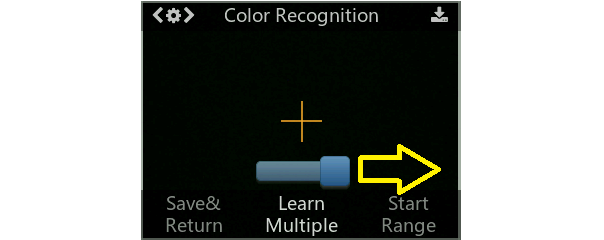

   HuskyLens - Learn Multiple

**Short press** the Function button to set “Learn Multiple” to **ON**.

**Step 3.** Dial the Function button to the left, and **short press** to
select “Save & Return”.

At the screen prompt “Do you want to save the parameters?” or “Do you
save data?”, **short press** the Function button to select “Yes”. This
saves the mode (again) as “Learn Multiple” and exits the settings menu.

Now ready for learning!

**Step 4.** As before, point the plus-sign “+” icon in the center of the
HuskyLens screen at your object’s main color area. A **white frame**
appears on the screen, targeting the main color. Aim the HuskyLens so
the white frame includes only the target color.

With the main color framed, **long press** (press and hold) the small
**Learning button** (right side). A **yellow frame** appears on the
screen, indicating that HuskyLens is learning the color.

During this long press, move the HuskyLens while pointing at the color
area, to let HuskyLens learn the color from various distances and
angles. Then, release the Learning button to complete learning that
color.

The long-press learning period can last for just a few seconds. After
releasing the Learning button, **``Color:ID1``** is now trained, with
its label shown on-screen. Easy!

   HuskyLens - RED (Color 1) Trained

**Step 5.** As prompted on the screen, **short press** the Learning
button again (before the 5-second time-out). This prepares for learning
the next color.

**Step 6.** Point the lens at your second color, and repeat the previous
Step 4. Namely, **long press** the Learning button, aim and move, then
**release** to complete learning that color.

Now **``Color:ID2``** is trained, with its label shown on-screen.

**Step 7.** As prompted, **short press** the “other” button, the
Function button. Or, allow the 5-second time-out to complete. In either
case, this completes the multi-color training. All done!

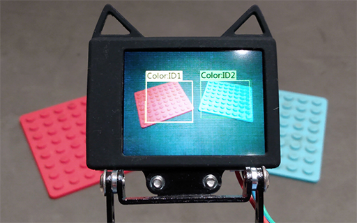

   HuskyLens - Two Colors Trained (ID1 and ID2)

If you want to do all this **over again**, short-press the Learning
button, then (as prompted) short-press again to **``Forget`` all of the
learned colors**.

This makes the plus-sign “+” icon appear again. Repeat the above, from
Step 4, to train colors again.

Multi-Color Detection
---------------------

For your OpMode code to read **``Color:ID2``**, for example, the
Algorithm must be set to ``COLOR_RECOGNITION`` and the field
``HuskyLens.Block.id`` will be **the value 2**. This can be seen in the
Telemetry portion of the Sample OpMode you used above.

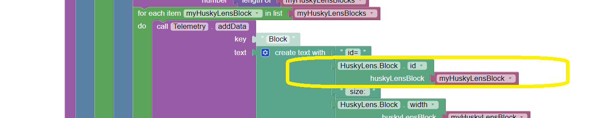

   Adding Telemetry for Colors

Here’s the DS Telemetry from the Sample OpMode used above for single
color, **with no coding changes**:

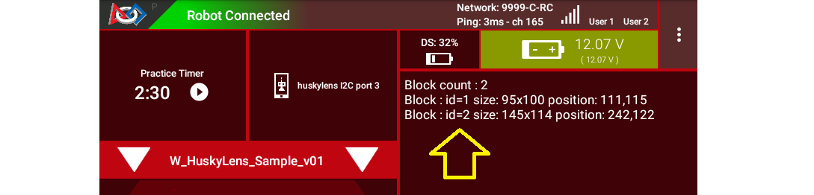

   Example Telemetry showing Both Colors

Now there are two trained and recognized colors, with ID Codes 1 and 2 –
see yellow arrow above.

These two lines of Telemetry are generated in different cycles of the
same FOR Loop. They display together, since the ``Telemetry.update``
Block appears **after** the FOR Loop has completed all of its cycles.
Namely, the FOR Loop has processed each HuskyLens “color block” in the
``List`` of HuskyLens “blocks”.

In the Java sample OpMode, add these lines **inside the FOR loop**:

.. code:: java

   int thisColorID = blocks[i].id;                      // save the current recognition's Color ID
   telemetry.addData("This Color ID", thisColorID);     // display that Color ID

Besides ``.id``, other Java fields are available for the currently
recognized Bounding Box: ``.width``, ``.height``, ``.left``, ``.top``,
plus ``.x`` and ``.y`` (center location).

The color ID numbers are assigned **in order of training**. You cannot
renumber these later, so plan your training and OpMode coding to agree
with each other.

.. tip::
   **Advanced tip:** If your color recognition is heavily affected by ambient
   lighting, you could try training your object in various lighting conditions
   **as different HuskyLens colors**. Namely, the Red-shade Team Prop could be
   trained as **``Color:ID1``** in bright light, and trained as
   **``Color:ID2``** in dim light or shadow. Your OpMode could accept
   **either** Color ID (1 or 2) as “Red”. Likewise, Blue shades could have
   Color IDs 3 and 4.

Object Training
---------------

This tutorial ends with HuskyLens **color training**. Now you are
familiar with the basic steps for HuskyLens operation, training, and FTC
programming.

You are encouraged to proceed with training the HuskyLens to recognize
an **actual object**. This could be one of its 20 pre-trained models
(“Object Recognition”) or a **custom model or image** that you train
(“Object Classification”). In each case, follow a process similar to
color training, using the `HuskyLens
documentation <https://wiki.dfrobot.com/HUSKYLENS_V1.0_SKU_SEN0305_SEN0336>`__.

You may find that HuskyLens **object recognition** provides more
(educational) exposure to the process of AI and Machine Learning, along
with more reliable results than color recognition.

Best of luck this season!

============

Questions, comments and corrections to westsiderobotics@verizon.net
