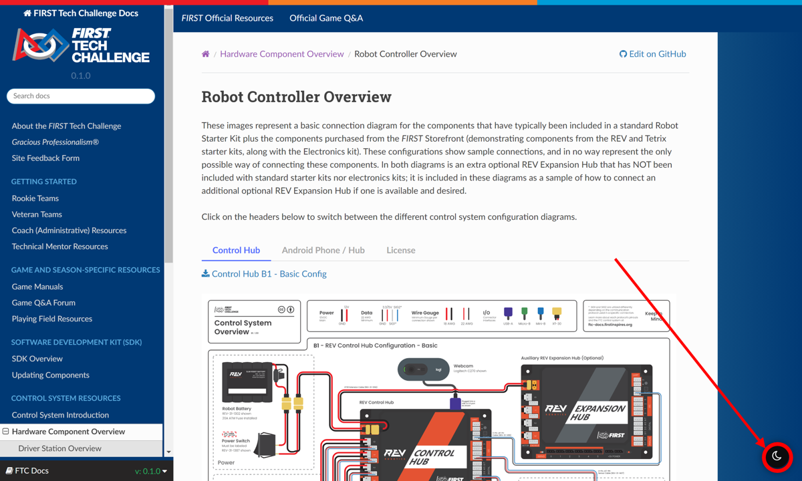

Dark Mode
==========

|

FTC Docs has built in functionality for a dark mode. This is disabled by default but can 
be activated by clicking the dark moon icon in the bottom right corner of the page. This can 
be disabled by clicking the light sun icon in the bottom right corner of the page. This functionality 
is available on every single page of FTC Docs.