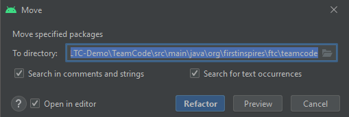
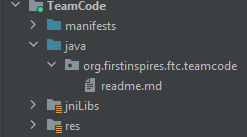
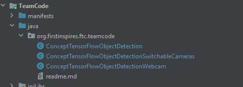
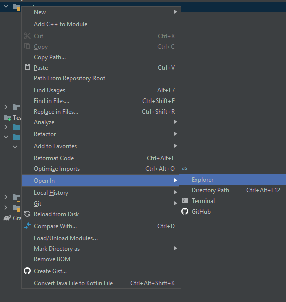
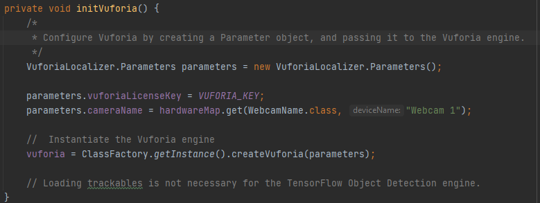
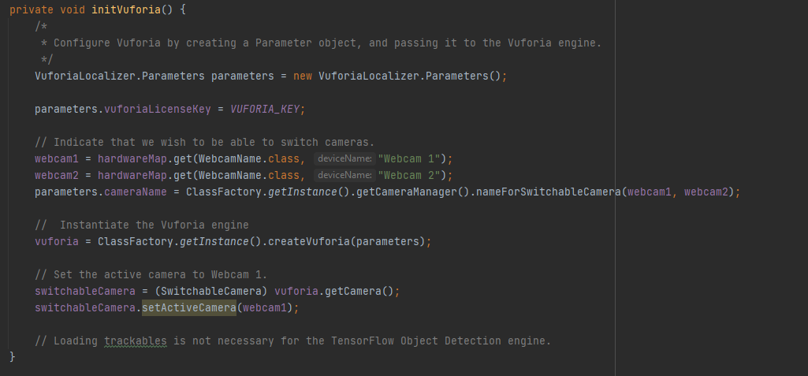
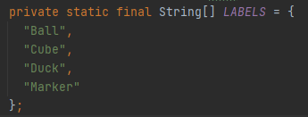
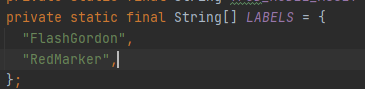

Android Studio
================

It is assumed that you already know how to use Android Studio. If not,
be sure to check out the :ref:`Android Studio Guide <programming_resources/android_studio_java/android-studio-tutorial:android studio programming tutorial>`
document before proceeding.

1. In Android Studio, there are three sample Opmodes to choose from.
   Each has its own use case. Depending on your use case choose one (or
   more) of the following.

   -  `ConceptTensorFlowObjectDetection <https://github.com/FIRST-Tech-Challenge/FtcRobotController/blob/master/FtcRobotController/src/main/java/org/firstinspires/ftc/robotcontroller/external/samples/ConceptTensorFlowObjectDetection.java>`_

      -  This opmode is designed to use the robot controller's internal
         camera, if it has one, for the input for TFOD.

   -  `ConceptTensorFlowObjectDetectionSwitchableCameras <https://github.com/FIRST-Tech-Challenge/FtcRobotController/blob/master/FtcRobotController/src/main/java/org/firstinspires/ftc/robotcontroller/external/samples/ConceptTensorFlowObjectDetectionSwitchableCameras.java>`_

      -  This opmode is designed to be able to switch between two
         different webcams for the input for TFOD.

   -  `ConceptTensorFlowObjectDetectionEasy <https://github.com/FIRST-Tech-Challenge/FtcRobotController/blob/master/FtcRobotController/src/main/java/org/firstinspires/ftc/robotcontroller/external/samples/ConceptTensorFlowObjectDetectionEasy.java>`__

      -  This opmode is designed to use an external webcam as its input
         for TFOD

2. We will now have to move the sample opmode from the samples folder to
   the teamcode folder. To do this we will first have to go to the
   project view on the right. Then we will need to navigate to

   -  ``FtcRobotController -> Java ->
      org.firstinspires.ftc.robotcontroller -> external.samples``

It should look like this:

.. figure:: images/image22.png
   :align: center

3. Select the opmode that you chose earlier and drag and drop it into
   the following folder:

   -  TeamCode -> Java -> org.firstinspires.ftc.teamcode

..

   When prompted to refactor select “refactor”. In the image below I
   moved all three opmodes into my teamcode folder but that is not
   necessary. You only need one opmode.

|

|

4. You will then have to open the opmode that you moved and remove the
   ``@Disabled`` should be near the top of the code.

5. The next step is to add your model (.tflite) to your assets folder.
   You will find this folder in your project view on the left by going
   to:

   -  ``FtcRobotControler -> assets.``

By left- clicking on the assets folder you go to the “Open In” sub menu
from which you can choose your file explorer of choice. From there you
need to copy your model (.tflite) into the assets folder that you have
just opened.

6. You will now have to modify the name of the model that the opmode
   uses. To do this change the TFOD_MODEL_ASSET variable such that
   “FreightFrenzy_BCDM.tflite” is replaced with the name and fully
   qualified path for the file that you uploaded earlier. The fully
   qualified path to where the tflite models live can be seen in the
   example below:

``private static final String TFOD_MODEL_ASSET =
"/sdcard/FIRST/tflitemodels/myCustomFreightFrenzyModel.tflite";``

.. tip:: On some older models of phones, the upload path may be 
   different. On some phones, like the Motorola G2 phone, the model 
   path should instead be set to 
   ``private static final String TFOD_MODEL_ASSET = 
   "/storage/emulated/0/FIRST/tflitemodels/myCustomFreightFrenzyModel.tflite";``

7. Next we will have to acquire a Vuforia Key. There are detailed
   instructions in each of the opmodes on acquiring such a key.

8. After following these instructions replace the following string with
   your key:

``“ -- YOUR NEW VUFORIA KEY GOES HERE --- “``

9.  (optional) You may find it necessary to adjust the zoom. By default
    it is set to 2.5 but feel free to adjust this to your needs. Note
    that this is digital zoom not optical zoom. This means that in
    essence you are simply telling TFOD to ignore outer sections of the
    image.

10. If you are using ``ConceptTensorFlowObjectDetectionWebcam`` or
    ``ConceptTensorFlowObjectDetectionSwitchableCameras`` you will also need
    to update the device name of the camera. Simply change the device
    name to correspond with your config. In the image below the name of
    the webcam is “Webcam 1”.

11. You will next have to update the labels. To do this find the section
    of code shown below. This should match the order of the labels in
    the dataset(s) that your model is based on. There should be at least
    one label.

    
    Before

|

    After

12. And you are all set to test. Just open the opmode as you would any
    other opmode and select initialize and play.
