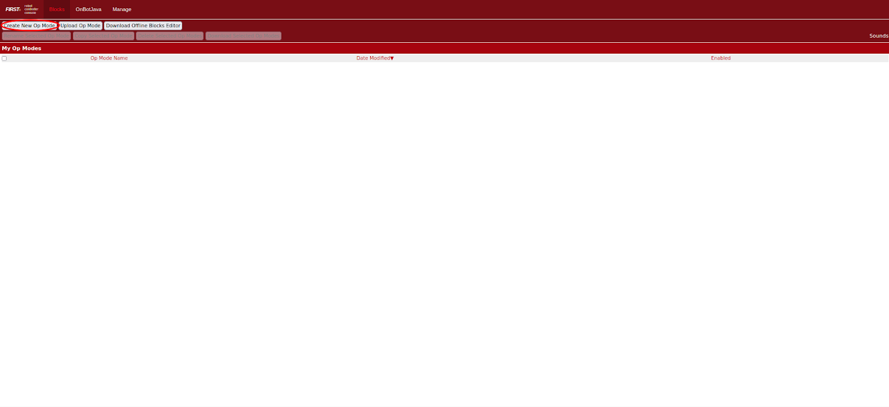
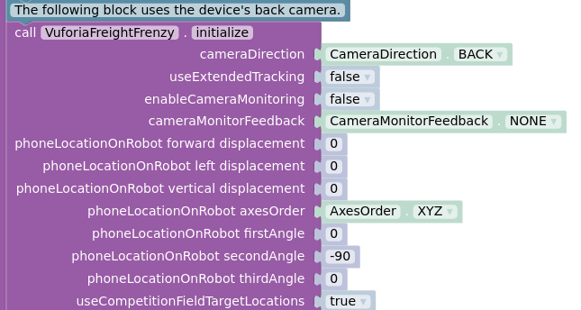
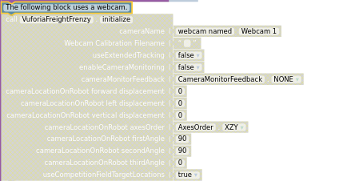
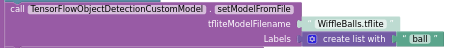
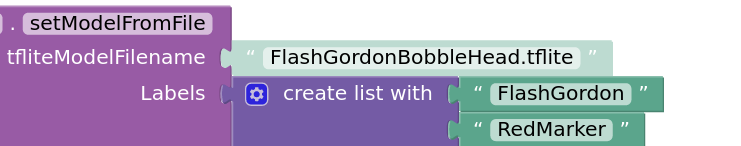
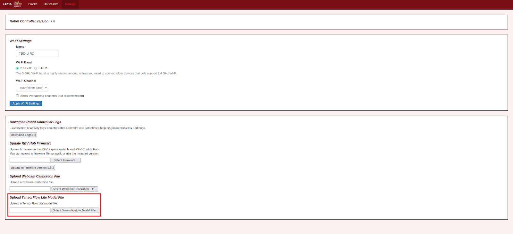

Blocks
=======

It is assumed that you already know how to use Blocks. If not, be sure
to check out the :ref:`Blocks Programming
Guide <programming_resources/blocks/blocks-tutorial:blocks programming tutorial>`
document before proceeding.

1. First click the “Create New Op Mode” button in the Blocks main
   management interface.

2. Select “ConceptTensorFlowObjectDetectionCustomModel” in the sample
   drop down and choose whatever name you find appropriate. Then click
   OK.

..

   .. figure:: images/image40.png
      :align: center

|

   .. note:: 
    Be careful of a common pitfall – as of SDK 7.0, normal
    TensorFlow blocks cannot load custom tensorflow models. There are TWO
    kinds of TensorFlow blocks, one type for regular models and one type
    for custom models, and ALL of the blocks in each category MUST be
    used together (so old programs that load regular models would need
    ALL of the TensorFlow blocks replaced, not just the ones that load
    the model). If you choose to not create a new Op Mode for loading the
    Custom Models, and you do not replace ALL of the “normal” TensorFlow
    blocks, be aware that we warned you here.

3. You can either use a webcam or the built in camera for your video
   input. If you are using the control hub you, do not have a built in
   camera. If you are using the phone’s built in camera do not change
   the disabled block. If you are using a webcam, disable the block of
   code below the comment “The following block(first image below) uses
   the device's back camera.” To disable the block right click the block
   and select “Disable Block.” Then enable the following block (second
   image below). Do so by right clicking the block and clicking “Enable
   Block”.

4. If you are using a webcam change the cameraName parameter in the
   block that you just enabled to the name of your webcam. Currently it
   is called “Webcam 1.”

5. Then scroll down to the following block.

You will now have to modify the name of the model that the opmode uses.
To do this change the tfliteModelFilename string from
``“WiffleBalls.tflite”`` to the name of the file that you will upload. If
you don’t use the model uploader, you need to specify the fully
qualified path to where the tflite models live. An example of the fully
qualified path to where the tflite models live can be seen in the
example below:

``/sdcard/FIRST/tflitemodels/myCustomFreightFrenzyModel.tflite``

.. tip:: On some older models of phones, the upload path may be 
   different. On some phones, like the Motorola G2 phone, the model 
   path should instead be set to 
   ``/storage/emulated/0/FIRST/tflitemodels/myCustomFreightFrenzyModel.tflite``

6. Next you will have to update the labels. This should match the order
   of the labels in the dataset(s) that your model is based on. To do so
   click on the gear icon and add the needed number of items. Then add
   the items in your model to the labels list (seen below). This should
   be in alphabetical order and match the labels in the dataset(s) that
   your model is made from.

7. The next step is to upload the TFOD model that you created using
   FTC-ML. To do this go to the ribbon on the top of your windows and
   select “Manage”.

..

   .. figure:: images/image47.png
      :align: center

8. If you're using **SDK 7.0 or older**, select the “Upload TensorFlow Lite Model File” button and select
   the model (.tflite). Then click upload.

   
If you're using **SDK 7.1 and newer**, in the same location you'll find a TensorFlow Lite Model File 
Manager link. Click on that link to take you to the model file manager, and upload your model. 
Here you can also view other models already uploaded, rename, and delete models.

9. And you are all set to test. After building the opmode as you would
   any other opmode and select initialize and play. Have fun testing.
