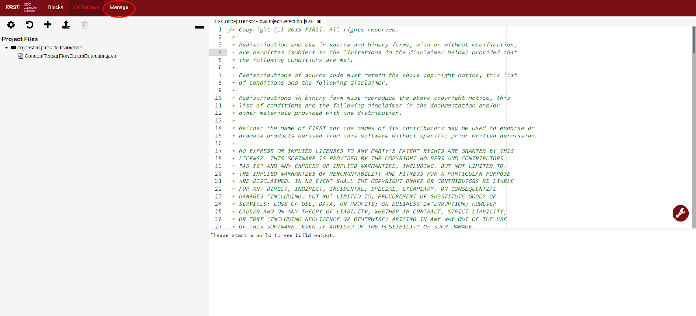
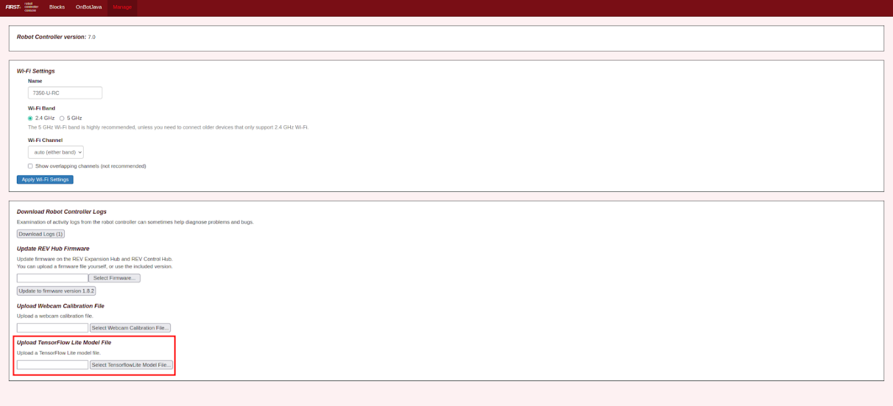
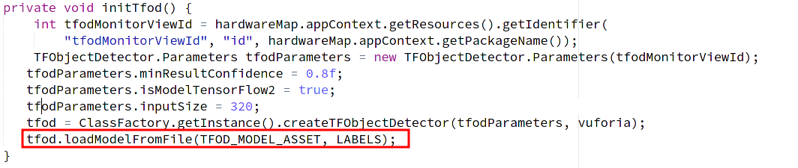
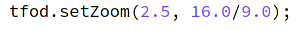

OnBot Java (OBJ)
=================

It is assumed that you already know how to use OnBot Java. If not, be
sure to check out the :ref:`OnBot Java
Guide <programming_resources/onbot_java/onbot-java-tutorial:onbot java programming tutorial>`
document before proceeding.

1. In On Bot Java, there are three sample Opmodes to choose from. Each
   has its own use case. Depending on your use case choose one (or more)
   of the following.

   -  ``ConceptTensorFlowObjectDetection``

      -  This opmode is designed to use the robot controller's internal
         camera, if it has one, for the input for TFOD.

   -  ``ConceptTensorFlowObjectDetectionSwitchableCameras``

      -  This opmode is designed to be able to switch between two
         different webcams for the input for TFOD.

   -  ``ConceptTensorFlowObjectDetectionWebcam``

      -  This opmode is designed to use an external webcam as its input
         for TFOD

2. Click the “Add Files” button in the top left corner.

..

   .. figure:: images/image31.png
      :align: center

3. In the bottom half of the popup click the drop down below “Sample”.
   Then select the opmode that you chose earlier in Step 1. Then in the
   “File Name” text box enter the desired name of your opmode. Then
   click the blue “OK” button.

..

   .. figure:: images/image32.png
      :align: center

4. The next step is to upload the TFOD model that you created using
   FTC-ML. To do this go to the ribbon on the top of your windows and
   select “Manage”.

5. If you're using **SDK 7.0 or older**, select the “Upload TensorFlow Lite Model File” 
   button and select the model (.tflite). Then click upload.

If you're using **SDK 7.1 and newer**, in the same location you'll find a TensorFlow Lite Model File 
Manager link. Click on that link to take you to the model file manager, and upload your model. 
Here you can also view other models already uploaded, rename, and delete models.

6. Then navigate back to the “OnBotJava” page. You will now have to
   modify the name of the model that the opmode uses. To do this change
   the ``TFOD_MODEL_ASSET`` variable such that ``“FreightFrenzy_BCDM.tflite”``
   is replaced with the name and fully qualified path for the file that
   you uploaded earlier. The fully qualified path to where the tflite
   models live can be seen in the example below:

``private static final String TFOD_MODEL_ASSET =
"/sdcard/FIRST/tflitemodels/myCustomFreightFrenzyModel.tflite";``

.. tip:: On some older models of phones, the upload path may be 
   different. On some phones, like the Motorola G2 phone, the model 
   path should instead be set to ``private static final String TFOD_MODEL_ASSET = "/storage/emulated/0/FIRST/tflitemodels/myCustomFreightFrenzyModel.tflite";``

7. Change from “loadModelFromAsset” to “loadModelFromFile” in the line
   below in your opmode.

8. Modify the labels of the model such that it matches those of your
   model. You need at least one label. The order should be alphabetical
   and be composed of the labels in the datset(s) used to make the
   model.

..

   .. figure:: images/image36.png
      :align: center

9.  You will now need to acquire a Vuforia License Key. To do this
    follow the instructions provided in the opmode. They will be found
    above the line shown below. The final step will be to replace ``" --
    YOUR NEW VUFORIA KEY GOES HERE --- "`` with your actual key.

10. (optional) You may find it necessary to adjust the zoom. By default
    it is set to 2.5 but feel free to adjust this to your needs. Note
    that this is digital zoom not optical zoom. This means that in
    essence you are simply telling TFOD to ignore outer sections of the
    image.

11. If you are using ``ConceptTensorFlowObjectDetectionWebcam`` or
    ``ConceptTensorFlowObjectDetectionSwitchableCameras`` you will also need
    to update the device name of the camera. Simply change the device
    name to correspond with your config. In the image below the name of
    the webcam is ``“Webcam 1”``.

..

   .. figure:: images/image38.png
      :align: center

12. And you are all set to test. After clicking the build button just
    open the opmode as you would any other opmode and select initialize
    and play. Have fun testing.
