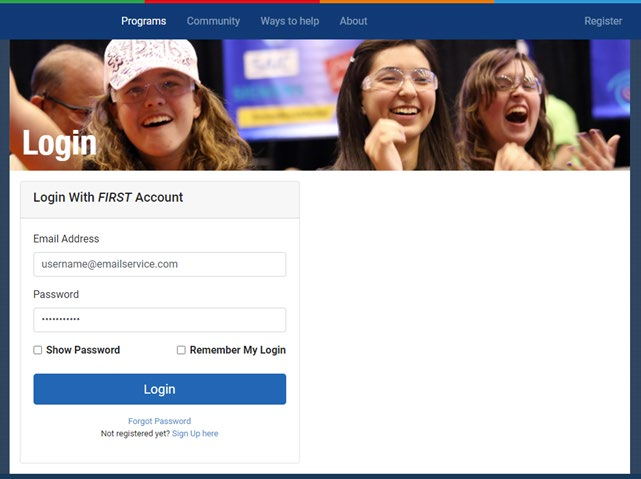
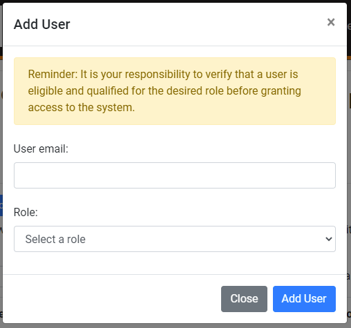

Logging in to FIRST Tech Challenge Machine Learning
========================================================

The *FIRST* Tech Challenge Machine Learning (ftc-ml) tool uses a Single
Sign On (SSO) login through an individual’s `FIRST Dashboard
account <https://my.firstinspires.org/Dashboard/>`__ managed by the
`ftc-scoring <https://ftc-scoring.firstinspires.org>`__ platform,
allowing the ftc-ml tool use a *FIRST* Dashboard login session for
authentication through the ftc-scoring platform. One consequence of
using *FIRST* Dashboard SSO is that all users of the ftc-ml tool MUST
have a *FIRST* Dashboard account. The benefits of using the *FIRST*
Dashboard SSO are that team affiliation and permission levels are
automatically shared with the ftc-ml tool, allowing an individual’s
*FIRST* Dashboard account to be used for identity purposes and allows
the team’s roster to be the definitive source for team membership
information.

Before logging into the ftc-ml tool, your browser (Chrome, Firefox,
etc.) should be updated to the most recent version provided by the
author of the browser. For example, older chromebooks that are limited
and cannot update to the most recent version of the Chrome browser may
not properly function within the ftc-ml tool. The only browser that has
been fully tested with the ftc-ml tool is the Chrome browser, currently
at version 94.0.4606.81 as of the writing of this document.

Logging into the ftc-ml tool
----------------------------

To log into the ftc-ml tool, go to the following URL:
https://ftc-ml.firstinspires.org. If there is an active login session
already being managed by the ftc-scoring platform, this URL will either
take you directly to the team selection page (if you are present on the
roster of multiple teams) or the main workflow page of the ftc-ml tool.
Otherwise, this URL will temporarily redirect to the *FIRST* Dashboard
login page as seen in Figure 1.

   
   FIRST Dashboard Login Page

Enter login credentials for your *FIRST* Dashboard account here. If a
password manager is being used, the password manager should recognize
the domain being used and auto-fill the username and password for you.
Once login details are complete, click the Login button. Once the login
credentials are accepted, you may be taken to one or more of these three
pages:

1. If your *FIRST* Dashboard account is present on the roster for more
   than one team, you will be taken to the Team Selection page. On this
   page, clicking the “Select…” button under the “Team Number” header
   will provide a drop-down list of all team numbers for which you
   appear on the roster. Select the team number of the ftc-ml session
   you wish to enter, and click “Submit.”

2. If your *FIRST* Dashboard account is present on the roster of only
   one team, you will be taken to the main workflow page for the ftc-ml
   tool for your team. If your *FIRST* Dashboard account is present on
   the roster of more than one team, you will be taken to the main
   workflow page of the team selected on the Team Selection page.

3. If your *FIRST* Dashboard account is not associated with a team, or
   the associated/selected team does not have access to the ftc-ml tool,
   you will be taken to an error page.

.. figure:: images/image3.png
   :align: center
   
   ftc-ml login permission denied error page

Changing the active team login session
--------------------------------------

If your *FIRST* Dashboard Account appears on the roster of multiple
teams, and you’re currently logged in to the ftc-ml tool and wish to
change the active team session, **follow these steps exactly** to change
teams:

1. Click on the “Hello, <NAME> Team <NUMBER>” text in the main header.

   -  This will redirect you to the ftc-scoring accounts page. The
      simple act of clicking on “Hello…” and being redirected to the
      ftc-scoring login page will invalidate the Team Selection setting
      submitted when you first logged on.

2. **DO NOT** CLICK ON THE BROWSER’S BACK BUTTON once at the ftc-scoring
   accounts page, this will invalidate your entire session.

   -  If you click on the browser’s BACK button while on the ftc-scoring
      accounts page, you invalidate your entire SSO login session, and
      you will have to click the “Log Off” button on the `ftc-scoring
      accounts page <https://ftc-scoring.firstinspires.org/account>`__
      in order to completely clear your SSO session and try again.

3. In the browser’s URL, go to https://ftc-ml.firstinspires.org to go
   back to the ftc-ml site.

4. Select the team from the “Select…” drop-down that you wish to enter
   the ftc-ml session for.

5. Click the “Submit” button.

Logging out
-----------

When finished with an active ftc-ml session, it is advisable to log out
of ftc-ml in order to ensure that the login session is closed and your
*FIRST* Dashboard account is secure. To do this, follow these steps:

1. Click on the “Hello, <NAME> Team <NUMBER>” text in the main header.

   -  This will redirect you to the ftc-scoring accounts page.

2. Click on the red “Logout” button on the ftc-scoring accounts page.

   -  Pressing the “Logout” button closes the active authentication
         session with the *FIRST* Dashboard, cleans up session cookies,
         and prevents others from accessing your account.

3. Close the browser window.

-  This last step isn’t technically necessary, but it’s good practice.

Adding students to your team’s ftc-ml workspace
-----------------------------------------------

Until an alternate solution is found, adding team members to your ftc-ml
workspace is a manual process. Adult team affiliations are returned
through the SSO from the *FIRST* Dashboard, but youth team affiliations
are not. In order to add youth team members to your team workspace the
following process must be followed:

1. Log into the main ftc-scoring page
      https://ftc-scoring.firstinspires.org - this will require logging
      in using your *FIRST* Dashboard account.

2. On the ftc-scoring page, you will have a list of teams that you are
      allowed to administrate. Click on the number/name team link to
      access the team administration page for that team.

3. On the left side of the page, you’ll find a vertical tab containing,
      “Events”, “Practice Matches”, and “Users”. Click “Users”.

4. To add a new “Team Member” user:

   a. Click the “Add Role” button. This will open the “Add User” dialog
      as seen in Figure 3.

   b. Type in the user’s email address in the “User email” field.

   c. Use the Role drop-down to select “Team Member”.

   d. Click “Add User” when done. This will add the user to the users
      list for the team.

5. Repeat step 4 to add additional users.

   ftc-scoring Add User dialog