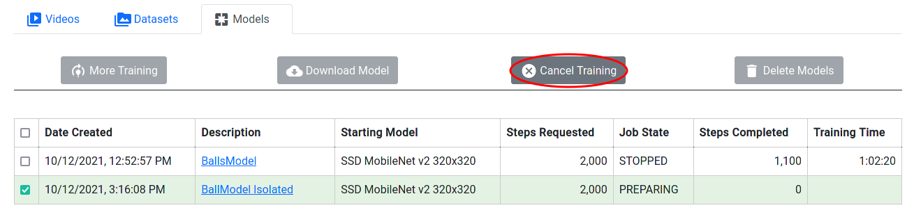

Canceling Training
==================

If one model is selected and that model's training is not finished and
has not already been canceled, the Cancel Training button is enabled.
If a model has a checkpoint, the checkpoint can still be downloaded.

   Figure 13: Canceling Training on a model