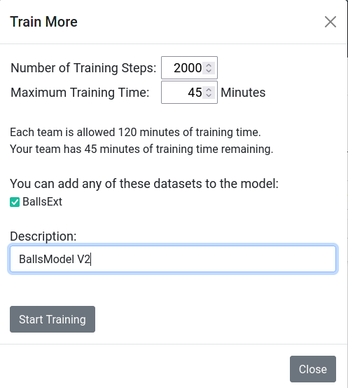

Continuing Training on Models
=============================

Once a model has been created, and its training and evaluation metrics
have been analyzed, it’s possible to use that model as a basis for
continued training. You must continue to use the same dataset(s) that
the model was originally trained with, but it’s possible to add datasets
if they are completely label identical. If this is the case, additional
checkboxes will appear in the “More Training” pop-up to allow you to add
datasets for training. There are benefits to NOT adding more datasets –
you now have a good estimation of how long your model takes to perform
minimal training, and perhaps you can accurately determine training
efficiency.

To continue training a model, select the Models tab, select the model
you wish to continue training for, and click the “More Training” action
button. A pop-up will allow you to specify the number of Training Steps
to continue with, the Maximum Training Time, additional datasets if any
are compatible, and a new Description for the new model.

   
   Figure 10: Example of continuing training and adding additional datasets

Note: Models share a parent/child relationship, much like Datasets and
Models. You cannot delete a dataset that a model used (without deleting
the model first) just in case the model wants to continue training, and
you cannot delete a parent model without deleting its children first.