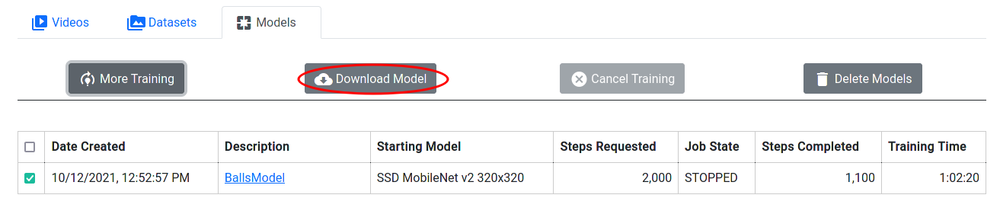

Downloading Models 
===================
In order to integrate models into your robot code, the models need to be
downloaded first. If a model is selected and that model's training has
finished and saved a checkpoint, the Download Model button is enabled.

   
   Figure 16: Downloading a Model