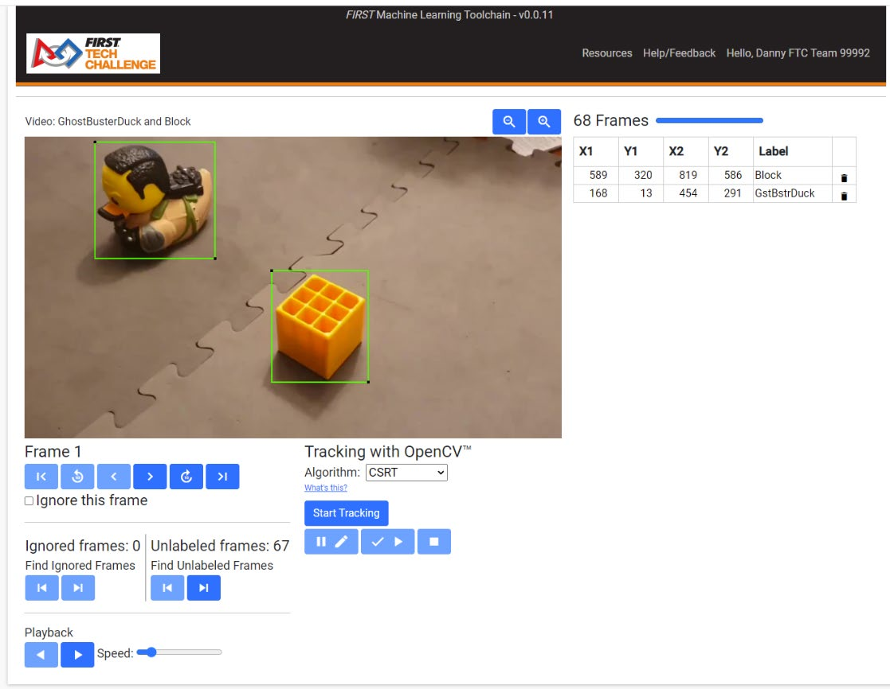
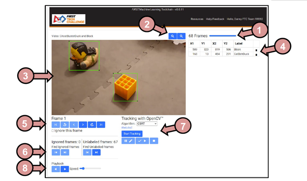

Adding labels to frames in a video
=====================================

   
|

The Video Labeling tool is the primary method for providing
input to the Machine Learning process. Also known as Supervised
Learning, a user selects regions of each video frame that contains
objects that a model will be trained to recognize and provides
categorization data in the form of a label. If done completely manually,
this process can be time consuming and error prone – fortunately there
are tools to help us do this. Because the input package is a video, each
frame is more than likely sequential to one another. As the objects move
around in the frame (such as a ball rolling by), or the camera pans
around the objects (to get multiple pose angles at varying distances
from the object) the objects are going to move between frames at
relatively predictable increments. Tracking algorithms, such as the
OpenCV Object Tracking API, can help track the movement of labeled
objects from one frame to another with the help (from time to time) from
a human supervising the process.

   
   Figure 6: Video Labeling Tool main window.

Figure 6 shows a sample of the Video Labeling Tool main window. The tool
is composed of multiple segments, labeled as follows:

1. **Loading Progress Bar** - In the upper-right-hand area of the
   window, a frame loading progress bar will show the frame load
   progress; for large videos this might take a while. While the image
   frames are loading, loaded frames may begin to be examined and
   labeled in the main image window.

2. **Zoom Tools** - If necessary or desired, these zoom buttons may be
   used to increase and decrease the size of elements in the Video
   Labeling tool window.

3. **Main Image Window** – The main image window is for viewing the
   current frame of the video, and where the labeling for the video
   happens. To create a bounding box left-click on the location for one
   corner of the box, drag the mouse to the opposite diagonal corner for
   the box, and then release the mouse button. Once a bounding box is
   shown, a label can be added to the Region Labels area or the bounding
   box can be deleted using the Trash Can icon in the Region Labels
   area.

4. **Region Labels** – When dragging a bounding box within the Main
   Image Window, the coordinates of the bounding box are stored here.
   Each bounding box needs a label. Labels must be exact – just like in
   a password, capitalization matters! Keep labels short and to the
   point.

5. **Frame Navigation Buttons** – To navigate deliberately between
   frames, and show which frame is currently being viewed, the frame
   navigation area can help out. The current Frame number is shown above
   the navigation toolbar. To ignore the current frame (completely
   eliminate the frame from being used in training) the “Ignore this
   frame” checkbox below the frame navigation toolbar must be checked
   for each frame to be ignored.

6. **Special Frame Navigation** – This area is used to view/verify
   ignored frames and to find unlabeled frames in the video. All
   instances of objects in frames should be labeled, but unlabeled
   frames (also known as “negative frames”) can be useful if your
   objects are typically hiding something that you would like for your
   model to ignore if the objects are not present.

7. **OpenCV Object Tracking tools** – Use this to begin, pause, or stop
   object tracking using the selected object tracking algorithm. Click
   the “Start Tracking” button once the first frame is fully labeled,
   and monitor each frame to ensure the bounding boxes are correct

8. **Playback Menu** - The Playback menu can play the video (with or
   without labels) at varying speeds. The Left and Right buttons
   indicate direction, and the Speed slider controls the speed of the
   playback. Click a direction once to begin playing the video in that
   direction. This is useful when reviewing bounding box selections
   between frames.

When a video is first loaded into the Video Labeling tool, it may take
several seconds for the image data to be loaded into the tool. Bounding
Boxes should be drawn around objects in the Main Image Window and each
bounding box needs to be labeled. If the bounding box needs to be
modified, click and drag the corners with a black “dot” in them to
adjust the bounding box. It’s okay if bounding boxes overlap slightly in
training data. If multiple “blocks” are in the image, then each should
get the same “block” label. If you want the model to classify an object
within a bounding box as a “duck”, then add the “duck” label, and so on.
You should not have more than 10 objects within a single frame (so keep
that in mind when creating videos); this is because the ftc-ml tool is
limited to 10 labels per frame, and there should NEVER be unlabeled
trackable objects in a frame (See :ref:`here <ftc_ml/optimize_videos/optimize-videos:optimizing 
videos for increased tensorflow model performance>` for more
information about the background detector).

Once the first frame has been fully labeled, click the “Start Tracking”
button on the OpenCV Object Tracking tools. It may take several seconds
for the tracking process to begin. Once started, OpenCV will progress
frame-by-frame, attempting to track the bounded labeled object as it
moves for you. If you need to pause the OpenCV tracking and correct a
bounding box that becomes too large, too small, or loses the object, do
so. You may resume tracking at any time.

To review the bounding boxes throughout the video, use the Playback Menu
to show each frame in sequence in the desired direction.

Once the labeling process has completed, click on the FIRST Tech
Challenge logo to return back to the ftc-ml main workflow page. Note
that there is no “save” button, actions are saved each time a browser
action occurs, and there is no way to “undo” or “redo” actions.