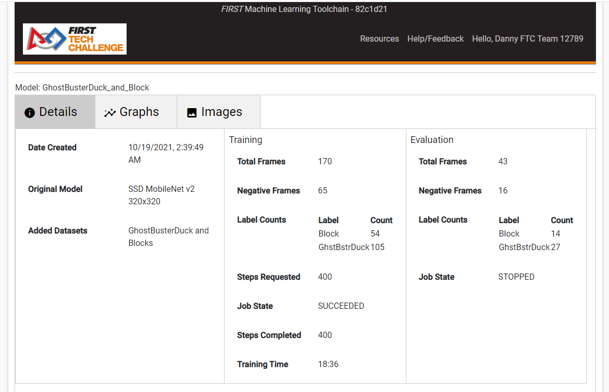
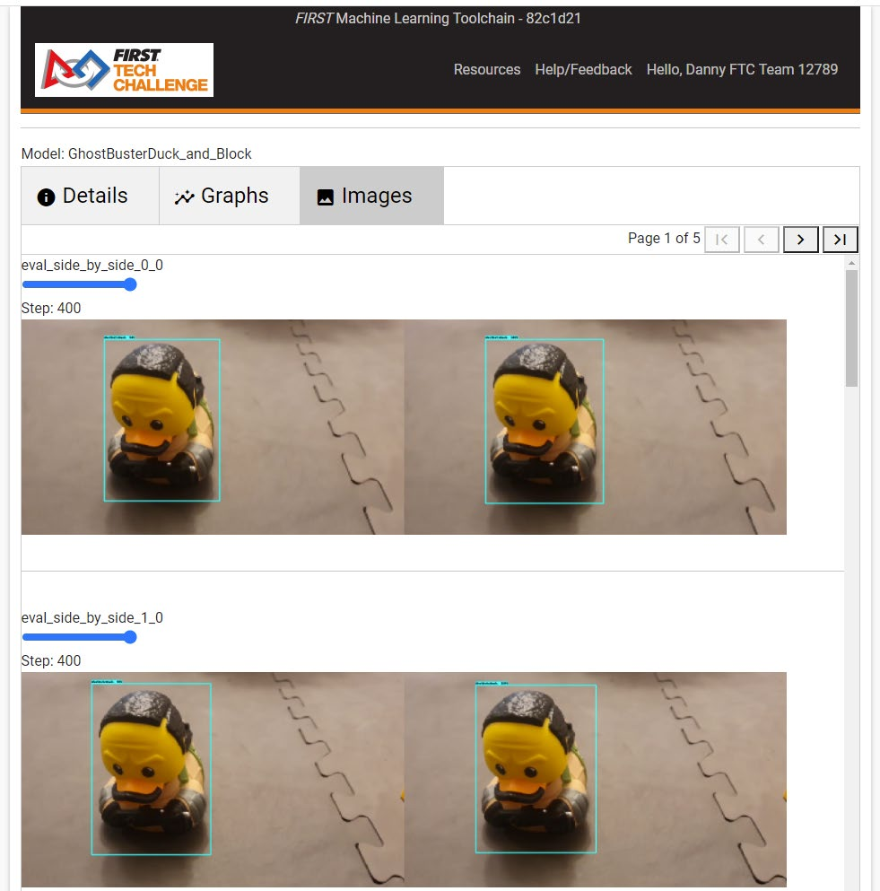

Understanding Model Metrics
---------------------------

Models are essentially prediction engines, or weighted algorithms that
are designed to predict a future value given a set of input values. When
a model is being trained, data from the Training pool is being used to
train the model along with a set of weights which can be tuned to help
the model with its predictions. For each step in training, data from the
Testing pool is used to measure the cumulative model’s ability to make
predictions. Loss functions are used to determine how far the predicted
values of the model deviate from the actual values in the Testing data;
this deviation is known as “Loss”. Optimization functions use the loss
to help adjust model weights between each training step to minimize that
loss, so that each step the model prediction is closer to the actual
data. This is, in effect, what training is all about.

Each training checkpoint (100 training steps), model metrics are saved –
among these metrics include the loss values for various properties of
the model. Metrics can be analyzed to get a general sense for how model
training is going, and whether or not the model is reaching convergence
(reaching the point where additional training yields little to no
benefits). Several of these metrics are described below:

Training Metrics (metrics taken as the model is being trained)

-  **learning_rate** – The learning_rate refers to the average update
   rate at which the model’s weights are changing in order to fit the
   data. Really small values means the model will take a long time to
   adjust the weights to fit the prediction to the data, and really
   large values means the model might overshoot as it’s trying to adjust
   the weights. ftc-ml ramps up the learning rate and then lowers the
   learning rate over the course of the model training in a process
   known as “warm-up”, which helps combat training bias in datasets when
   a portion of the early training data might cause the model to skew
   toward undesired training features based on related commonalities.

-  **Loss/classification_loss** – This is the loss for the
   classification of detected objects into various classes (Labels),
   such as Block, Ball, Duck, etc. During training, this graph should
   trend downward as the classification improves. Values closer to zero
   are better.

-  **Loss/localization_loss** – This is the loss for the bounding box
   regressor, which is the function for determining the bounding box for
   detected objects. This graph should trend downward as the prediction
   for the bounding box moves closer to the labeled bounding boxes.
   Values closer to zero are better.

-  **Loss/regularization_loss** – This is the loss for a larger set of
   “global” optimization metrics that help drive the model in desired
   directions. Since parameter tweaks aren’t available to users in
   ftc-ml, this metric is generally meaningless for analyzing model
   behavior during training.

-  **Loss/total_loss** – This is an overall summary of the loss metrics
   for the model as a whole. Values closer to zero are better.

-  **steps_per_sec** – This shows the average model training speed at
   each checkpoint.

Evaluation Metrics (metrics taken as the model is being
tested/evaluated)

-  **DetectionBoxes_Precision/mAP** – This is the “mean average
   precision”, which is an overall precision of detection/classification
   across all frames, labels, and bounding box thresholds and taking the
   average. This gives a view of how well the model is generally
   performing; values closer to 1.0 are better.

-  **DetectionBoxes_Precision/mAP (large, medium, small)** – This
   filters and separates the mAP metrics into three buckets based on the
   average pixel size of the detected objects and bounding boxes with
   respect to the model size. Values of -1 indicate that no objects met
   the size constraints for that bucket.

-  **DetectionBoxes_Precision/mAP(@.50IOU, @.75IOU)** – IOU stands for
   “Intersection Over Union”, also referred to as the Jaccard index, and
   is essentially a statistic used for gauging the similarity and
   diversity of sample sets. Normally an IOU >.50 is considered a good
   prediction, and >.75 is considered a really good prediction. These
   metrics are the average precision using only the specified IOU (but
   still going over all frames and labels). The idea of this metric is
   to give you a rough sense of accuracy of object detection if you are
   not super strict about the position of your bounding boxes. For
   example, in the .50IOU case, you would see model accuracy over all
   frames and labels if we “only somewhat” care about bounding box
   accuracy. However, at .75IOU the bounding box accuracy is taken more
   seriously, so model accuracy is often less with higher values of IOU.
   Values closer to 1.0 are better.

-  **DetectionBoxes_Recall/AR(@1, @10, @100)** – These are “mean average
   recalls”, or a metric for specifically measuring object detection
   performance, bucketed by the maximum number of detections within the
   image (objects with only one detection would be in the @1 bucket,
   objects with at most 10 detections would be in the @10 bucket, and so
   on). The Recall metric is a metric that compares “true data” with
   “predicted data”, and provides an indication of the number of
   misdetections. A value of 1.0 means “all perfect detections”, and the
   more “misdetections” in the model the closer the value is to zero.

-  **DetectionBoxes_Recall/AR@100(large, medium, small)** – these are
   average recalls bucketed by the size of the detected bounding box.
   Notice the AR@100 in the metric – this means only images with at most
   100 detections are used (typically this will mean all images for
   fml-tc). Buckets are equal to that of the /mAP metric above. Values
   of -1 indicate that no objects met the size constraints for that
   bucket.

-  **Loss/classification_loss** – Same as Loss/classification_loss in
   Training Metrics, except this is for the Evaluation/Testing data.

-  **Loss/localization_loss** – Same as Loss/localization_loss in
   Training Metrics, except this is for the Evaluation/Testing data.

-  **Loss/regularization_loss** – Same as Loss/regularization_loss in
   Training Metrics, except this is for the Evaluation/Testing data.

-  **Loss/total_loss** – Same as Loss/total_loss in Training Metrics,
   except this is for the Evaluation/Testing data.

To view model metrics, click on the Description link for the model in
the Models tab you wish to view. This will open the “Monitor Training”
viewer for that model.

   Figure 11: Viewing the model details in the "Monitor Training" viewer

The Monitor Training Viewer, seen in Figure 11, has 3 separate “tabs”
within the viewer.

1. **Details** – Here the general training details are listed for the
   model. This includes which datasets were used to create the model,
   which model originated this model, training details, and evaluation
   details. This is the default tab when the Monitor Training viewer for
   the model is opened.

2. **Graphs** – This provides a scrollable viewer to see the graphs of
   specific performance metrics (discussed above). When the Monitor
   Training viewer is opened, the graphs may take several seconds to
   load – a rotating icon will show as the metric graphs are loaded.

3. **Images** – In the Images tab, you are able to see how well the
   model performed on each evaluation image at each 100-step checkpoint
   for each of the evaluation images in your data set. When the viewer
   is first opened, the images may need to load; a spinning icon in the
   images tab will be shown while loading. An example of the Images Tab
   can be seen in Figure 12 below. There are two copies of the same
   image side by side – each image represents one evaluation image in
   the Dataset. The image on the right always shows the bounding box
   labeled by the user, and always has a 100% detection shown on the
   bounding box. The image on the left shows the bounding box and
   detection percentage as predicted by the model at a specific
   checkpoint. In the example 400 steps were run and the images are
   showing the bounding boxes and detection rate of the 400-step
   checkpoint. Move the slider above each image to select a different
   checkpoint. The images are small, but to view the images larger
   right-click the image you wish to view and select “Open image in new
   tab” to open the image at full resolution in a new tab.

   Figure 12:Viewing Training Image Performance in the Monitor Model viewer

If the images are scaled incorrectly (too large or too small), reload
the page in the browser with the Images tab opened until the tab has
completely loaded. Images are scaled based on the size of the browser
during page load, and sometimes the page size is calculated incorrectly
when the Images tab isn’t selected.