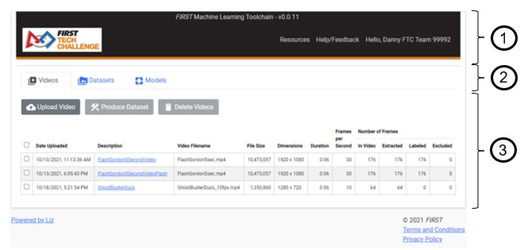

Overview
----------

The ftc-ml tool is designed in such a way as to make TensorFlow model
building simple and easy. It does not provide the myriad of
user-accessible parameters to tweak that TensorFlow offers, so it’s not
meant as a general-purpose TensorFlow model building tool. However,
teams will find that the parameters are sufficient for the vast majority
of TensorFlow Object Detection (TFOD) use-cases used in *FIRST* Tech
Challenge.

The process of building/training a TensorFlow model using the ftc-ml
tool is summarized as follows:

1. Teams create short videos of the objects that they would like the
   model to be trained to recognize.

2. Videos are uploaded into the ftc-ml tool, and individual objects to
   be recognized in each video frame are labeled by the users.

3. Datasets composed of one or more labeled videos are created.
   Unlabeled videos, if used in a dataset, must be combined with labeled
   videos.

4. One or more datasets can be combined to create a model. The model is
   trained using Google TensorFlow cloud training services using the
   selected datasets as training resources.

5. The model is downloaded from the ftc-ml tool, and installed either
   onto the Robot Controller (for OnBotJava or Blocks) or within the
   Android Studio assets for use on the robot.

6. Robot code is modified to use the new model file and the labels
   created during the model creation process.

The ftc-ml main workflow page is designed to facilitate the model
building/training process, and is demonstrated in Figure 4. The main
body of the workflow page is designed to lead the user through a
chronologic workflow of building/training TensorFlow models. This page
is designed to be rendered minimally full-screen on a 1280x720
resolution monitor.

   Figure 4: Example ftc-ml Main Workflow Page, showing sample **Videos**
   menu tab content

There are 3 primary areas of the main workflow page:

1. **Title Header** – The header has several important elements in it.

   a. **Title and Version Information**\ *–* The title of the product,
      “FIRST Machine Learning Toolchain”, is shown alongside a version
      number indicator. Each time a new version of the software is
      deployed the version indicator will update.

   b. **FIRST Tech Challenge Logo** – On the left of the header is a
      *FIRST* Tech Challenge logo. Clicking on the FIRST Tech Challenge
      Logo will always bring you back to the main workflow page,
      regardless of what menu or screen you are currently in, and will
      always restore the workflow Tab to the last selected Tab. There is
      no need to “save” any work or progress when using the ftc-ml tool,
      progress and work is saved automatically.

   c. **Resources** – The Resources link will navigate to a page that
      contains resources such as the most recent copy of this ftc-ml
      manual and links to important or supplementary information.

   d. **Help/Feedback** – The Help/Feedback link will navigate to the
      ftc-ml support forums. The support forums also use SSO login
      authentication, so to log in just click the “Login” button and if
      prompted just click the “Sign in with FIRST” button.

   e. **Hello <NAME> Team <NUMBER>** - this link will take you to the
      ftc-scoring accounts page where you can log off when desired. This
      link also serves as the mechanism for invalidating a team
      selection (if your account is rostered on multiple teams) so
      that a different team can be selected. See section 4.3 and section
      4.4 for more information.

2. **Workflow Tabs** – The three main workflow tabs are **Videos**,
   **Datasets**, and **Models**. These workflow tabs are mostly
   chronologic from left to right through the TensorFlow model training
   process. Clicking on each tab will show the tab’s contents in the Tab
   Contents section of the page.

3. **Tab Contents** – Shows the specific actions and data for the
   currently selected workflow tab.

   a. **Videos** – The **Videos** menu tab contains/displays action
      buttons for Videos. This includes Upload Videos, Produce Datasets
      (from selected Videos), and Delete Videos. A listing of all of the
      uploaded videos and a summary of the video contents is provided.
      Each video’s description, once processed, provides a link to the
      video labeling page for that video.

   b. **Datasets** – the **Datasets** menu tab contains/displays action
      buttons for Datasets. This includes Download Datasets, Start
      Training models (with selected Datasets), and to Delete Datasets.
      A summary of each Dataset’s contents are displayed for each
      Dataset.

   c. **Models** – the **Models** menu tab contains/displays action
      buttons for Models. This includes More Training (to continue
      training on an existing model), Download Model, Stop Training, and
      Delete Model. A summary of each Model’s training metrics is
      displayed for each Model. Each model’s description, once
      completed, shows in-depth details on the model including training
      performance metrics and a visual comparison of test data.

This section is meant to provide a basic explanation of the model
creation process. For information regarding best practices for creating
models, see :ref:`Optimizing Videos for increased TensorFlow Model
Performance<ftc_ml/optimize_videos/optimize-videos:optimizing videos for increased tensorflow model performance>`.
