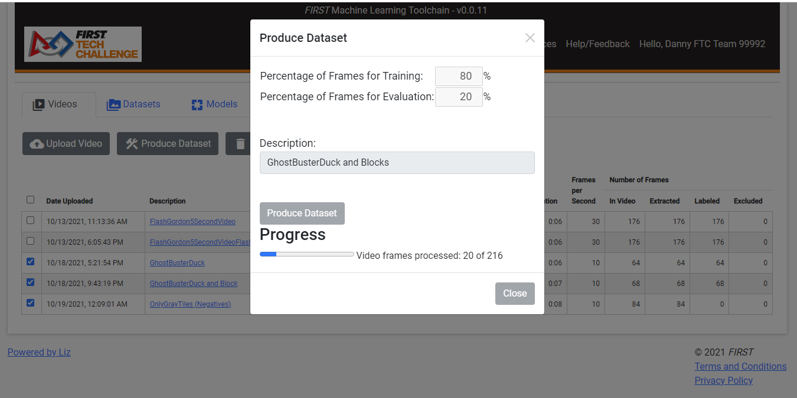
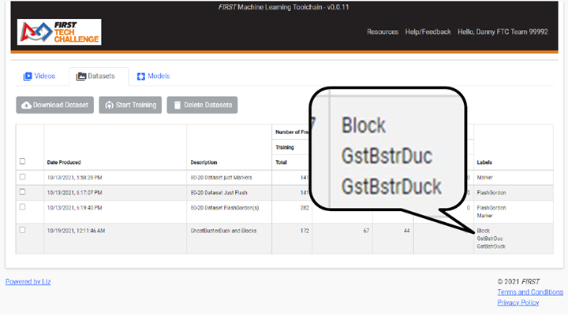

Producing Datasets
===================
Video frames, bounding boxes, and labels are the core inputs to the
TensorFlow model training platform. In order to package this data
together for TensorFlow, these inputs are converted into Datasets.
Datasets are then submitted to the TensorFlow API to create models.

To create a dataset, one or more videos should be selected (checking the
box to the left of each video to be combined into a single dataset) and
the “Produce Dataset” action button pressed. This will open a pop-up
dialog to select the number of frames for training and evaluation. The
standard is to take 80% of the frames for training the model, and saving
20% for validation/evaluation/testing. Frames are randomized and
separated into the two pools (Training vs Evaluation) based on this
percentage. It’s not recommended to change this. Enter a descriptive
name in the “Description” field, as this will be the description for the
dataset. Keep it short and to the point. When ready, press “Produce
Dataset” – the ftc-ml tool will extract the frame, label, and bounding
box information and build the dataset. Don’t worry if you close your
window or the pop-up goes away before it’s done, when the dataset is
completed it will show up in your “Datasets” Tab Content area.

      Figure 7: Creating a Dataset with the "Produce Dataset" video action

The most important thing to consider when creating a dataset is the
final list of labels. There are several rules to datasets that must be
adhered to:

-  Datasets must contain AT LEAST one label. In other words, a dataset
      cannot contain only negative frames (frames that are unlabeled,
      because no actual objects being detected are present).

-  Datasets should be considered “whole” by themselves. While it’s
      possible to create datasets for individual labels, datasets cannot
      be “combined” to train models unless they contain exactly the same
      labels. For example, a dataset containing only the label “Bird”
      cannot later be combined with a dataset containing both labels
      “Bird” and “Bee” to form a model. However, a single dataset may be
      created out of multiple labeled videos that contain only “Bird”,
      multiple videos that contain both “Bird” and “Bee”, and videos
      that only contain negative frames all with the Video “Produce
      Dataset” action.

When creation of datasets is complete, check the dataset in the
“Dataset” tab. Look at the labels used to create the dataset and make
sure they’re spelled correctly. If one of the videos had a misspelling,
it might be necessary to find and correct the video and create the data
set again. See Figure 8 for an example of a dataset made from one or
more videos with a misspelled label.

      Figure 8: Whoops! Dataset made with videos containing misspelled labels