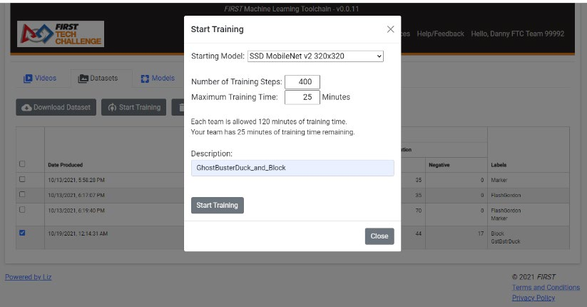

Training Models
==================

Once a Dataset is created, you’re almost ready to start training your
model! From the Dataset tab, one or more datasets may be selected to use
as training input for a TensorFlow model. Remember, if selecting
multiple datasets the datasets must be 100% label identical in order to
be combined into a model, or else the “Start Training” button will not
be enabled. No more, no less!

   Figure 9: Configuring a Model Training Session

Once you’ve selected the dataset(s) you wish to use to train a model,
clicking on the “Start Training” button brings up a pop-up window as
seen in Figure 9. Here you’re able to tweak several options:

-  **Starting Model** –The typical starting model size is the SSD
   MobileNet v2 320x320, and this is the default recommended model type.

-  **Number of Training Steps** – “Steps” are the basic “work unit” for
   training a model. A specific number of training frames are processed
   each step, known as the “batch size”. The batch size is chosen on a
   per-model basis depending on the size of the model and the hardware
   accelerator being used to train the model (TPU or GPU), optimizing
   for frame processing and memory utilization while training on that
   model. For most models provided by ftc-ml for training, the batch
   size is set at 32; this means 32 frames will be processed each step.
   An “epoch” is a term used to represent the number of steps required
   to process every frame in a training set at least once (one full
   cycle). For example if there are 1300 training frames in a dataset,
   it will require at least 41 steps (rounding up) to complete one epoch
   for a model with a batch size of 32. As a rough rule of thumb, models
   should train for at least 100 epochs. A quick formula to use to
   determine how many steps to train your model for is:

.. math:: Steps = \frac{\text{Epochs * TrainingFrames}}{\text{BatchSize}}

Using this formula, it can be determined that 4063 steps (rounding up)
are required to train 1300 training frames for at least 100 epochs on a
model with a batch size of 32 frames. In the model training pop-up,
ftc-ml will indicate the batch size, calculate and display the number of
steps to complete one epoch, and calculate and display the number of
epochs that will be processed with the selected number of training steps
and model.

“Model checkpoints” are saved after every 100 steps – model checkpoints
contain training and evaluation data (used for metrics) as well as a
“snapshot” of the model (though only the most recent model snapshot is
kept). It is highly recommended to keep the number of training steps as
a multiple of 100, so it would be recommended to train our example of
100 epochs of 1300 training frames for 4100 steps in order to retain all
metrics and model training.

NOTE: 100 epochs is just a rough rule of thumb; careful analysis of the
model metrics will help you determine when the model has “trained
enough” – it is possible to “overtrain” a model by training for too many
steps, causing the model to be less general and more heavily weighted
toward training data.

-  **Maximum Training Time** – If you specify 500 steps the model will
   continue to train until 500 steps have been completed, or until the
   maximum training time is reached, whichever comes first. If your
   model trains for 499 steps, and is forced to quit because it reached
   its maximum training time, the extra 99 steps will be wasted training
   because only the last model checkpoint is used and checkpoints are
   only saved every 100 steps. Unfortunately we cannot track how many
   ACTUAL steps the model trains for, we only get the last model
   checkpoint. Therefore, set your number of training steps and your
   maximum training time accordingly to ensure you don’t lose training
   steps due to reaching the maximum training time. If you allocate 60
   minutes for a training session, and it only takes 50 minutes to
   complete training, you get the remaining 10 minutes back once the
   training session has completed. As a general rule of thumb, models
   with a batch size of 32 train approximately 3,000 steps in around 60
   minutes in ftc-ml.

-  **Description** – this will be used for the description of your
   Model. Keep it short and succinct.

Click the “Start Training” button and your dataset is shipped off to the
Google TensorFlow platform for training!

**KNOWN BUG**: Sometimes once you press the “Start Training” button the
pop-up will eventually go away but the page is still grayed and
disabled. If this happens, press the browser’s Refresh button to reload
the page.

To monitor model training, a user may monitor the status on the Models
tab or they can click on the description for the model. The main status
indicators are “Job State”, “Steps Completed”, and “Training Time.”
Steps Completed will update each time a model checkpoint is reached, and
Training Time will update while the Job is in the RUNNING state. A full
list of Job States is as follows:

Table 1: Job State possible values

+-------------------+-------------------------------------------------+
| **Name**          | **Description**                                 |
+===================+=================================================+
| SUCCEEDED         | The model has been trained successfully. Check  |
|                   | metrics for performance.                        |
+-------------------+-------------------------------------------------+
| FAILED            | The model training has failed.                  |
+-------------------+-------------------------------------------------+
| CANCELED          | The user canceled the job prior to any          |
|                   | checkpoints being created.                      |
+-------------------+-------------------------------------------------+
| STATE_UNSPECIFIED | This means that the model is in an unpredicted  |
|                   | state. Contact Support.                         |
+-------------------+-------------------------------------------------+
| QUEUED            | The job has been queued but has not yet         |
|                   | started, is waiting for resources.              |
+-------------------+-------------------------------------------------+
| PREPARING         | The job is preparing to run.                    |
+-------------------+-------------------------------------------------+
| RUNNING           | The job is running.                             |
+-------------------+-------------------------------------------------+
| STOP REQUESTED    | The user pressed the stop button, but the job   |
|                   | hasn’t been CANCELED yet.                       |
+-------------------+-------------------------------------------------+
| STOPPING          | The job is in the process of being stopped.     |
+-------------------+-------------------------------------------------+
| STOPPED           | The user canceled the job after checkpoints     |
|                   | were created, can train more.                   |
+-------------------+-------------------------------------------------+
| TRY_AGAIN_LATER   | The job cannot be queued due to current         |
|                   | resource limitations. Try again later.          |
+-------------------+-------------------------------------------------+
