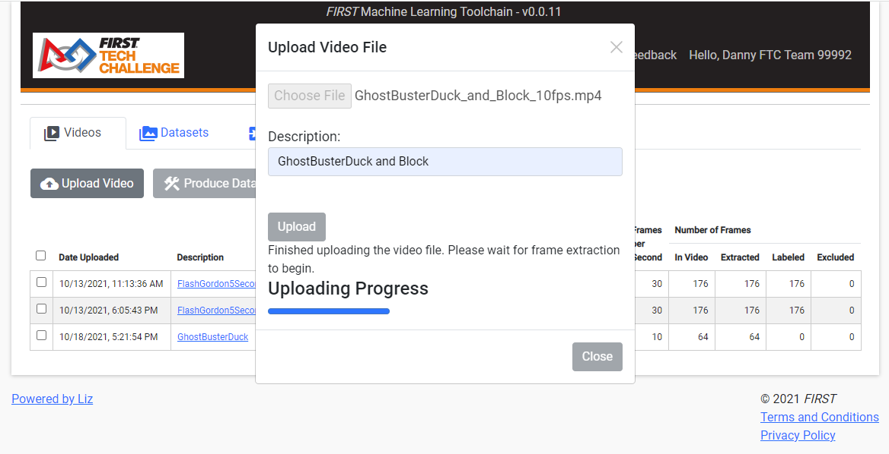

Uploading videos to the ftc-ml tool
===================================

*Please be aware that for youth protection purposes, only adult coaches
given the Coach1 or Coach2 team role within the* FIRST *Dashboard can
upload videos. All other accounts can perform all other functions.* Once
a video is ready for upload, select the Videos tab on the main workflow
page. Click the Upload Video button, which will create a pop-up with the
title, “Upload Video File.” On this pop-up page, click the “Choose File”
button to browse the local computer for the video file you wish to
upload. Enter a description for the video in the box under the label
“Description.” Make the description meaningful, but short. Once
completed, click the “Upload” button. If you wish to cancel the action
and close the pop-up, click the “X” or the “Close” button.

   Figure 5: Uploading a video and preparing for frame extraction

Once the “Upload” button is clicked, the ftc-ml tool will begin the
process of uploading the video. A progress bar will show the progress of
the video upload. Once video upload process is complete, the ftc-ml tool
will add the video to the Tab Contents area and prepare to extract the
individual frames in the video for processing. Clicking the “Close”
button, the “X” button, or clicking anywhere outside the pop-up will
close the pop-up window, but the adding and extraction process is still
being carried out by the server in the background. It may take several
seconds for the new video to show up in the Tab Contents area. Once the
new video shows up in the list, it may take several seconds for the
extraction process to begin, depending on server resources. As frames
are extracted, the “Extracted” column will begin to count up. Once the
“Extracted” column matches the “In Video” column, the description of the
video will change to a link. Clicking on the link will navigate to the
Video Labeling tool where objects in video frames may be labeled.
