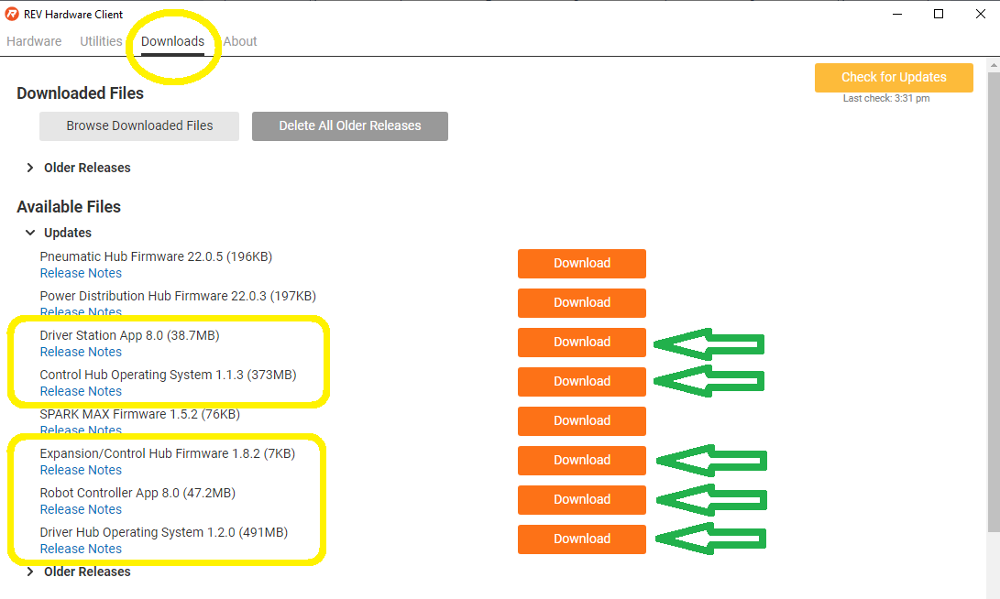
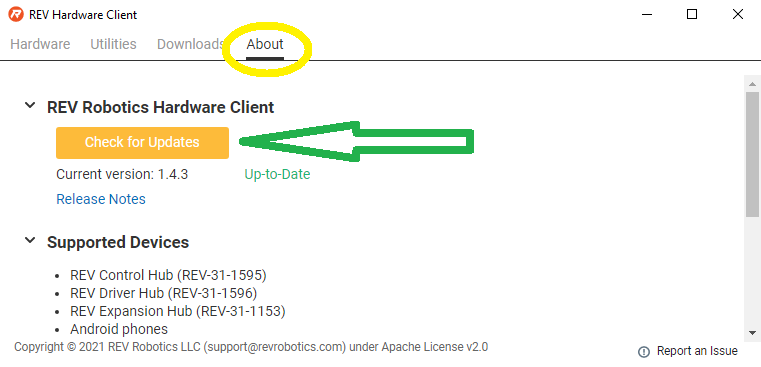

Installing and Updating the REV Hardware Client
===============================================

The REV Hardware Client is a desktop app, or software tool, that simplifies
updating software on devices used in *FIRST* Tech Challenge. Unfortunately the
REV Hardware Client is currently Windows-only, Apple/Mac users must use
alternate methods of updating software. In this tutorial, some steps ask to
download software and updates - doing this is not required, but will save time
during updates. 

To install, use the following steps on a **64-bit** PC or laptop running
Windows 7 or newer.

**Apple/Mac users should skip these steps.**

.. tip:: 
   Not sure about 64-bit? In Windows Explorer, right-click “Computer” (Win
   7) or “This PC” (Win 10), choose Properties, see “System type”.

Installing the RHC
------------------

1. Connect the computer to the internet, and download RHC
   `from the REV RHC download page <https://docs.revrobotics.com/rev-hardware-client/>`__. Just
   click the orange Download button and choose your computer’s Downloads
   folder to store the file.

   .. figure:: images/010-download.png
      :alt: Downloading REV Hardware Client
      :width: 80%
      :align: center

      Downloading REV Hardware Client

   |

2. See the downloaded file shown at lower left (green arrow). Click that
   filename to begin installing the RHC app; then follow the prompts.
   When that’s complete, the RHC icon will appear on your computer’s
   desktop.

   If the computer is **not** 64-bit, RHC installation will fail with an
   appropriate error message.

Downloading Initial Updates
---------------------------

Open the RHC app. This is a good time to **pre-download** various
pieces of software you might need soon.

Why download now? Later, this computer might be connected via Wi-Fi to a
Robot Controller, not to the internet. Or a good internet connection
might not be available when urgently needed (Murphy’s Law).

Click on the Downloads tab (top left). Under “Available Files” is a list
of software for *FIRST* Tech Challenge and other software for a different program called
*FIRST* Robotics Competition.

   REV Hardware Client Available Files

|

Click the orange Download button, only for the 5 *FIRST* Tech Challenge items (yellow
rectangles). This may take a few minutes; the OS files are large.

You don’t need to track where these files are stored; they will be
available to the RHC app when needed for device update.

When complete, these 5 items will appear under the heading “Downloaded
Files”.

Updating the REV Hardware Client
--------------------------------

1. On a Windows computer connected to the internet, open the REV
   Hardware Client.

   REV Hardware Client Available Updates

|

2. Click the "About" tab, then click "Check for Updates" (green arrow,
   above). If a new version is available, click to update.

That’s all for now! You will use these files later, when updating
various devices. More info about the RHC is
`at REV Robotics’ excellent documentation site. <https://docs.revrobotics.com/rev-hardware-client/>`__ 

Questions, comments and corrections to westsiderobotics@verizon.net

