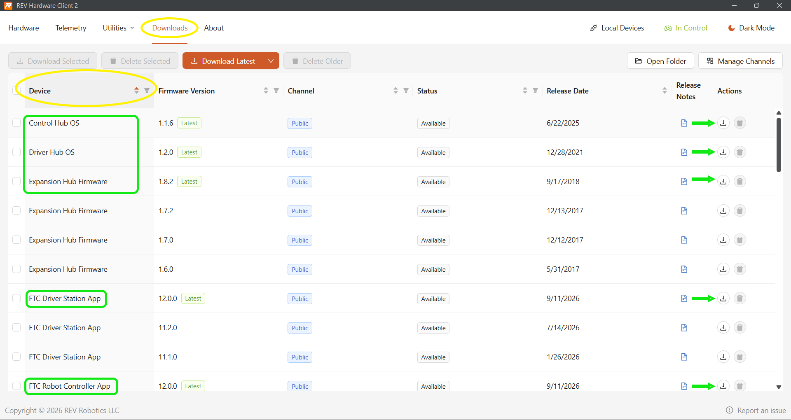
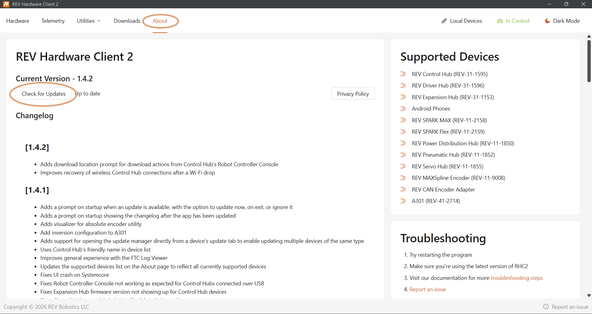
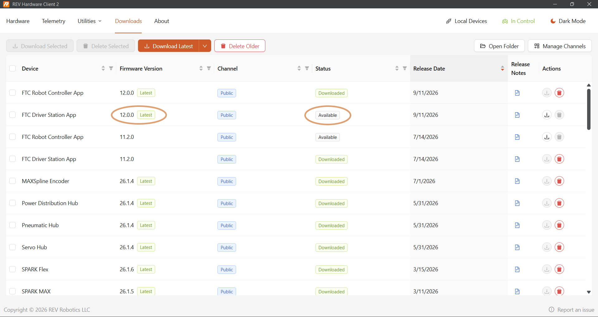

Installing and Updating the REV Hardware Client
===============================================

The :term:`REV Hardware Client` (RC) is a desktop app, or software tool, that simplifies
updating software on devices used in *FIRST* Tech Challenge. 
In this tutorial, some steps will ask you to download software and updates - 
doing this is not required, but useful if you happen later to not have an internet connection.

To install, use the following steps on a PC or laptop running Windows 11.

**Apple/Mac and Linux users should visit the REV website for install instructions. 
The overall process is very similar.**

Installing the RC 2
--------------------

In 2026 there is a new version 2 of the REV hardware client. It is separate from the 1.x versions. 
If you already have a 1.x version installed, there is no automatic upgrade to version 2.

.. Warning:: If you are using an Android phone for a Robot Controller do NOT use version 2 of the REV Hardware Client.
   The RC version 2 is NOT able to recognize or install/update the Robot Controller App on an Android phone.
   It will only install the Driver Station App.
   
   You can use the `original RC <HTTP://docs.rev robotics.com/rev-hardware-client>`__ to install the Robot Controller App
   and Driver Station App on an Android phone.  

1. Connect the computer to the internet, and go to the
   `RC version 2 Overview & Installation page <HTTP://docs.rev robotics.com/rev-hardware-client-2/>`__.
   Click the orange "REV Hardware Client 2" button. 

   .. figure:: images/010-download.png
      :alt: screenshot of the installation page
      :width: 80%
      :align: center

      RC version 2 Overview & Installation page

   |

2. This should display a page that varies depending on whether you are using Windows, macOS, or Linux.
   Click the green button, for Windows users it says "INSTALL AND LAUNCH".

   .. figure:: images/015-install-and-launch.png
      :alt: screenshot of the install and launch page
      :width: 80%
      :align: center

      Downloading REV Hardware Client 2

   |

3. Clicking that button will download a file. Choose your computer’s Downloads
   folder to store the file (if that is an option your browser supports).

   The file is likely named **rev-hardware-client.exe**.
   Your browser may allow you to run that program after it is downloaded. If needed, 
   find that file in your browser's downloads folder. Click that
   filename to begin installing the RC 2 app.

.. tip:: Be patient, the download file is small, but when you run the install program it copies over
   500MB of files. This can take over 10 minutes to copy and install over a slow Wi-Fi connection.
   There is a progress meter showing how much is done, but over a slow connection it may appear not to move.
   
When complete the program **REV Hardware Client 2** is installed, but there is no icon on the desktop.
Run the program from the Windows Start menu.
Search for "REV" to find it, or look under R alphabetically in the list of programs.

.. note:: 
   If you have the original version of the RC installed, installing version 2 does NOT uninstall the that version.
   Go to Add or Remove Programs in Windows and select the older version to uninstall it.

Downloading Initial Updates
---------------------------

This is a good time to **pre-download** various pieces of software you might need soon.
These are the :term:`firmware <Firmware>`, operating system and App files that the RC
can install on your devices.

Why download now? Later, this computer might be connected via Wi-Fi to a
:term:`Robot Controller`, not to the internet. Or a good internet connection
might not be available when urgently needed (`Murphy’s Law <HTTP://en.wikipedia.org/wiki/Murphy's_law>`__).

Open the RC app. 
Click on the "Downloads" tab. 
This will display a long list of files you can download for all REV hardware.
This includes numerous devices that are not for *FIRST* Tech Challenge.
You can ignore the Pneumatic Hub Firmware, the Power Distribution Firmware,
and the SPARK MAX Firmware as these are for the *FIRST* Robotics Competition program.

If may help to click on the upper triangle in the Device column so that this list
is sorted by device and "Control Hub OS" is the first item shown.
This makes it easier to see the devices for *FIRST* Tech Challenge.

   REV Hardware Client Available and Downloaded Files

|

As shown above *FIRST* Tech Challenge has the following device files:

1. Control Hub OS
2. Driver Hub OS
3. Expansion Hub Firmware - Note: the Control Hub also uses this firmware file.
4. FTC Driver Station App
5. FTC Robot Controller App
6. Not shown is the "Servo Hub Firmware" which you can locate in the list and download
   if you have a REV Servo Hub. The older REV Servo Power module cannot be updated.

.. caution:: Android Studio users should probably NOT download the FTC Robot Controller App. 
   Android Studio users compile their programs to create their own copy of the FTC Robot Controller App
   that they run on their robot.
   You don't want to overwrite your Android Studio created App on the robot with the downloaded App.
   
   Teams that use Blocks or OnBot Java SHOULD download and install the FTC Robot Controller App.

The Status column will show "Available" or "Downloaded". 
In addition, there is a "Latest" tag beside the version number.

Look for those files and if there is a "Latest" version that is "Available" you should download it.
Click the Download icon for each (beside the green arrow).
This may take a few minutes; the OS files are large.

You don’t need to track where these files are stored; they will be
available to the RC app when needed for device update.

When complete, these items will appear with the label "Downloaded"
instead of "Available".

Updating the REV Hardware Client
--------------------------------

The REV Hardware Client should check for new versions of itself when you start the program.
You can also check this yourself.

1. On computer connected to the internet, open the REV
   Hardware Client.

2. Click the "About" tab, then click "Check for Updates" button. If a new version is available, click to update.

   REV Hardware Client Check for Updates

|

That’s all for now! You will use these files later, when updating
various devices. More info about using the RC to update your devices is
`at REV Robotics’ excellent documentation site. <HTTP://docs.rev robotics.com/rev-hardware-client-2/rhc2/navigation/>`__ 

Updating the Downloaded Files
-----------------------------

From time to time, *FIRST* will release new versions of the Apps.
It's unlikely, but possible that REV might update the Rev Hub OS or Firmware files.
It possible that an urgent fix might be released at any time.

1. On computer connected to the internet, open the REV Hardware Client.
2. Click on the "Downloads" tab.  This will display a long list of files you can download for all REV hardware.
   Be default it displays the most recently published updates first.

   REV Hardware Client Available Updates

|

The FTC Robot Controller App and the FTC Driver Station App update more frequently than other devices.
They are likely at or near the top of the list.
Check for a version that is marked "Latest", and if it is "Available" then you can download it.
If it is already "Downloaded", you already have it on your PC or laptop.

See :doc:`Updating Components of the Control System </ftc_sdk/updating/index>` for more information about App updates
and how to get notified when updates occur. 

Questions, comments and corrections to westsiderobotics@verizon.net

