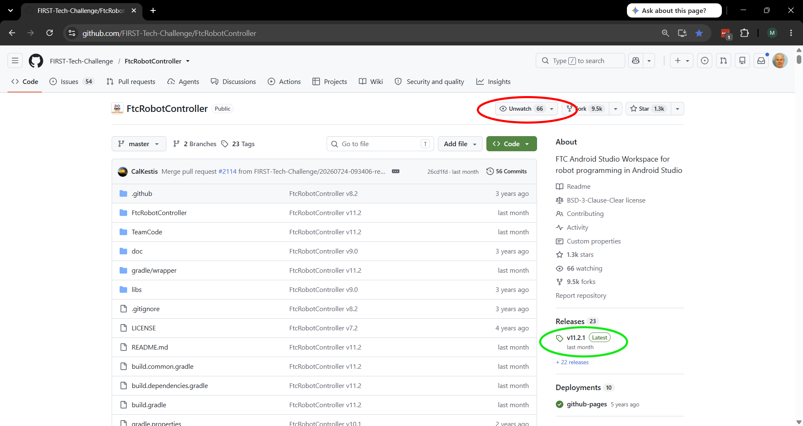
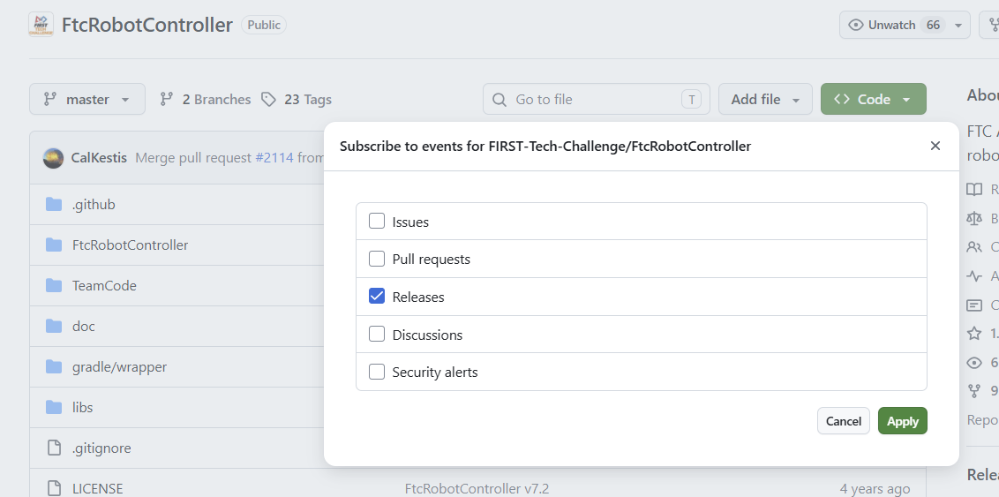

.. meta::
   :title: Updating Components of the FTC Control System
   :description: A comprehensive guide to updating key components of the FIRST Tech Challenge Control System
   :keywords: FTC Docs, FIRST Tech Challenge, FTC, Control System, update

Updating Components of the Control System
=========================================

Components of the *FIRST* Tech Challenge Control System will
periodically receive updates.  
It is recommended teams update each component of the Control System
to the latest released version of firmware, operating system and applications.

The Robot Controller App and the Driver Station App have an update schedule based on the game season.
The season Kickoff SDK Release each year will include new game specific assets such as 
:doc:`AprilTags </apriltag/vision_portal/apriltag_intro/apriltag-intro>`. 

.. note::
   The most recent versions of FTC software have the
   latest bugfixes and updates. Teams are encouraged to update their
   software to the most recent version. FIELD STAFF at an FTC Event may not be able to
   provide comprehensive support to teams using older software.

A **Robot Controller** should be using the most recent Robot Controller App.
At the start of a new FTC season this should be the Kickoff SDK Release
which normally comes out a few weeks after kickoff.

A **Driver Station** should be using the most recent Driver Station App.

Regardless of the App versions selected, it is highly recommended that the installed
Robot Controller App and Driver Station App versions match major and minor values
to ensure compatibility as not all software versions are compatible with each other.
e.g. if the Robot Controller App is version 11.1, the the Driver Hub should be
using Driver Station App 11.1.

Teams may choose to run older versions of software without affecting their
robot inspection status at an event. This is not recommended, but allowed.

Teams may also use Android phones as their Robot Controller or Driver Station.
Please see the Competition Manual for permitted devices and the procedure for requesting exceptions.

.. caution::
   Due to unpredictable variations in Android software across different
   manufacturers and updates, the REV Control Hub is the only officially supported
   Robot Controller.
   
   The REV Driver Hub is the only officially supported Driver Station device. 
   Not all phones have hardware driver support for the gamepads that are used in a driver station.
   
   Teams choosing to use an Android phone are responsible for testing and verifying its
   compatibility, functionality, and performance.
   
Update Instructions
-------------------

.. tip::
   It is recommended to use the 
   `REV Hardware Client <https://docs.revrobotics.com/rev-hardware-client/>`__
   to update devices if a Windows computer is available. 
   The REV Hardware Client is able to update all control system device software.
   

Alternate methods can be used to update devices, see the detailed 
instructions linked to below.

.. toctree::
    :maxdepth: 1
    
    Updating REV Hardware Client <hardware_client/Updating-REV-Hardware-Client>
    Updating Driver Station App <ds_app/Updating-the-DS-App>
    Updating Robot Controller App <rc_app/Updating-the-RC-App>
    Updating Driver Hub OS <driverhub_os/Updating-the-Driver-Hub-OS>
    Updating Control Hub OS <controlhub_os/Updating-the-Control-Hub-OS>
    Updating Hub Firmware <hub_firmware/Updating-Hub-Firmware>

The REV Servo Hub (REV-11-1855) has firmware that can be 
`updated <https://docs.revrobotics.com/rev-hardware-client/crossover/servo-hub#update-tab>`__
using the REV Hardware Client. Instructions at the REV website.

For those teams not using the REV Hardware Client the following table has links
to the Change Log or Release Notes for each component that can be used to determine the current version.
Then use the alternate update methods mentioned in the instructions in the above links.

.. list-table:: Component Changes
   :widths: 50 50
   :header-rows: 1
   
   * - Device
     - Change Log or Release Notes
   * - REV Control Hub
     - `Hub Firmware <https://docs.revrobotics.com/duo-control/managing-the-control-system/updating-firmware/firmware-changelog>`__ 
       and `Control Hub OS <https://docs.revrobotics.com/duo-control/managing-the-control-system/updating-operating-system/operating-system-changelog>`__
       and `Robot Controller App <https://github.com/FIRST-Tech-Challenge/FtcRobotController/releases>`__
   * - REV Driver Hub
     - `Driver Hub OS <https://software-metadata.revrobotics.com/releasenotes/driverhubos/#driver-hub-os-release-notes>`__
       and `Driver Station App <https://github.com/FIRST-Tech-Challenge/FtcRobotController/releases>`__
   * - REV Expansion Hub
     - `Hub Firmware <https://docs.revrobotics.com/duo-control/managing-the-control-system/updating-firmware/firmware-changelog>`__
   * - REV Servo Hub
     - `REV Servo Hub Firmware <https://docs.revrobotics.com/rev-crossover-products/servo/servo-hub/servo-hub-firmware-changelog>`__

App Update Notifications
------------------------

You can receive notifications of new App releases from the 
`GitHub FtcRobotController repository <https://github.com/FIRST-Tech-Challenge/FtcRobotController>`__.
That web page shows the most recent release of the App.
See the green circled area under the Releases section in the screenshot figure.
It shows the version number of the release, and when that release occurred.

   You can sign up to receive new release updates on GitHub

.. raw:: html

   <!-- cspell:ignore Unwatch -->

On that web page you can sign up for notifications.
You need to have or create a GitHub account to sign up for notifications.
Click the word ``Watch`` which is circled in red as shown in the screenshot.
This will change the word ``Watch`` to ``Unwatch``.
This will send you notifications of all activity in the FtcRobotController project.
In the screenshot, this shows as ``Unwatch`` because the GitHub account signed in was already watching this project.
The ``Watch`` option is not shown if you are not signed in.

Then click the drop down triangle beside ``Unwatch`` and the number of accounts watching this project.
See the red circled area in the screenshot.
This will present a list of possible notifications. 
You likely only want to click on the "Releases" option and click "Apply".

   Select Releases to be notified of new releases of the FTC Robot Controller App.
   
.. tip::
  
   Do not select **Pull Requests** when customizing what notifications to receive.
   The FtcRobotController project receives many Pull Requests, and will send you many Pull Request notices.
   Most are submitted by accident by teams who are updating their own copy of this project.
   
   The FTC Technology team does not accept public Pull Requests on this project and 
   closes them (which sends another notice).
   If you do wish a change to the Robot Controller App, the correct procedure is to open a GitHub Issue for this project.

If this is your first time electing to receive GitHub notifications you may wish to review GitHub's own documentation on
`Configuring Notifications <https://docs.github.com/en/subscriptions-and-notifications/get-started/configuring-notifications>`__.
You can choose to receive notifications by email or in your GitHub inbox as well the types of notifications.

