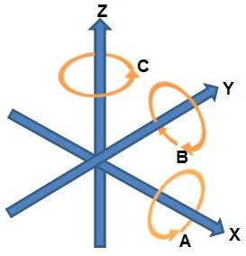
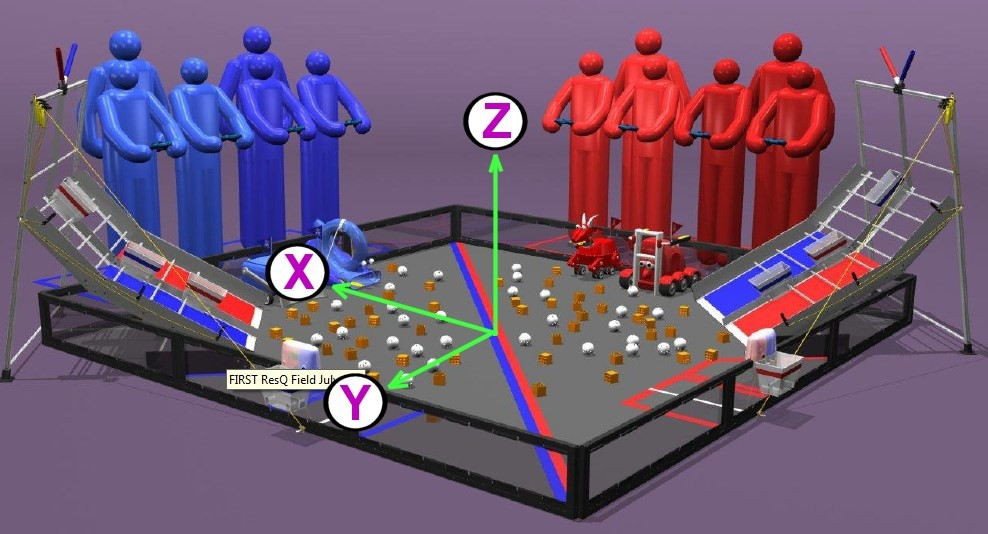
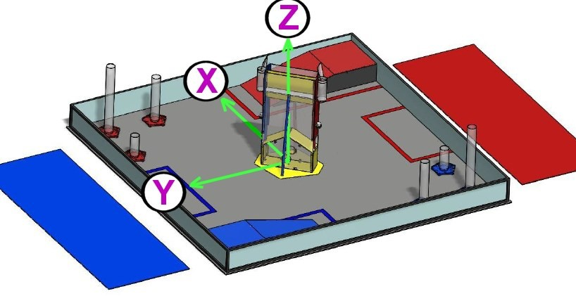

*FIRST* Tech Challenge Field “Coordinate System" Definition
===========================================================

Scope
-----

This document defines the “standard” Coordinate System (orthogonal axes)
definition for a *FIRST* Tech Challenge playing field. This definition can be
used for consistent field-centric navigation, target localization and path
planning.

Reference frame
---------------

The reference frame for this definition is the field perimeter wall, adjacent
to the RED Alliance Station (known here as the: RED WALL).  The definition is
from the perspective of a person, standing outside the field, in the center of
RED WALL, looking towards the center of the field.

Caveat: If the Red Alliance Station is ever adjacent to two perimeter walls,
the RED WALL will be the one with *most* contact with the Alliance Station. If
the red Alliance Station is ever adjacent to two perimeter walls EQUALLY, then
the most clockwise of the two walls will be considered to be the RED WALL.

Origin
^^^^^^

The 0,0,0 origin of the *FIRST* Tech Challenge coordinate system is the point
in the center of the field, equidistant from all 4 perimeter walls (where the
four center tiles meet). The origin point rests on the top surface of the floor
mat.

X Axis
^^^^^^

Looking at the origin from the RED WALL, the X axis extends through the origin
point and runs to the right and left, parallel with the RED WALL. The X axis
values increase to the right.

Y Axis
^^^^^^

Looking at the origin from the RED WALL, the Y axis extends through the origin
point and runs out and in, perpendicular to the RED WALL.  Increasing Y values
run out (away) from the RED WALL.

Z Axis
^^^^^^

Looking at the origin from the RED WALL, the Z axis extends through the origin
point and runs up and down in a vertical line. Increasing Z values extend
upwards.

Rotation about Axes
^^^^^^^^^^^^^^^^^^^

When considering rotations about an axis, consider yourself looking down the
(positive) axis of rotation from the positive towards the origin. Positive
rotations are then CCW, and negative rotations CW.

   Figure 1: Coordinate Axes

An example: consider looking down the positive Z axis towards the origin. This
would be like standing in the middle of the field, looking down. A positive
rotation about Z (i.e. a rotation parallel to the X-Y plane) is then CCW, as
one would normally expect from the usual classic 2D geometry.

Examples
--------

Below are two examples illustrating this Axes definition.

.. note::
   Note that in both cases the Red Alliance members are facing out,
   along the positive Y axis.

   However, in the “Diamond” field configuration, the X axis is pointing
   towards the Blue Alliance, but in the “Square” field configuration
   the Y axis is pointing towards the Blue Alliance.

   Figure 2: FIRST Tech Challenge RES-Q game field orientation

   Figure 3: FIRST Tech Challenge Cascade Effect game field orientation

Measured Values
---------------

The following values have been measured from a 2016 competition field. They are
representative only, and should not be assumed to be exact, or guaranteed.

-  Distance between opposite inside faces of panels: 3580 mm
   (if field assembled well: the straps give some adjustment tolerance)
-  Polycarbonate transparencies have a visible opening height of 255 mm
-  The top edge of transparencies is 30 mm from the top of the perimeter
-  Total perimeter height is 313 mm
-  Tiles are 13mm thick

So, for a diamond field configuration, the corner of the field closest to the
audience, at a height equal to the top of the perimeter wall, would have a
coordinate position of: (-1790, 1790, 300).

