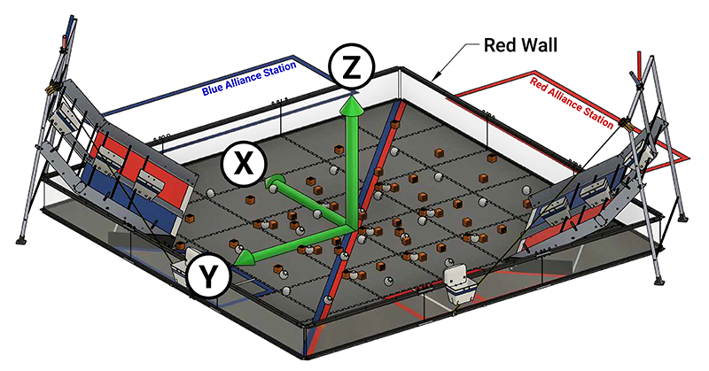
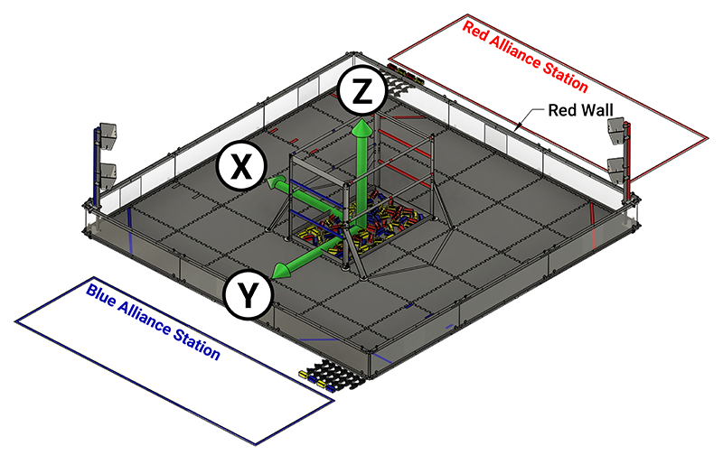
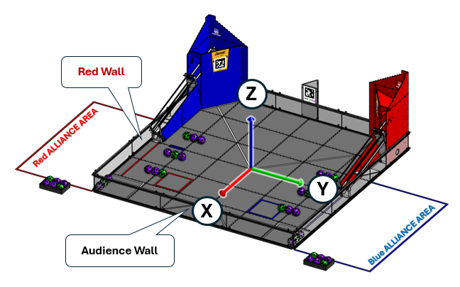

.. _first field coordinate system:

*FIRST* Tech Challenge Field Coordinate System Definition
=========================================================

.. meta::
   :description: This document defines the FIRST Tech Challenge Field Coordinate System which can be used to specify position on the playing field.

Summary: The *FIRST* Tech Challenge Field Coordinate System is a Cartesian Coordinate System of three dimensions.
The X and Y axes will refer to a position on the field and the Z axis a height above the field.

Scope
-----
  
This document defines the Field Coordinate System 
for a *FIRST* Tech Challenge playing field. This definition can be
used for consistent field-centric navigation, target localization and path
planning.

Reference Frame
---------------

The reference frame for this definition is the field perimeter wall, adjacent
to the red Alliance Area, known here after as the Red Wall.  The definition is
from the perspective of a person, standing outside the field, in the center of
Red Wall, looking towards the center of the field.

.. note:: 
   If the red Alliance Area is ever adjacent to two perimeter walls,
   the Red Wall will be the one with *most* contact with the Alliance Area. If
   the red Alliance Area is ever adjacent to two perimeter walls *equally*, then
   the most clockwise of the two walls will be considered to be the Red Wall.
   
Coordinate System
-----------------

The Field Coordinate System is a Cartesian Coordinate System of three dimensions.
X and Y will refer to a position on the field.
Z will refer to a height above the field.
You may use any length measure as long as the same measure is used for all three axes.
The coordinates are ordered (X, Y, Z).
Example: coordinate position (10, -10, 0) has X = 10, Y = -10 and Z = 0.

Origin
^^^^^^

The 0,0,0 origin of the *FIRST* Tech Challenge coordinate system is the point
in the center of the field, equidistant from all 4 perimeter walls (where the
four center tiles meet). The origin point rests on the top surface of the floor
mat.

X Axis
^^^^^^

Looking at the origin from the Red Wall, the X axis extends through the origin
point and runs to the right and left, parallel with the Red Wall. The X axis
values increase to the right.

Y Axis
^^^^^^

Looking at the origin from the Red Wall, the Y axis extends through the origin
point and runs out and in, perpendicular to the Red Wall. Increasing Y values
run out (away) from the Red Wall.

Z Axis
^^^^^^

Looking at the origin from the Red Wall, the Z axis extends through the origin
point and runs up and down in a vertical line. Increasing Z values extend
upwards.

Rotation About Axes
^^^^^^^^^^^^^^^^^^^

When considering rotations about an axis, consider yourself looking down the
axis from the positive end towards the origin. Positive
rotations are then counterclockwise and negative rotations clockwise.
   
.. figure:: images/image1.jpg
   :alt: X, Y and Z coordinate axes.
   
   Counterclockwise rotations about each axis
   
   Imagine looking down the positive Z axis towards the origin.
   This would be like standing in the middle of the field looking down.
   A positive rotation about the Z axis would be counterclockwise.

Example: a robot spinning clockwise on the Field is making a negative rotation about the Z axis.

Field Configuration Examples
----------------------------

Below are two examples illustrating the Field Coordinate System for different
*FIRST* Tech Challenge field configurations.

.. note::
   In both field configurations the red Alliance is facing out along the positive Y axis,
   and the Z axis points up from the center of the field.

Diamond Field
^^^^^^^^^^^^^

   
   The FIRST RES-Q game field
   
   In a diamond field configuration the two Alliance walls are adjacent.
   The field is rotated 45 degrees such that both Alliances face the audience.
   From the audience perspective the field forms a diamond shape.
   The Red Wall will be on the right as seen from the audience.
   The Y axis points across the field as seen from the Red Wall. 
   The X axis points to the Blue Alliance.
   
Square Field
^^^^^^^^^^^^

   
   The Into The Deep game field
   
   In a square field configuration the two Alliances face each other across the field.
   
   * The field is oriented such that the Red Wall is on the right as seen from the audience.
   * The Y axis points across the field from the Red Wall towards the Blue Alliance.
   * The X axis points away from the audience to the rear of the field.

Square Field (Inverted ALLIANCE AREA)
^^^^^^^^^^^^^^^^^^^^^^^^^^^^^^^^^^^^^^^

   
   The DECODE game field
   
   The DECODE game field is essentially a square field, but the red and blue ALLIANCE
   AREAS are swapped from their typical configuration (red ALLIANCE AREA on the left 
   when viewed from the audience). In this configuration, the X and Y axes are "inverted"
   in which direction the positive axis points. This is still consistent with the field
   coordinate system definition, but the field is inverted.
   
   * The field is oriented such that the Red Wall is on the left as seen from the audience.
   * The Y axis points across the field from the Red Wall towards the Blue Alliance.
   * The X axis points towards the audience to the front of the field.

Coordinate Position Example
---------------------------

Let's consider the coordinates (-58.3727, 55.6425, 29.5) in inches on the DECODE field, which is a square field with inverted red/blue.
Given the order of coordinates then X = -58.3727, Y = 55.6425, and Z = 29.5. 

* The X axis value of -58.3727 is located deep in the back (away from the Audience Wall) of the field.
* The Y axis value of 55.6425 would be located closer to the Blue Wall, about a 3/4 tile length from the Blue wall.
* The Z axis value of 29.5 is 29.5 inches above the field tiles.

This set of coordinates is the center of the Red Goal AprilTag on the Red Goal. 

Measured Values
---------------

The following metric values have been measured from a 2016 competition field. They are
representative only, and should not be assumed to be exact, or guaranteed.

-  Distance between opposite inside faces of panels: 3580 mm,
   (if the field is assembled well: the straps give some adjustment tolerance)
-  Polycarbonate transparencies have a visible opening height of 255 mm
-  The top edge of transparencies is 30 mm from the top of the perimeter
-  Total perimeter height is 313 mm
-  Tiles are 13 mm thick

So, for a diamond field configuration, the corner of the field closest to the
audience, at a height equal to the top of the perimeter wall, would have a
coordinate position of: (-1790, 1790, 300) in millimeters.

Additional Information
----------------------

See this Wikipedia article on `Cartesian coordinate system
<https://en.wikipedia.org/wiki/Cartesian_coordinate_system#Three_dimensions>`__
in three dimensions.
The Field Coordinate System rotation convention comes from the 
`right hand rule <https://en.wikipedia.org/wiki/Right-hand_rule>`__ 
of classic geometry.

Robots with a webcam can use :ref:`AprilTags <apriltag/vision_portal/apriltag_intro/apriltag-intro:apriltag introduction>`
to determine where an :ref:`AprilTag is located 
<apriltag/understanding_apriltag_detection_values/understanding-apriltag-detection-values:introduction>` 
with respect to the robot.
Since AprilTags are in known locations on the field, you can also determine the
:ref:`location of the robot <apriltag/vision_portal/apriltag_localization/apriltag-localization:apriltag localization>`
on the field.

Robots can use an inertial measurement unit (IMU) to measure rotations about axes
with respect to the robot. See :ref:`IMU axes definition. <programming_resources/imu/imu:axes definition>`
The yaw value from the IMU, also known the heading, measures rotation about the Z axis
which points up from the robot. 
You can use the IMU to determine which direction a robot is facing.

