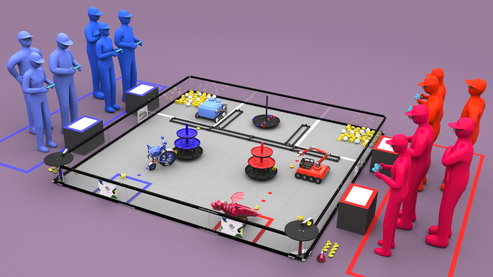

Playing Field Resources
=======================

    
    Traditional Playing Field ~ FREIGHT FRENZY presented by Raytheon Technologies, 2021-2022

About the Playing Field
------------------------------------
There are multiple configurations of the playing field that can be used. For traditional games, the playing field is a part of the Competition Area that includes the 12 ft. x 12 ft. (3.66 m x 3.66 m) field and all
the elements described in the official field drawings. For remote games, the playing field is a part of the Competition Area that includes the 12 ft. x 8 ft. (3.66 m x 2.44 m) field and all the elements described 
in the official field drawings. The base field stays the same for all games but the game elements are subject to change as per :ref:`Game Manual Part 2<manuals/game_manuals/game_manuals:game manuals>`.

Traditional Field Setup Guide
------------------------------------

`Traditional Field Setup Guide <https://www.firstinspires.org/sites/default/files/uploads/resource_library/ftc/field-setup-guide.pdf>`__

.. raw:: html

    <iframe id="iframepdf" src="https://www.firstinspires.org/sites/default/files/uploads/resource_library/ftc/field-setup-guide.pdf" width="100%" height="700"></iframe>

|

Remote Field Setup Guide
------------------------------------

`Remote Field Setup Guide <https://firstinspiresst01.blob.core.windows.net/first-forward-ftc/remote-field-requirements.pdf>`__

.. raw:: html

    <iframe id="iframepdf" src="https://firstinspiresst01.blob.core.windows.net/first-forward-ftc/remote-field-requirements.pdf" width="100%" height="700"></iframe>

|

