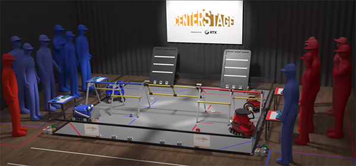

Playing Field Resources
=======================

    
   Traditional Playing Field, CENTERSTAGE presented by RTX, 2023-2024

About the Playing Field
-----------------------
There are multiple configurations of the playing field that can be used. For traditional games, the playing field is a part of the ARENA that includes the 12 ft. x 12 ft. (3.66 m x 3.66 m) field and all
the elements described in the official field drawings. For remote games, the playing field is a part of the ARENA that includes the 12 ft. x 8 ft. (3.66 m x 2.44 m) field and all the elements described 
in the official field drawings. The base field stays the same for all games but the game elements are subject to change as per the :ref:`Competition Manual <team_resources/team_resources:team resources>`.

There are multiple configurations of the playing field that can be used. For traditional games, the playing field is a part of the Arena that includes the 12 ft. x 12 ft. (3.66 m x 3.66 m) field and all
the elements described in the official field drawings. For remote games, the playing field is a part of the Arena that includes a 12 ft. x 8 ft. (3.66 m x 2.44 m) field and all the elements described 
in the official field drawings. The base field stays the same for all games but the game elements are subject to change as per the Competition Manual.

The Competition Manual contains an Arena section that details the playing field for that years game.
It includes measurements for key aspects of the field and game elements and scoring elements.
For example, the height of a basket into which a scoring element can be placed.
The Competition Manual can be found on the
`Game and Season Materials page <https://ftc-resources.firstinspires.org/files/ftc/game>`_ on the *FIRST* Website.

Field Setup Guide
-----------------

The Field Setup Guide has the official instructions for assembling and setting up a *FIRST* Tech Challenge field.
Typically there are assembly instructions that build structures that then have setup instructions for placing on the field.
There are also teardown instructions that indicate how to take apart the field for storage or transport.

The guide typically has the following sections:

- A list of all tools required for assembly and setup, some tools are only for assembly or for setup.
- Lists all the game elements and scoring elements with the quantity of each.
- Instructions for setup of the field perimeter and field tiles.
- Step by step instructions for assembling parts and setting them on the field.
- Most games have tape lines on the field to mark locations or areas of the game. There are also taped areas outside the field for the Alliances, and sometimes for game areas.
- Most games have AprilTags placed around the field that can be used for robot navigation.
- Finally, there are teardown instructions that indicate how to take the field down for storage or transport.

Use the following button link to download a PDF of the Field Setup Guide from the *FIRST* Website:

.. button-link:: https://ftc-resources.firstinspires.org/file/ftc/game/fieldguide
   :color: primary

   Download PDF, 4.5 MB, will open in a new tab

.. note:: The Field Setup Guide has instructions for assembling an official game set as purchased from AndyMark.
   
   A purchased game set can be full or partial. A partial game set is less expensive and also suitable for teams who
   want official game elements but don't have room to setup a full field.

The `Game and Season Materials page (FIRST website) <https://ftc-resources.firstinspires.org/files/ftc/game>`_ also contains downloadable PDFs for the AprilTag images that can be printed and placed on the field.
There is also a do it yourself (DIY) Resources section that include CAD models of the game and scoring elements and DIY field and perimeter build guides.
