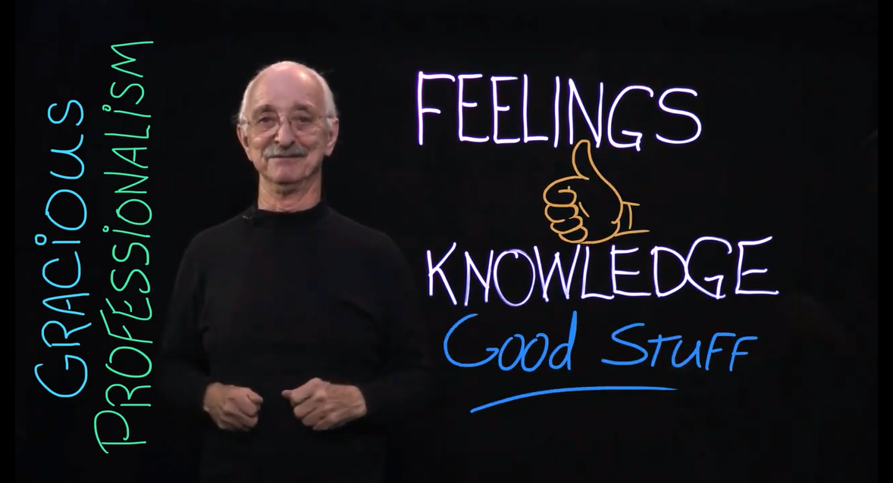

*Gracious Professionalism®*
===========================

*Gracious Professionalism®* is part of the ethos of *FIRST*. It’s a way of doing
things that encourages high quality work, emphasizes the value of others, and
respects individuals and the community.  *Gracious Professionalism* is not
clearly defined for a reason. It can and should mean different things to
everyone.

Some possible meanings of *Gracious Professionalism* include:

*  gracious attitudes and behaviors are win-win,
*  gracious folks respect others and let that respect show in their actions,
*  professionals possess special knowledge and are trusted by society to use that knowledge responsibly, and
*  gracious professionals make a valued contribution in a manner pleasing to others and to themselves.

In the context of *FIRST*, this means that all teams and participants should:

*  learn to be strong competitors, but also treat one another with respect and kindness in the process, and 
*  avoid leaving anyone feeling as if they are excluded or unappreciated.

Knowledge, pride, and empathy should be comfortably and genuinely blended.  In
the end, *Gracious Professionalism* is part of pursuing a meaningful life. When
professionals use knowledge in a gracious manner and individuals act with
integrity and sensitivity, everyone wins and society benefits.

|

   *The FIRST spirit encourages doing high-quality, well-informed work in a
   manner that leaves everyone feeling valued. Gracious Professionalism seems
   to be a good descriptor for part of the ethos of FIRST. It is part of what
   makes FIRST different and wonderful.*

   - Dr. Woodie Flowers, (1943 – 2019), Distinguished Advisor to *FIRST*

It is a good idea to spend time going over this concept with your team and
reinforcing it regularly. We recommend providing your team with real-life
examples of *Gracious Professionalism* in practice, such as when a team loans
valuable materials or expertise to another team that they will later face as an
opponent in competition. Routinely highlight opportunities to display *Gracious
Professionalism* at events and encourage team members to suggest ways in which
they can demonstrate this quality themselves and through outreach activities.

In Memoriam
^^^^^^^^^^^

In October 2019, Dr. Woodie Flowers, an innovator in design and engineering
education and a Distinguished Advisor to *FIRST* and supporter of our mission,
passed away. As thousands of heartfelt tributes to Woodie have poured in from
around the world, it is clear his legacy will live on indefinitely through the
gracious nature of our community and our ongoing commitment to empowering
educators and building global citizens.

   Dr. Woodie Flowers, (1943 - 2019)

|

