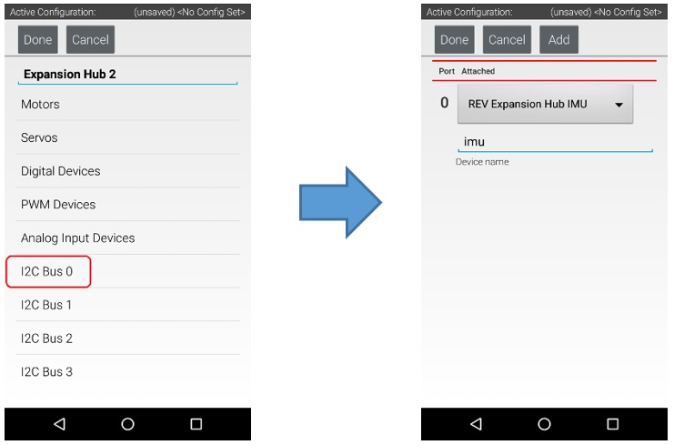
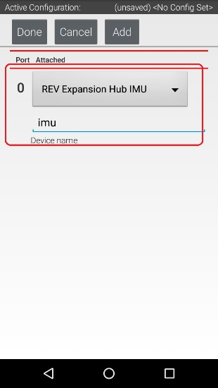
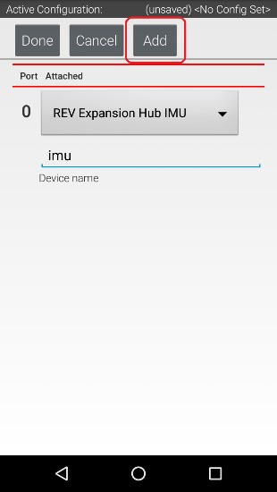
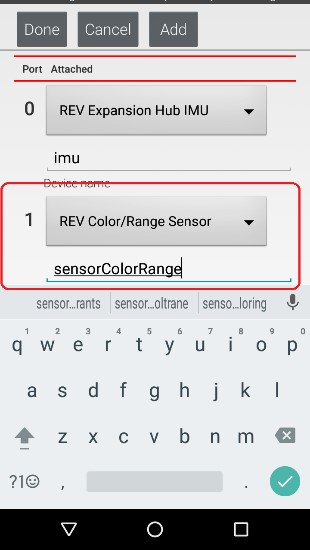
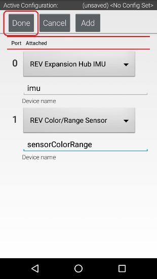

Configuring a Color Distance Sensor
=====================================

The REV Robotics Color Distance Sensor is an I2C sensor. It actually
combines two sensor functions into a single device. It is a color
sensor, that can determine the color of an object. It is also a distance
or range sensor, that can be used to measure short range distances. Note
that in this tutorial, the word "distance" is used interchangeably with
the word "range".

Configuring a Color Distance Sensor Instructions
------------------------------------------------

1. Touch the words **I2C Bus 0** on the screen to launch the I2C      
configuration screen for this I2C bus.                                

|

The Expansion Hub has four independent I2C buses, labeled "0" through "3".  In this example, since you connected the Color Sensor to the port labeled "0", it resides on I2C Bus 0.

2. Look at the **I2C Bus 0** screen. There should already be a sensor 
configured for this bus. The Expansion Hub has its own built-in       
inertial measurement unit (IMU) sensor. This sensor can be used to    
determine the orientation of a robot, as well as measure the          
accelerations on a robot.                                             

|

The built-in IMU is internally connected to I2C Bus 0 on each Expansion Hub.  Whenever you configure an Expansion Hub using the Robot Controller, the app automatically configures the IMU for I2C Bus 0. You will need to add another I2C device for this bus to be able to configure the color sensor.

3. Press the **Add** button to add another I2C device to this bus.    

|

4. Select "REV Color/Range Sensor" from the dropdown selector for     
this new device. Use the touchscreen keyboard to name this device     
"sensorColorRange".                                                   

|

5. Press the **Done** button to complete the I2C sensor               
configuration. The app should return to the previous screen.          

|