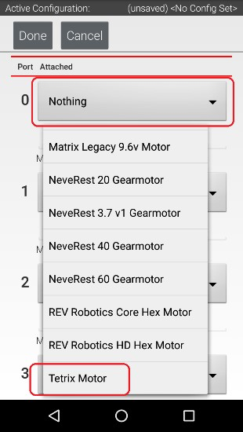

Configuring a DC Motor
=======================

Now that you've created a file, you will need to add a DC Motor to the
configuration file.

.. important:: At this point, although you have created your configuration file, you have not yet saved its contents to the Robot Controller. You will save the configuration file later in the :ref:`Saving the Configuration Information <hardware_and_software_configuration/configuring/saving_config/saving-config:Saving the Configuration Information>` step.

Configuring a DC Motor Instructions
-----------------------------------

1. Touch the word **Motors** on the screen to display the Motor       
Configuration screen.

.. image:: images/ConfiguringHardwareMotorStep1.jpg
   :align: center

|

2. Since we installed our motor onto port #0 of the Expansion Hub,    
use the dropdown control for port 0 to select the motor type (Tetrix  
Motor for this example).

|

3. Use the touch screen keypad to specify a name for your motor       
("motorTest" in this example).

|

4. Press the **Done** button to complete the motor configuration. The 
app should return to the previous screen.

.. image:: images/ConfiguringHardwareMotorStep4.jpg
   :align: center

|