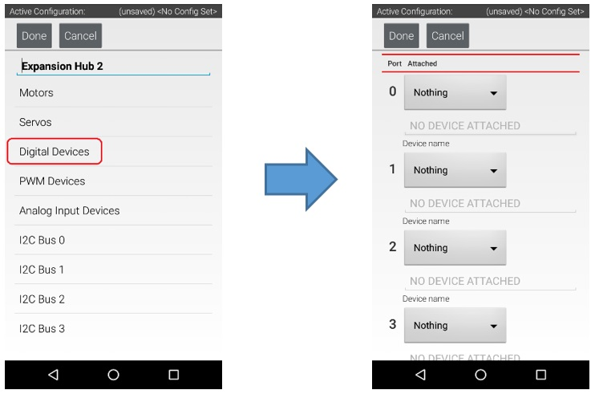
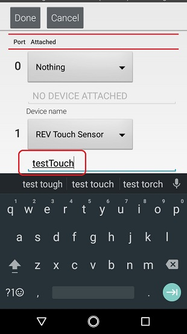

Configuring a Digital Touch Sensor
==================================

The REV Robotics Touch Sensor is a digital sensor. An Op Mode can query
the Touch Sensor to see if its button is being pressed or not.

Configuring a Digital Touch Sensor Instructions
-----------------------------------------------

1. Touch the words **Digital Devices** on the screen to launch the    
Digital I/O configuration screen.                                     

|

2. Use the touch screen to add a "REV Touch Sensor" for port #1 and   
name the device "testTouch".                                          

|

Notice that we are configuring the Touch Sensor on port #1 instead of port #0.  This is because when the REV Robotics Touch Sensor is connected to a digital port using a standard 4-wire JST sensor cable, it is the second digital pin that is connected. The first pin remains disconnected.

3. Press the **Done** button to return to the previous screen.        

|