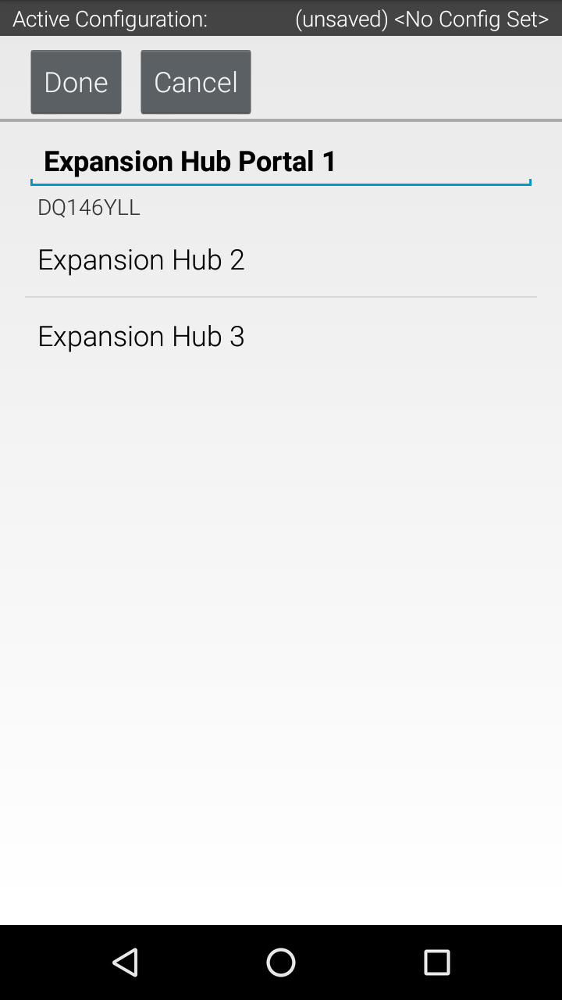

Using Two Expansion Hubs
========================

Introduction
~~~~~~~~~~~~

A single REV Robotics Control or Expansion Hub has a limited amount of input/output
(I/O) ports available. In some instances, you might want to use more
devices than there are ports available. For these instances you might
need to connect a second Expansion Hub to your first Hub to add more I/O
ports.

This document describes how to connect and configure two Expansion Hubs
for use in the FIRST Tech Challenge. Note that the FIRST Tech Challenge
Game Manual Part 1 (rule <RE07>, part f) limits the maximum number of
Expansion Hubs on a single robot to two.

**Important Note:** This document describes the process for setting up a
smartphone Robot Controller with two Expansion Hubs. Control Hubs have a
reserved address, so you do not need to worry about an Expansion Hub's
address when it is the only Expansion Hub connected to a Control Hub.
However, the process for physically connecting and configuring them is the same.

Equipment Needed
~~~~~~~~~~~~~~~~

To follow along with the instructional steps in this document, you will
need the following items:

.. list-table::
   :header-rows: 1
   :widths: auto

   * - Required Item(s)
     - Image

   * - Two (2) FIRST-approved Android smartphones. One should have the Robot
       Controller app installed and the other should have the Driver Station
       app installed. For a list of FIRST-approved Android  smartphones, refer
       to the current Game Manual Part 1, rule <RE06>.
     - .. figure:: images/twoAndroidPhones.jpg

   * -  USB Type A male to type mini-B male cable.
     -  .. figure:: images/USBTypeACable.jpg

   * - Micro USB OTG adapter.
     - .. figure:: images/OTGAdapter.jpg

   * - REV Robotics Switch, Cable, & Bracket (REV-31-1387).
     - .. figure:: images/REVSwitch.jpg

   * - REV Robotics Tamiya to XT30 Adapter Cable (REV-31-1382).
     - .. figure:: images/TamiyaAdapter.jpg

   * - FIRST-approved 12V Battery (such as Tetrix W39057). For a list of
       FIRST-approved 12V batteries, refer to the current Game Manual
       Part 1, rule <RE03>.
     - .. figure:: images/Battery.jpg

   * - Two(2) REV Robotics Expansion Hubs (REV-31-1153).
     - .. figure:: images/ExpansionHub.jpg
       .. figure:: images/ExpansionHub.jpg

   * - REV Robotics (or equivalent) 3-Pin JST PH Cable (REV-35-1414, 3 pack shown but only one needed).
     - .. figure:: images/3PinJSTPH.jpg

   * - REV Robotics XT30 Extension Cable (REV-31-1394).
     - .. figure:: images/xt30Extension.jpg

Changing the Address of an Expansion Hub
~~~~~~~~~~~~~~~~~~~~~~~~~~~~~~~~~~~~~~~~

You can use the Advanced Settings menu of the Robot Controller App
to change the address of any connected Expansion Hubs.

**Important Note:** If both of your Expansion Hubs have the same address
or were just removed from the box (by default, the address is set to 2),
you need to change the address of one of them _before_ connecting them
together. This guide assumes that you will be setting the address of the
first Expansion Hub before connecting the second Expansion Hub.

With your first Expansion Hub connected to the 12V battery and to the Robot
Controller, launch the Settings menu from the Robot Controller app (note you
can also do this from the Driver Station app, if the Driver Station is
paired to the Robot Controller).

1. Select the Advanced Settings item to display the Advanced Settings menu.

.. figure:: images/AdvancedSettings.jpg
   :align: center

2. Then select the Expansion Hub Address Change item to display the
Expansion Hub address screen.

.. figure:: images/ExpansionHubAddressChange.jpg
   :align: center

3. The USB serial number of the Expansion Hub and its currently-assigned
address should be displayed.

**Important Note:** If any Expansion Hubs that are physically connected and
powered are not displayed, there may be an address conflict. If this happens,
disconnect all Expansion Hubs except the one whose address you want to change.

.. figure:: images/DefaultAddress.*
   :align: center

4. Use the dropdown list control on the right hand side to change an Expansion
Hub's address. Addresses that conflict with other currently-connected Expansion
Hubs won't be available.

.. figure:: images/NewAddress.*
   :align: center

Push the “Done” button to change the address. You should see a message
indicating that the Expansion Hub’s address has been changed.

Connecting the Two Expansion Hubs
~~~~~~~~~~~~~~~~~~~~~~~~~~~~~~~~~

1. After you have changed the address of one of the Hubs, you can use the
3-pin JST PH cable and the XT30 cable to daisy chain the two Hubs
together. Before you do this, disconnect the 12V battery and power
switch from the first Expansion Hub.

Use the XT30 extension cable to connect an XT30 power port on one of the
Expansion Hubs to an XT30 power port on the other Hub.

2. The Expansion Hubs use the RS-485 serial bus standard to communicate
between devices. You can use the 3-pin JST PH cable to connect one of
the ports labeled “RS485” on one Expansion Hub to one of the ports
labeled “RS485” on the other Expansion Hub.

.. figure:: images/RS485Connected.jpg
   :align: center

Note that it is not important which “RS485” port that you select on an
Expansion Hub. Either port should work.

.. figure:: images/RS485Port.jpg
   :align: center

3. Once you have the two devices daisy chained together (12V power and
RS-485 signal) you can reconnect the battery and power switch, and then
connect the Robot Controller and power on the devices.

.. figure:: images/DualConnected.jpg
   :align: center

Configuring Your Expansion Hubs
~~~~~~~~~~~~~~~~~~~~~~~~~~~~~~~

If you successfully daisy chained your two Expansion Hubs,
then you should be able to create a new configuration file that includes
both devices.

**Note:** If you already have a configuration that contains just the USB-connected
Expansion Hub, you can add the second Expansion Hub by editing the
configuration and pressing the "Scan" button.

Connect the Robot Controller and select the Configure Robot option from
the Settings menu. Press the New button to create a new configuration
file. When you first scan for hardware, your Robot Controller should
detect the Expansion Hub that is immediately connected to the Robot
Controller via the OTG adapter and USB cable. The Robot Controller will
automatically label this device as an Expansion Hub “Portal”. The Robot
Controller will talk through this portal to the individual Expansion
Hubs.

If you click on the Portal item in the configuration screen, you should
see two Expansion Hubs listed, each with their respective addresses as
part of their default device name.

You can save this configuration file and return to the main screen of
the Robot Controller. After the robot has been restarted, each Hub’s LED
should be blinking in the manner that indicates its individual address.

Congratulations, you are now ready to use your dual Expansion Hubs! You
can configure and operate these Hubs as you would an individual Hub.
