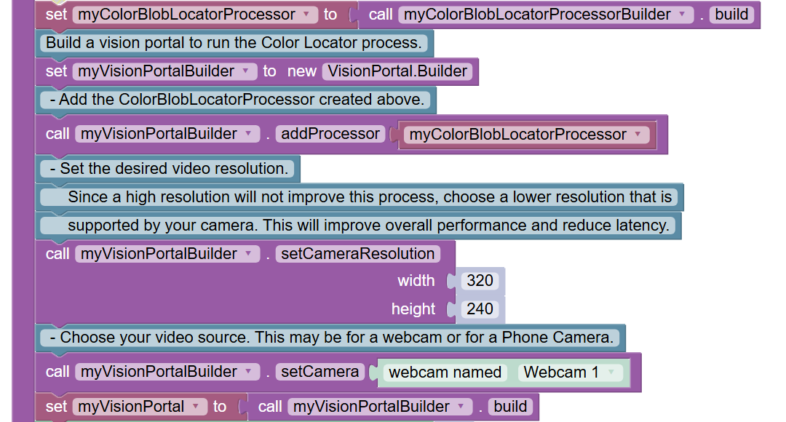
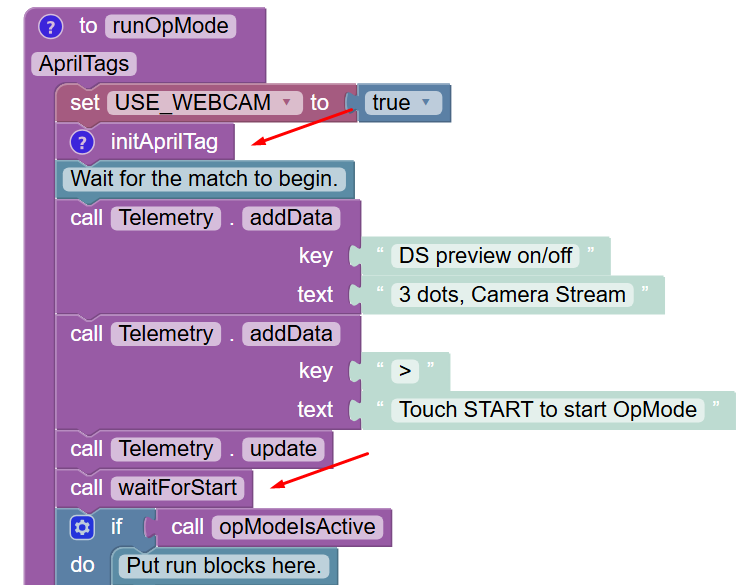
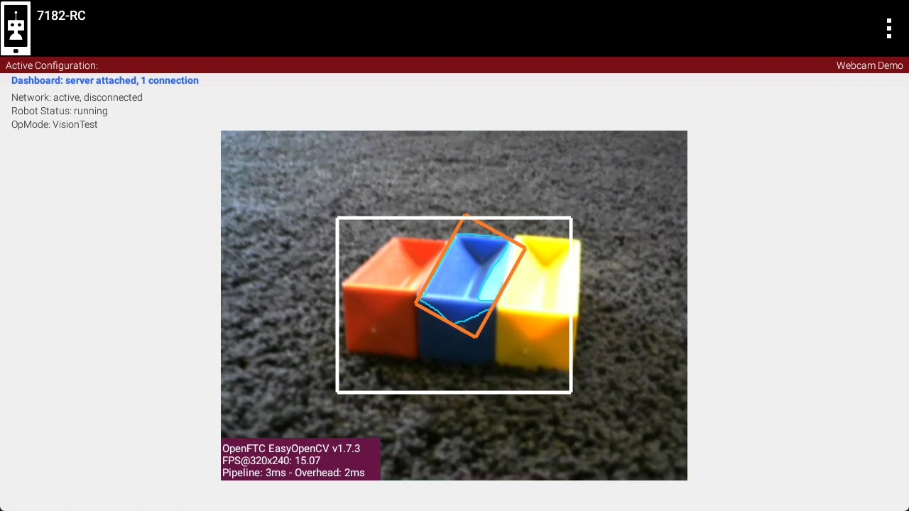
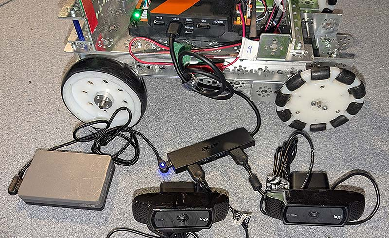
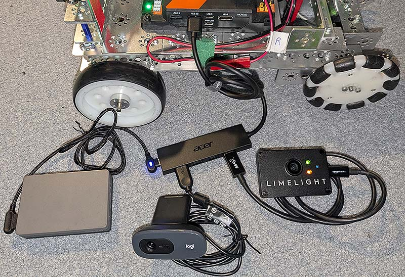

Configuring an External Webcam with a Control Hub
==================================================

Introduction
------------

The Competition Manual allows the use of USB Video Class (UVC) compatible
cameras for computer vision-related tasks. 
If you are using a REV Robotics Control Hub, then
you will need to use an external webcam, since the Control Hub does not
include a built-in camera. This document describes how to connect,
configure and use an external webcam with a Control Hub.

Special thanks to Chris Johannesen of Westside Robotics (Los Angeles)
for putting together this documentation.

Type of External Camera
-----------------------

Theoretically, any USB Video Class (UVC) camera should work with the 
system. However, *FIRST* recommends using UVC web cameras from Logitech.
The following cameras have been tested and calibrated to work accurately
with SDK software:

- :ref:`logitech_c270_label`
- :ref:`logitech_c310_label`
- :ref:`logitech_c920_label`

Calibrating a UVC camera is an optional, advanced task. Instructions for
creating a calibration file are in the comments of the
`teamwebcamcalibrations.xml <https://github.com/ftctechnh/ftc_app/blob/master/TeamCode/src/main/res/xml/teamwebcamcalibrations.xml>`__
file in the ftc_app project folder (visit this
`link <https://github.com/ftctechnh/ftc_app/blob/master/TeamCode/src/main/res/xml/teamwebcamcalibrations.xml>`__
for an online copy of the file).

Connecting the Camera
---------------------

The UVC camera can plug directly into the USB 3.0 port on the REV Control
Hub. Unlike the REV Expansion Hub, there is no need for an external
powered USB hub.

.. image:: images/USB-camera-Control-Hub.jpg
   :alt: Control Hub with UVC camera connected.
   
.. warning:: An electrostatic discharge (ESD) event on the USB 2.0 port on the Control Hub can cause Wi-Fi disconnects.

   The REV Control Hub has a 
   `known ESD issue <https://docs.revrobotics.com/duo-control/troubleshooting-the-control-system/troubleshooting-the-control-system#esd-mitigation-techniques>`_
   with devices plugged into the USB 2.0 port. 
   Using the USB 2.0 Port may cause ESD to affect your Control Hub's Wi-Fi Chip (causing Wi-Fi disconnects with the driver hub). 
   Ensure that you plug USB devices, such as a Camera, into the USB 3.0 Port on your Control Hub. 
   
If you wish to connect two webcams see `Cameras and USB Hubs`_.

Camera Configuration
--------------------

Before using the external camera, it must be added to the active
configuration file as a USB-connected device.

Use the Configure Robot menu item on the paired DRIVER STATION device to
add the webcam as a USB-connected device to an existing or newly created
configuration file. Note that the Scan operation for the Configure Robot
activity should detect the webcam and give it a default name of “Webcam
1”.

.. image:: images/webcam-config-CH.jpg
   :alt: Screen shot showing the Scan button circled in yellow and the resulting USB device listed as Webcam 1.

You can keep this default name (the sample Op Modes reference this name)
or change it. If you change the webcam name, make sure your Op Modes
refer to this new name.

Sample Op Modes
---------------

When the configuration has been saved and activated, the external UVC
camera can be programmed for robot vision tasks.

The SDK software offers “webcam” versions of its sample Blocks and Java
Op Modes, showing how to use the external UVC camera for VisionPortal operations.

Before opening and editing an Op Mode, verify that the intended
configuration (with camera) is active. Also verify that the name
referenced in the Op Mode matches the name specified in the
configuration file.

Image Preview
-------------

The *FIRST* Tech Challenge apps provide camera preview for ‘stream-enabled’ Op
Modes using VisionPortal.

On a paired DRIVER STATION device, with the camera connected and
configured, select a stream-enabled Op Mode. Press the INIT button, and
wait briefly for streaming software to initialize; do not press the
START button. Instead open the main menu (the 3 dots in upper right hand
corner of the screen) and select Camera Stream. This option appears only
at this time, during which the game pads and START button are disabled
for safety.

.. image:: images/DS-webcam-preview-CH-1.jpg
   :alt: Driver Station screen shot showing the menu with the Camera Stream option circled in yellow.

The camera image will appear on the DRIVER STATION screen. Manually
touch the image to refresh it. To preserve bandwidth, only one frame is
sent at a time.

.. image:: images/DS-webcam-preview-CH-2.jpg
   :alt: Driver Station screen shot showing the camera image. 

This option may be used to adjust the camera, with frequent manual image
refreshing as needed. When finished, open the main menu and select
Camera Stream again to turn off the preview. The preview image will
close, the game pads will be enabled, and the START button may be
pressed to continue running the Op Mode.

.. image:: images/DS-webcam-preview-CH-3.jpg
   :alt: Driver Station screen shot showing the menu with the Camera Stream option circled in yellow.

**Important Note:** Because the Camera Stream feature is only available
during the INIT phase of an Op Mode, you must ensure that the VisionPortal
is activated in your Op Mode **before** the waitForStart command:

If you do not see the Camera Stream option in your main menu on your
DRIVER STATION, then verify that the VisionPortal is activated
before the waitForStart command in your Op Mode. Also make sure you’ve
given the system enough time to initialize the VisionPortal software before
you check to see if Camera Stream is available.

Scrcpy
------

To view the camera output from a computer while an OpMode is running, you
can use `scrcpy <https://github.com/Genymobile/scrcpy>`__. To do this,
you will first need to obtain an ADB connection with your Control Hub.
This can be done by connecting a USB-A to USB-C cable to the USB-C port
on your Control Hub. If on Windows, you may also connect to your Control
Hub WiFi network and open the `REV Hardware Client <https://docs.revrobotics.com/rev-hardware-client/gs/install>`__.
Once connected, use `these instructions <https://github.com/Genymobile/scrcpy?tab=readme-ov-file#get-the-app>`__
to install and run scrcpy on your computer.

**Important Note:** While scrcpy is a great way to view the camera output
outside of competitions, the Competition Manual does not allow teams to
have any devices other than the DRIVER STATION connected to your Control
Hub during a match.

External HDMI Monitor
---------------------

Alternatively, camera output can be viewed on a display monitor or other
device plugged into the HDMI port on the REV Control Hub.

.. image:: images/HDMIMonitor.jpg
   :alt: Photo showing an external HDMI monitor displaying the camera output from a connected control hub.

**Important Note:** While a portable display monitor can be used to view
or troubleshoot the camera stream on your Control Hub, teams are not
allowed to have a portable display monitor connected to their Control
Hub during a match.

Advanced Users
--------------

For custom streams, advanced users of Android Studio may consult the
`API documentation <https://javadoc.io/doc/org.firstinspires.ftc>`__ for
`CameraStreamClient <https://javadoc.io/doc/org.firstinspires.ftc/RobotCore/latest/org/firstinspires/ftc/robotcore/external/stream/CameraStreamClient.html>`__,
`CameraStreamServer <https://javadoc.io/doc/org.firstinspires.ftc/RobotCore/latest/org/firstinspires/ftc/robotcore/external/stream/CameraStreamServer.html>`__
and
`CameraStreamSource <https://javadoc.io/doc/org.firstinspires.ftc/RobotCore/latest/org/firstinspires/ftc/robotcore/external/stream/CameraStreamSource.html>`__
classes.

Cameras and USB Hubs 
^^^^^^^^^^^^^^^^^^^^

You can already connect a UVC webcam into the USB 3.0 port of a Control Hub.
But what if you want to use two webcams?
Perhaps you want the robot to be able to look forward and/or behind without having to spin the robot. 
In order to use two webcams on the Control Hub's USB 3.0 port you can add a USB Hub.
This avoid the ESD issue with devices on the USB 2.0 port.

.. note:: If you're using two standard UVC webcams you are not required to use a powered USB hub.

Another use case for a USB hub is if you have a `Limelight 3A <https://limelightvision.io/products/limelight-3a>`_ camera. 
This device has its own processor on board and one drawback of this is that the camera always draws power, even when an opMode is not running.
By adding a powered USB hub the Limelight will not drain your robot's battery.

One suitable powered USB hub is the Acer ODK350 5-IN-1 USB 3.0 Hub. 
It has a USB C port that can supply power to all connected devices.

.. note:: At the time this was written, the Acer ODK350 hub was not listed on Acer's website, but was available on Amazon's website.
   
   Not all USB hubs are powered hubs.
   Typically, you can't just plug a power bank into any of the USB hub's ports. It must be a port that is designed to supply power.
   So if you looking for a powered USB hub there should be a note in the specifications something like the following:
   *Note: This USB C port (with IN 5V printed) can not be used for data transfer and charge other devices. It can only supply power for the other 4 USB ports.*

   
   Acer ODK350 USB hub
   
   The USB Hub is connected to the USB 3.0 port of the Control Hub.
   A powerbank is connected to the USB C port on the USB hub to supply power to the connected devices.
   Two Logitech 920 webcams are connected to the USB hub.

See the `AprilTag Switchable Cameras <https://github.com/FIRST-Tech-Challenge/FtcRobotController/blob/master/FtcRobotController/src/main/java/org/firstinspires/ftc/robotcontroller/external/samples/ConceptAprilTagSwitchableCameras.java>`_ sample program that demonstrates swapping between the two cameras to detect AprilTags.

The other use case is using a Limelight a with a powered USB hub to reduce robot battery drain.
This example shows both a Limelight and a webcam.

   Acer ODK350 USB hub
     
   The USB Hub is connected to the USB 3.0 port of the Control Hub.
   A powerbank is connected to the USB C port on the USB hub to supply power to the connected devices.
   A Logitech 270 webcam and a Limelight 3A are connected to the USB hub.

The Limelight 3A is not a compatible VisionPortal device. So you can't use the AprilTag switchable camera sample code.
But you can still get results from either the Limelight and/or the VisionPortal webcam and use them as required.

