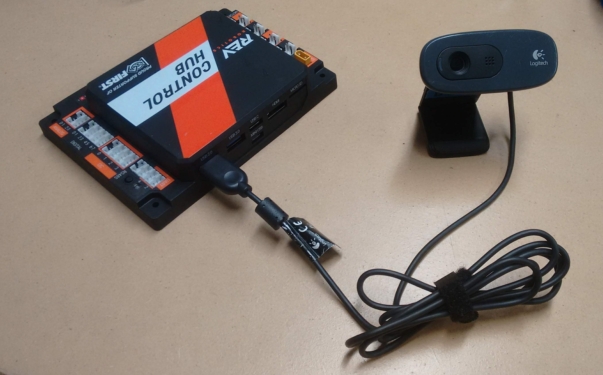
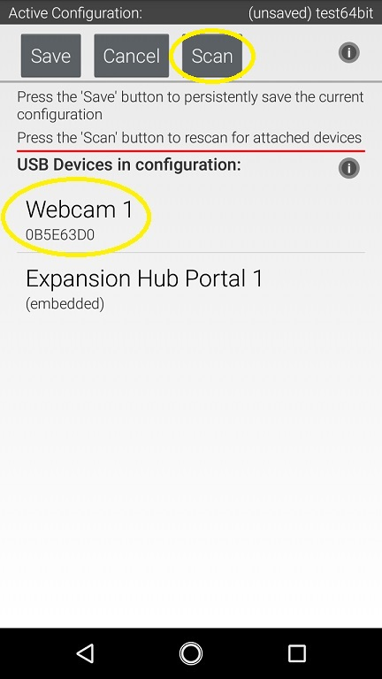
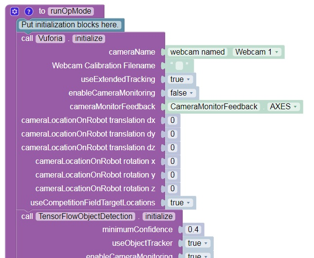
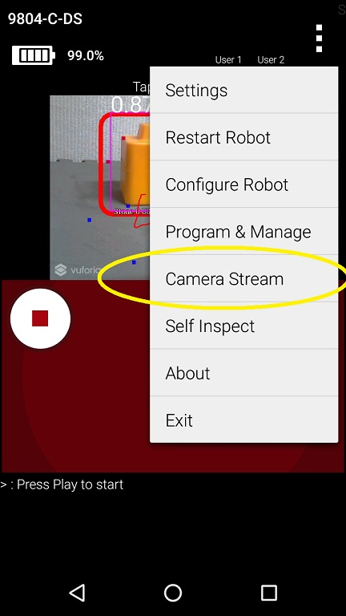
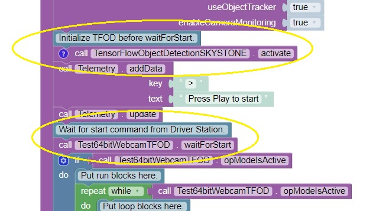
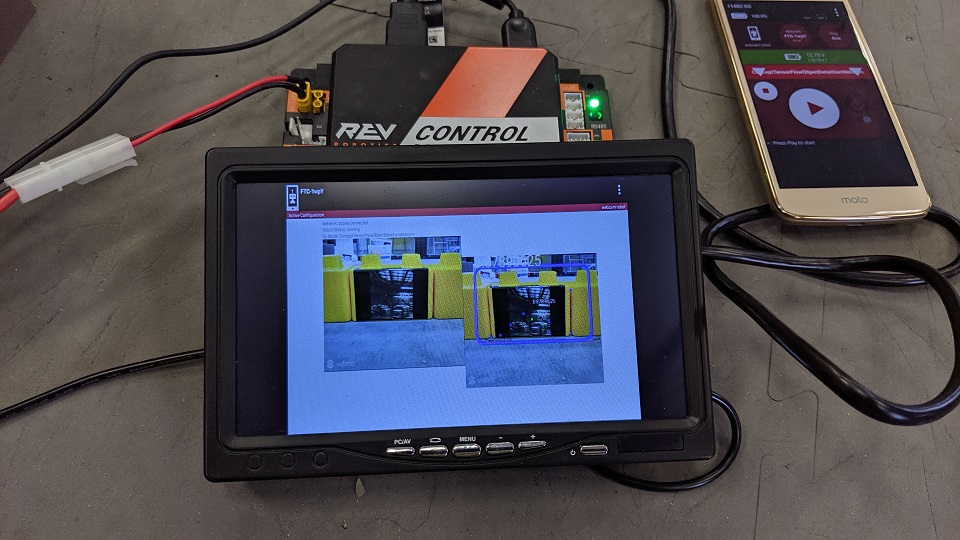

Configuring an External Webcam with a Control Hub
==================================================

Introduction
------------

The Game Manual Part 1 allows USB Video Class (UVC) cameras for
robot vision tasks. If you are using a REV Robotics Control Hub, then
you will need to use an external webcam, since the Control Hub does not
include a built-in camera. This document describes how to connect,
configure and use an external webcam with a Control Hub.

Special thanks to Chris Johannesen of Westside Robotics (Los Angeles)
for putting together this documentation.

Type of External Camera
-----------------------

Theoretically, any USB Video Class (UVC) camera should work with the 
system. However, FIRST recommends using UVC web cameras from Logitech.
The following cameras have been tested and calibrated to work accurately
with SDK software:

-  `Logitech C270 HD
   Webcam <https://www.logitech.com/en-us/products/webcams/c270-hd-webcam.960-000694.html>`__
-  `Logitech C310 HD
   Webcam <https://www.logitech.com/en-us/products/webcams/c310-hd-webcam.960-000585.html>`__
-  `Logitech C920 HD
   Webcam <https://www.logitech.com/en-us/products/webcams/c920s-pro-hd-webcam.960-001257.html>`__

Calibrating a UVC camera is an optional, advanced task. Instructions for
creating a calibration file are in the comments of the
`teamwebcamcalibrations.xml <https://github.com/ftctechnh/ftc_app/blob/master/TeamCode/src/main/res/xml/teamwebcamcalibrations.xml>`__
file in the ftc_app project folder (visit this
`link <https://github.com/ftctechnh/ftc_app/blob/master/TeamCode/src/main/res/xml/teamwebcamcalibrations.xml>`__
for an online copy of the file).

Connecting the Camera
---------------------

The UVC camera plugs directly into the USB 2.0 port on the REV Control
Hub. Unlike the REV Expansion Hub, there is no need for an external
powered USB hub.

Camera Configuration
--------------------

Before using the external camera, it must be added to the active
configuration file as a USB-connected device.

Use the Configure Robot menu item on the paired Driver Station phone to
add the webcam as a USB-connected device to an existing or newly created
configuration file. Note that the Scan operation for the Configure Robot
activity should detect the webcam and give it a default name of “Webcam
1”.

You can keep this default name (the sample Op Modes reference this name)
or change it. If you change the webcam name, make sure your Op Modes
refer to this new name.

Sample Op Modes
---------------

When the configuration has been saved and activated, the external UVC
camera can be programmed for robot vision tasks.

The SDK software offers “webcam” versions of its sample Blocks and Java
Op Modes, showing how to use the external UVC camera for Vuforia or
TensorFlow operations.

Before opening and editing an Op Mode, verify that the intended
configuration (with camera) is active. Also verify that the name
referenced in the Op Mode matches the name specified in the
configuration file.

Image Preview
-------------

The *FIRST* Tech Challenge apps provide camera preview for ‘stream-enabled’ Op
Modes using Vuforia or TensorFlow Object Detection (TFOD).

On a paired Driver Station phone, with the camera connected and
configured, select a stream-enabled Op Mode. Press the INIT button, and
wait briefly for streaming software to initialize; do not press the
START button. Instead open the main menu (the 3 dots in upper right hand
corner of the screen) and select Camera Stream. This option appears only
at this time, during which the game pads and START button are disabled
for safety.

.. image:: images/DS-webcam-preview-CH-1.jpg

The camera image will appear on the Driver Station screen. Manually
touch the image to refresh it. To preserve bandwidth, only one frame is
sent at a time.

.. image:: images/DS-webcam-preview-CH-2.jpg

This option may be used to adjust the camera, with frequent manual image
refreshing as needed. When finished, open the main menu and select
Camera Stream again to turn off the preview. The preview image will
close, the game pads will be enabled, and the START button may be
pressed to continue running the Op Mode.

**Important Note:** Because the Camera Stream feature is only available
during the INIT phase of an Op Mode, you must ensure that the Vuforia
library is activated in your Op Mode **before** the waitForStart
command:

If you do not see the Camera Stream option in your main menu on your
Driver Station, then verify that the Vuforia function is activated
before the waitForStart command in your Op Mode. Also make sure you’ve
given the system enough time to initialize the Vuforia software before
you check to see if Camera Stream is available.

External HDMI Monitor
---------------------

Alternatively, camera output can be viewed on a display monitor or other
device plugged into the HDMI port on the REV Control Hub.

**Important Note:** While a portable display monitor can be used to view
or troubleshoot the camera stream on your Control Hub, teams are not
allowed to have a portable display monitor connected to their Control
Hub during a match.

Advanced Users
--------------

For custom streams, advanced users of Android Studio may consult the
`API documentation <https://javadoc.io/doc/org.firstinspires.ftc>`__ for
`CameraStreamClient <https://javadoc.io/doc/org.firstinspires.ftc/RobotCore/latest/org/firstinspires/ftc/robotcore/external/stream/CameraStreamClient.html>`__,
`CameraStreamServer <https://javadoc.io/doc/org.firstinspires.ftc/RobotCore/latest/org/firstinspires/ftc/robotcore/external/stream/CameraStreamServer.html>`__
and
`CameraStreamSource <https://javadoc.io/doc/org.firstinspires.ftc/RobotCore/latest/org/firstinspires/ftc/robotcore/external/stream/CameraStreamSource.html>`__
classes.
