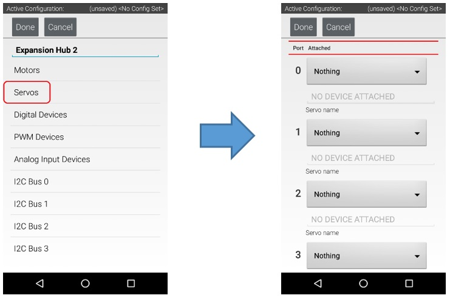
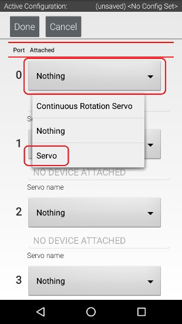
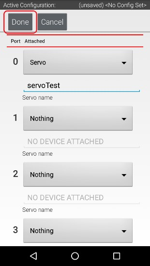

Configuring a Servo
====================

You will also want to add a servo to the configuration file. In this
example, you are using a standard 180-degree servo.

Configuring a Servo Instructions
--------------------------------

1. Touch on the word **Servos** on the screen to display the **Servo  
Configuration** screen.                                               

|

2. Use the dropdown control to select "Servo" as the servo type for   
port #0.                                                              

|

3. Use the touch pad to specify the name of the servo ("servoTest"    
for this example) for port #0.                                        

.. image:: images/ConfiguringHardwareServoStep3.jpg
   :align: center

|

4. Press the **Done** button to complete the servo configuration. The 
app should return to the previous screen.                             

|