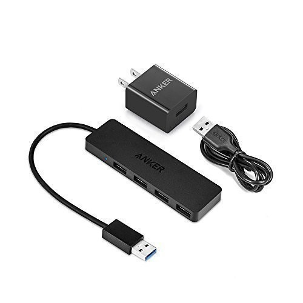
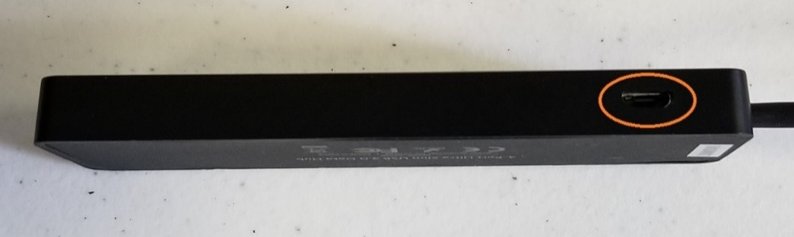
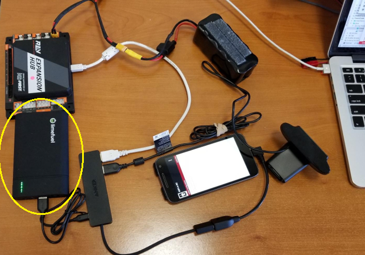
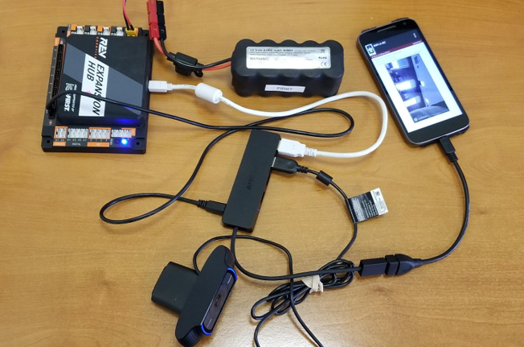
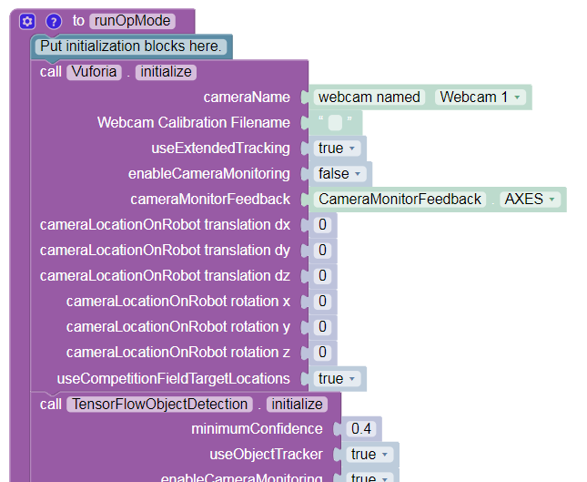

Configuring an External UVC Camera and a Powered USB Hub
==========================================================

Introduction
------------

Game rules and in the Game Manual Part 1 have been modified to allow the
use of USB Video Class (UVC) Compatible Cameras for computer
vision-related tasks. Teams have the option of using an externally
connected camera instead of the Android smartphone’s built-in camera for
computer vision tasks.

The advantage of using an external camera is that the camera can be
mounted in a location that is convenient for vision-related tasks while
the Android Robot Controller can be mounted where it is convenient for
Robot Controller-related tasks.

The disadvantage of using an external camera is there is additional
complexity introduced with the USB-connected camera. An external camera
adds costs and weight to a robot and it needs to be wired correctly to
run properly.

What type of External Camera can be Used?
-----------------------------------------

The system supports a “UVC” or USB Video Device Class cameras.
Theoretically, if a camera is UVC compliant, then it should work with
the system. However, there are a couple of recommended web cameras that
have been tested with the FIRST Tech Challenge software and have been
calibrated to work accurately with this software:

-  Logitech HD Webcam C310
-  Logitech HD Pro Webcam C920

Note that calibrating a UVC camera is an advanced task. Details on how
to create a calibration file can be found in the comments of the
*teamwebcamcalibrations.xml* file that is available as part of the
ftc_app project folder (visit this
`link <https://github.com/ftctechnh/ftc_app/blob/master/TeamCode/src/main/res/xml/teamwebcamcalibrations.xml>`__
for an online copy of the file).

.. image:: images/uvcdiagram.png

USB Hub
-------

Teams who would like to use an external camera will need a USB hub to
connect their Android Robot Controller to the external camera and the
REV Robotics Expansion Hub. To work properly, the USB hub should meet
the following requirements:

1. Compatible with USB 2.0.
2. Supports a data transfer rate of 480Mbps.

Note that the Modern Robotics Core Power Distribution Module cannot be
used for this task since its data transfer speed is not fast enough to
work with the USB-connected webcam.

Also note that rule c(iii) permits the use of a powered USB hub to make
this connection. If a team uses a powered USB hub, the power to operate
the USB hub can only come from either of the following sources:

1. An externally connected USB 5V Battery Pack.
2. The 5V DC Aux power port of a REV Robotics Expansion Hub (note that
   this requires advanced skills to implement).

FIRST has tested a few USB 2.0 powered hubs and recommends one from
Anker. At the time this document was written, this hub was available
from `Amazon.com <https://www.amazon.com/s?k=anker+4-port+usb+hub>`__.

The Anker 4-port powered hub is convenient because it has a Micro USB
port that is used to connect the hub to a 5V power source (highlighted
with orange circle in figure below).

This port allows a user to plug a standard USB type B Micro Cable into
the hub, and then connect the other end of the cable (which has a USB
Type A connector) into the output port of an external 5V USB battery
pack. In the image below, the Anker 4 port hub is powered by a
“limefuel” external 5V battery pack using a standard Type A to Type B
USB Micro cable. Note the battery is highlighted by the yellow outline
in the figure below.

A USB hub can also draw power from the 5V auxiliary ports on the REV
Robotics Expansion Hub. This configuration requires that the user have a
special cable that on one end can be plugged into the 5V Auxiliary port
and on the other end can be plugged into the power port of the USB hub.

Note that teams can create this special cable using one end of a servo
extension cable (to plug into the 5V aux port) and one end of a Micro
USB cable (to plug into the Anker hub’s power port). **Creating this
cable is an advanced task and should only be attempted by teams who have
guidance from an adult mentor who has expertise in electronics and
wiring! It is extremely important that the polarity is correct for this
special cable. If the polarity is reversed it could damage your
electronic equipment.**

Sample Op Modes
---------------

There are sample Blocks and Java Op Modes that demonstrate how to use
the external UVC web camera for Vuforia or TensorFlow operations. Before
a team can use the external UVC camera, a configuration file must be
configured with the external camera defined as one of the USB-connected
devices.

Once a valid configuration file has been defined and activated, the
programmer can use the external UVC camera, instead of the internal
Android cameras, for vision-related tasks.

