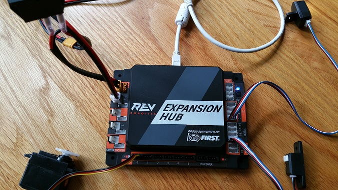
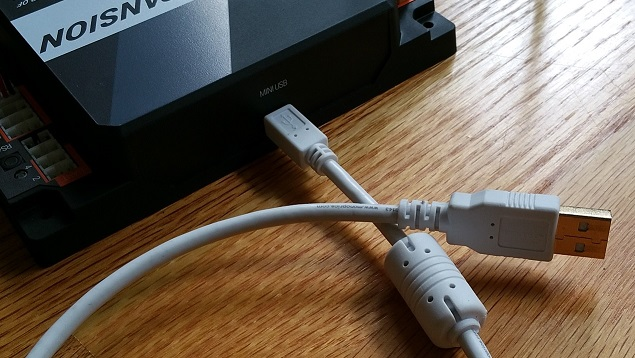
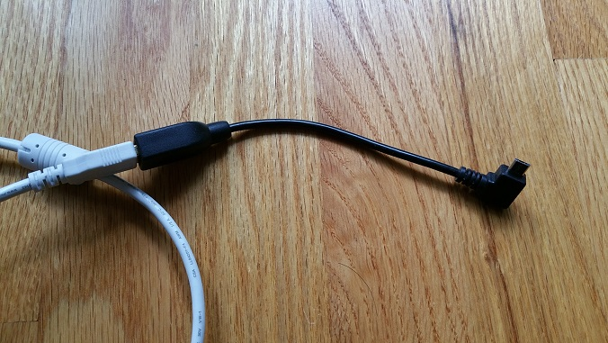
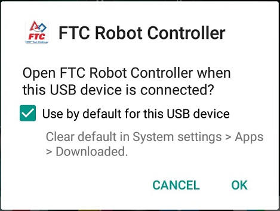
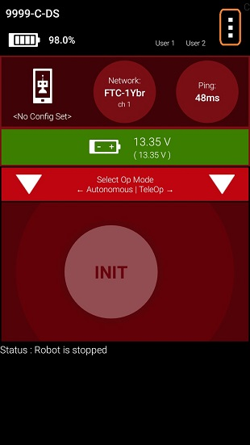
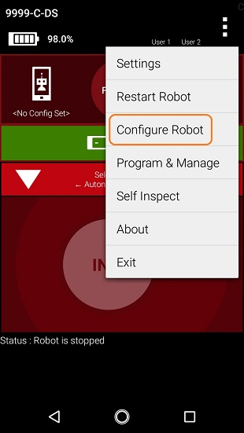
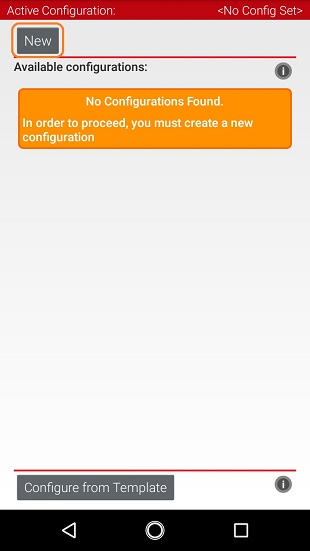
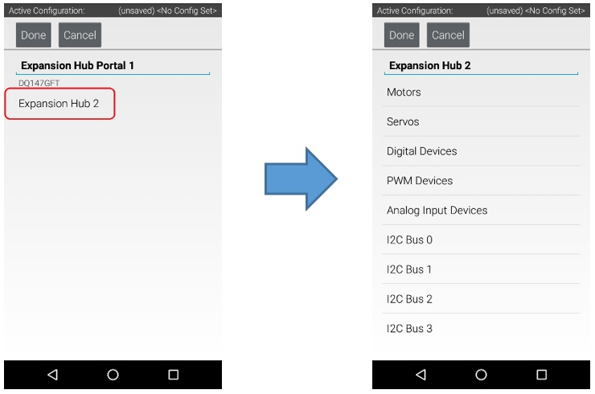

Getting Started
===============

Getting a Smartphone Robot Controller Ready
~~~~~~~~~~~~~~~~~~~~~~~~~~~~~~~~~~~~~~~~~~~~

Before you can communicate with the motor, servo and sensors that are
connected to the Control Hub or Expansion Hub, you first must create a
configuration file on your Robot Controller, so that the Robot
Controller will know what hardware is available on the Control Hub's or
Expansion Hub's external ports.

Connecting an Android Smartphone to an Expansion Hub
^^^^^^^^^^^^^^^^^^^^^^^^^^^^^^^^^^^^^^^^^^^^^^^^^^^^

If you are using an Android smartphone as a Robot Controller, you must
physically connect the Robot Controller smartphone to the Expansion Hub
using a USB cable and an On-The-Go (OTG) adapter. Also, you should
verify that the Driver Station is currently paired to the Robot
Controller.

Connecting an Android Smartphone to an Expansion Hub Instructions
-----------------------------------------------------------------

1. Power on the Expansion Hub by turning on the power switch.         

|

2. Plug the Type B Mini end of the USB cable into the USB mini port   
on the Expansion Hub.                                                 

|

3. Plug the Type A end of the USB cable into the OTG adapter.         

|

4. Verify that your Robot Controller smartphone is powered on and     
unlocked. Plug in the USB Micro OTG adapter into the OTG port of the  
Robot Controller phone.                                               

.. image:: images/ConfiguringHardwareStep4.jpg
   :align: center

|

Note that when the OTG adapter is plugged into the smartphone, the phone will detect the presence of the Expansion Hub and launch the Robot Controller app.

5. The first time you connect the Robot Controller smartphone to the  
Expansion Hub, the Android operating system should prompt you to ask  
if it is OK to associate the newly detected USB device (which is the  
Expansion Hub) with the Robot Controller app.                     

|

.. important:: 
   You might be prompted multiple times to associate the USB hardware with the
   Robot Controller.  Whenever you are prompted by your phone with this
   message, you should always select the "Use by default for this USB device"
   option and hit the "OK" button to associate the USB device with the Robot
   Controller app. If you fail to make this association, then the Robot
   Controller app might not reliably connect to this Expansion Hub the next
   time you turn your system on.

Getting the Control Hub Ready
~~~~~~~~~~~~~~~~~~~~~~~~~~~~~

If you are using a Control Hub, you do not need to make any additional
connections. You simply need to make sure that the Control Hub is
powered on and paired to the Driver Station.

Creating a Configuration File Using the Driver Station
^^^^^^^^^^^^^^^^^^^^^^^^^^^^^^^^^^^^^^^^^^^^^^^^^^^^^^

Although the configuration file needs to reside on the Robot Controller,
for this tutorial we will use the Driver Station app to create the
configuration file remotely. The Driver Station can be used to create a
configuration file for a Control Hub or for an Android smartphone Robot
Controller.

Creating a Configuration File on the Robot Controller using the Driver Station Instructions
-------------------------------------------------------------------------------------------

1. Touch the three vertical dots in the upper right hand corner of    
the Driver Station app. This will launch a pop-up menu.               

|

2. Select **Configure Robot** from the pop up menu to display the     
**Configuration** screen.                                             

|

3. If your Robot Controller does not have any existing configuration  
files, the screen will display a message indicating that you need to  
create a file before proceeding.                                      

|

Hit the **New** button to create a new configuration file for your Robot Controller.

4. When the new configuration screen appears, the Robot Controller    
app will do a scan of the serial bus to see what devices are          
connected to the Robot Controller.                                    

.. image:: images/ConfiguringHardwareStep9.jpg
   :align: center

|

It will display the devices that it found in a list underneath the words "USB Devices in configuration." You should see an entry that says something like "Expansion Hub Portal 1" in the list.

Your Expansion Hub is listed as a Portal because it is directly connected to the Robot Controller phone through the USB cable or in the case of the Control Hub through the internal serial bus.

If you do not see your Expansion Hub Portal listed and you are using a smartphone as a Robot Controller, check the wired connections to make sure they are secure and then press the Scan button one or two times more to see if the smartphone detects the device on a re-scan of the USB bus.

5. Touch the Portal listing ("Expansion Hub Portal 1" in this         
example) to display what Expansion Hubs are connected through this    
Portal.                                                               

.. image:: images/ConfiguringHardwareStep10.jpg
   :align: center

|

Since we only have a single Expansion Hub connected, we should only see a single Expansion Hub configured ("Expansion Hub 2" in this example).

6. Touch the Expansion Hub listing ("Expansion Hub 2" in this         
example) to display the Input/Output ports for that device.           

|

The screen should change and list all the motor, servo and sensor ports that are available on the selected Expansion Hub.
