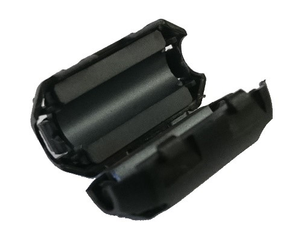

Managing Electrostatic Discharge Effects
=========================================

Introduction
~~~~~~~~~~~~

Electrostatic discharge (ESD) events have the potential to disrupt the
normal operation of a competition robot. This section examines causes of
ESD events and discusses ways to mitigate the risk that an ESD event
will disable or damage a robot’s control system.

Note that this section only provides a brief overview of the physical
phenomenon that causes ESD disruptions. You can use the following link
to view an in-depth white paper, written by Mr. Eric Chin (a FIRST
alumnus and a 2018 summer engineering intern), which examines and
quantifies the efficacy of various ESD mitigation techniques:

`Eric Chin’s White Paper on ESD Mitigation Techniques and their
Efficacy <https://www.firstinspires.org/sites/default/files/uploads/resource_library/ftc/analysis-esd-mitigation-echin.pdf>`__

Special thanks to Doug Chin, Eric Chin, and Greg Szczeszynski for the work they
did to model the problems caused by ESD and to evaluate different techniques to
mitigate the risk caused by this phenomenon.  Also special thanks to *FIRST*
Tech Challenge Teams 2844, 8081, 10523, 10523a, and 10984, and the volunteer
team from Arizona (including Robert Garduno, Susan Garduno, Richard Gomez,
Matthew Rainey, Christine Sapio, Patricia Strones, and David Thompson) for
assisting in testing some of these mitigation techniques under the hot desert
sun!

What is an Electrostatic Discharge Event?
~~~~~~~~~~~~~~~~~~~~~~~~~~~~~~~~~~~~~~~~~

An electrostatic discharge (ESD) event occurs when a highly charged
conductive object (like the metal frame of a robot) touches an uncharged
or oppositely charged conductive object and discharges to it. Because of
the high voltages involved (up to tens of kilovolts), ESD events can
produce extremely high electrical currents as the charge that was
accumulated on one object flows through a conductive path to the neutral
or oppositely charged object.

.. figure:: images/positivelyChargedRobot.png
   :align: center

   Positively charged robot next to neutral field wall.

How Robots Become Charged
~~~~~~~~~~~~~~~~~~~~~~~~~

Consider what happens when you shuffle your feet on a carpet in wool
socks and then touch a door knob. You’ll almost certainly get a shock.
What causes this phenomenon? When two surfaces interact, there is a
small amount of adhesion. This means that they share electrons and if
they are made from different materials the electron sharing may be
uneven. When the surfaces are taken apart, they can become charged. This
is called the triboelectric effect.

.. figure:: images/triboelectric.png
   :align: center

   Robots become charged due to the triboelectric effect.

A robot’s wheels moving on field tiles build charge on the robot frame just
like your wool socks moving on carpet build charge on your body.  Many other
plastic and rubber materials behave similarly. It is important to note that
triboelectric charging takes charge from one object and gives it to another, so
the charges are mirrored. In the case of a *FIRST* Tech Challenge robot,
positive charge accumulates on the wheels and negative charge accumulates on
the tiles.

Note that a robot with wheels that slide across the soft tiles of a
competition field will build electrostatic charge on its frame more
rapidly than a robot with wheels that roll across the tiles.

Discharging a Robot
~~~~~~~~~~~~~~~~~~~

Current “wants” to flow from objects at higher potential to the objects
at lower potential to equalize the voltage difference between them and
it will if given a conductive path to do so (like an uninsulated wire).
In the case of a robotics competition, if a robot is at a higher
potential than another metallic object (such as a portion of the game
field), an ESD event will occur if the frame of the charged robot
contacts the other object.

If the potential difference is high enough, it is also possible for
current to flow through the air in the form of an electrical arc. Arcing
occurs when the air between two differently charged conductors becomes
ionized and allows current to flow from one conductor to the other. Arcs
at voltages seen on FIRST Tech Challenge robots can jump air gaps of
more than 3/8” (1 cm). Arcs behave almost like direct contact, so they
can carry a significant amount of current. Visible sparks go with large
electrostatic arcs.

   Electric arc between two spheres of opposite charge.

What Steps can be Taken to Mitigate the Risk of an ESD Disruption?
~~~~~~~~~~~~~~~~~~~~~~~~~~~~~~~~~~~~~~~~~~~~~~~~~~~~~~~~~~~~~~~~~~

Step 1: Treating the Tile Floor with Anti-Static Spray (Event Hosts Only)
^^^^^^^^^^^^^^^^^^^^^^^^^^^^^^^^^^^^^^^^^^^^^^^^^^^^^^^^^^^^^^^^^^^^^^^^^

One of the most effective ways to reduce the risk of disruption by ESD
events is to treat the tile floors of a competition field with
anti-static spray. Anti-static spray increases electrical conductivity
of the surface of the tiles. This helps prevent the build-up of
electrostatic charge on the robots as the move across the tile floor.

*FIRST* recommends the use of `ACL Heavy Duty
Staticide <https://www.aclstaticide.com/products/heavy-duty-staticide>`__
spray to treat the tiles. This spray is extremely effective at
preventing charge build up on the robots. Also, this spray only needs to
be applied once and it will last for an entire event (and it will work
across multiple days).

Note that treating the tile floor is something that **only the event
host is authorized to do**. Teams are **not permitted** to treat the
tile floor themselves.

Step 2: Add Ferrite Chokes to Signal Wires
^^^^^^^^^^^^^^^^^^^^^^^^^^^^^^^^^^^^^^^^^^

Ferrite chokes block large changes in current like those seen during an
ESD event. This can reduce the risk of damage to or disruption of
electrical components when a sensor or other peripheral device receives
a shock.

   A snap-on ferrite choke.

Using ferrite chokes can be a very effective method for mitigating the
effects of ESD:

1. Use USB cables that have built-in or snap-on ferrite chokes.
2. Install snap-on ferrite chokes onto your signal cables:

   -  Sensor cables
   -  Encoder cables
   -  Servo cables

Step 3: Electrically Isolating the Electronics from the Metal Frame of the Robot
^^^^^^^^^^^^^^^^^^^^^^^^^^^^^^^^^^^^^^^^^^^^^^^^^^^^^^^^^^^^^^^^^^^^^^^^^^^^^^^^

As a robot moves back and forth across the tile floor during a FIRST
Tech Challenge match, charge can accumulate on the metallic frame of the
robot due to the triboelectric effect. If a charge builds up on the
frame of the robot, but the electronics that make up the Control System
are at a different voltage, then a shock can occur if an exposed or
poorly insulated portion of the Control System gets close (less than
3/8” or 10mm) to the metal frame.

Electrically isolating or insulating the electronics from the frame can
help avoid disruptions due to this type of shock.

Sub Step A: Mounting Electronics on a Non-Conductive Material
'''''''''''''''''''''''''''''''''''''''''''''''''''''''''''''

Mounting the Control System Electronics on a non-conductive material,
such as a thin sheet of plywood or a sheet of PVC type A, can help
reduce the risk of an ESD event between the frame and the electronics.
Using a non-conductive, rigid panel can also help with wire management
and strain relieving.

Sub Step B: Isolate Exposed or Poorly Insulated Parts of the Electronics
''''''''''''''''''''''''''''''''''''''''''''''''''''''''''''''''''''''''

Certain parts of the Control System’s electronics have exposed metal or
are poorly insulated. If these parts are placed too close to the metal
frame, a shock can occur if a charge accumulates on the frame.

.. figure:: images/poorlyinsulated.jpg
   :align: center

   Electrostatic shocks can occur at poorly insulated or exposed portions
   of the electronics.

For example, the 4-wire sensor cables that are used by the REV Robotics
Expansion Hub have plastic connectors that are poorly insulated. If a
charge accumulates on the metal frame of the robot, and the end of
sensor cable is placed close to the frame, a shock can occur and this
shock can disrupt or even damage the I2C port of an Expansion Hub.

Similarly, some servo extension cables (see figure above) have exposed
portions of metal that could be vulnerable to ESD unless properly
isolated or insulated.

.. figure:: images/keepawayfromframe.jpg
   :align: center

   Keep exposed portions of the electronics more than 3/8” (10mm) away from
   the frame.

Moving these vulnerable areas of the electronics system away from the
frame (with an air gap greater than 3/8” or 10mm) can help reduce the
risk of an ESD disruption. Using electrical tape to insulate these areas
can be equally effective and may be easier to implement.

.. figure:: images/tapepoorlyinsulated.jpg
   :align: center

   Electrical tape can be used to insulate exposed or poorly insulated
   metal.

Step 3: Covering Exterior Metal Features with Electrically Insulated Material
^^^^^^^^^^^^^^^^^^^^^^^^^^^^^^^^^^^^^^^^^^^^^^^^^^^^^^^^^^^^^^^^^^^^^^^^^^^^^

Another ESD mitigation strategy is to cover exposed portions of metallic
frame pieces with an electrically insulating material. Covering the
conductive exterior parts of a robot with a non-conductive material
reduces the risk that they will touch a conductive object at a different
electrical potential and trigger an ESD event. Wooden bumpers,
electrical tape, and other non-conductive coatings are all effective.

.. figure:: images/coverwithtape.jpg
   :align: center

   Insulating portions of the robot that touch other metallic objects on
   the field can help.

In past seasons, teams who have done this have observed reductions in
the frequency and severity of ESD events on their robots.

Step 4: Ground Electronics to Metal Frame with an Approved Cable
^^^^^^^^^^^^^^^^^^^^^^^^^^^^^^^^^^^^^^^^^^^^^^^^^^^^^^^^^^^^^^^^

Because it is difficult to perfectly isolate the electrical system, it
is beneficial to ground the electrical system to the frame of the robot
to prevent a potential difference from building up between the frame and
the electronics. Doing this can help reduce the risk that a shock can
occur between the frame of a robot and the Control System electronics.

.. figure:: images/REV-31-1269-ResistiveGroundingStrap.jpg
   :align: center

   The REV Resistive Grounding Strap (REV-31-1269) is an approved grounding
   cable.

It is important that the grounding **only be done using a
FIRST-approved, commercially manufactured cable** (i.e., the REV-31-1269
Resistive Grounding Strap). A FIRST-approved cable has an appropriately
sized inline resistor. This resistor is critical because it acts as a
safeguard to prevent excessive current from flowing through the frame of
the robot if a “hot” (positive) wire of the electronics system is
inadvertently short circuited to the frame of the robot. Also, the
commercially manufactured grounding cable has a keyed connection, which
is designed to prevent a user from inadvertently connecting a hot (12V)
line to the frame of robot.

Note that if your team uses Anderson Powerpole connectors, then you will
need to use the REV Robotics Anderson Powerpole to XT30 Adapter cable in
conjunction with REV Robotics’ Resistive Grounding Strap:

   The REV-31-1385 adapter is approved for use with REV’s Resistive
   Grounding Strap.

To ground the electronics, plug one end of the FIRST-approved cable into
a spare XT30 port on the Control System electronics. Then bolt the other
end using a conductive (i.e., metal) bolt to the frame of the robot.

.. figure:: images/groundtheelectronics.png
   :align: center

   Ground the electronics to the frame using a FIRST-approved cable.

It might initially seem contradictory to both insulate the electronic
components of the control system from the frame and to also ground the
electronics to the frame. However, if the electronics are not grounded
to the frame, shocks can occur if a charge builds on the robot frame and
an exposed or poorly insulated portion of the electronics (such as the
base of a REV Robotics color sensor) gets close it. If the electronics
are grounded to the frame, the grounding wire helps keep the electronics
at the same potential as the frame, preventing arcs between the two
systems.
