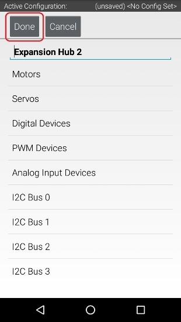
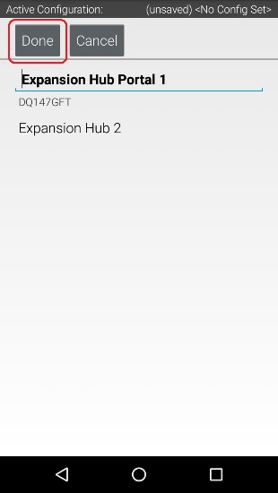
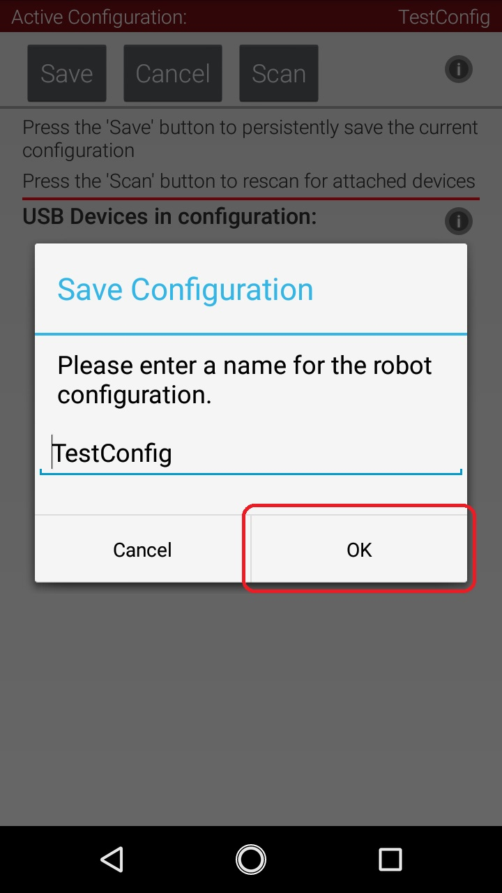
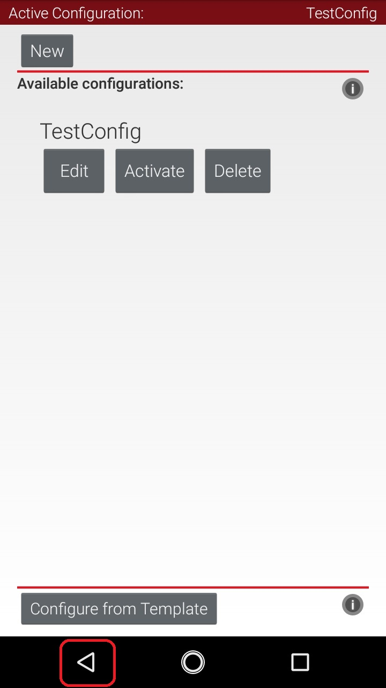
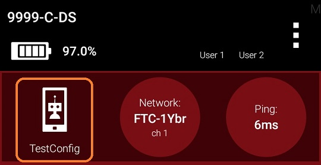

Saving the Configuration Information
====================================
Once you have configured your hardware, you must save the information to
the configuration file. If you do not save this information, it will be
lost and the robot controller will be unable to communicate with your
hardware.

Saving the Configuration Information Instructions
-------------------------------------------------

1. Press the **Done** button to go up one level in the configuration  
screens.                                                              

|

2. Press the **Done** button again to return to the highest level in  
the configuration screens.                                            

|

3. Press the **Save** button.                                         

.. image:: images/SavingConfigurationInformationStep3.jpg
   :align: center

|

4. When prompted, specify a configuration file name using the         
touchscreen's keypad (use "TestConfig" for this example).             

.. image:: images/SavingConfigurationInformationStep4.jpg
   :align: center

|

5. Press the **OK** button to save your configuration information     
using that file name.                                                 

|

6. After the configuration file has been saved, touch the Android     
back-arrow button to return to the main screen of the app.            

|

7. Verify that the configuration file is the active configuration     
file on the main Driver Station screen.                               

|