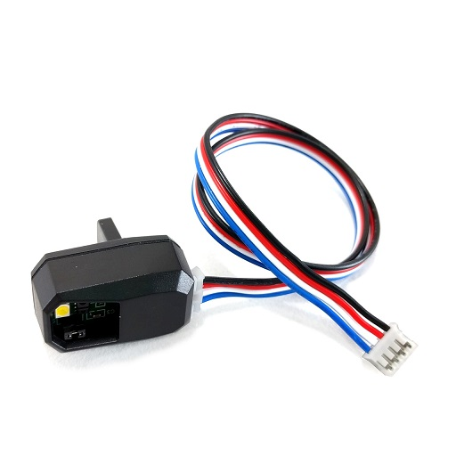
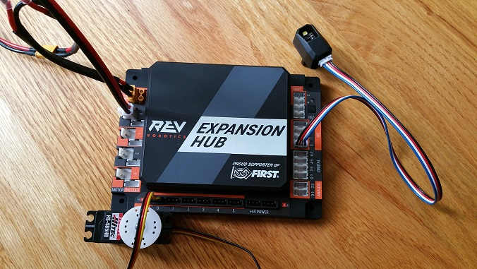

Connecting a Color-Distance Sensor to the Hub
=============================================

The Hub has 4 independent I2C buses. Each bus has its own port on the
Hub. We will connect a REV Robotics Color-Distance sensor to the I2C bus
#0 on the Hub.

Note that it will take an estimated 2.5 minutes to complete this task.

Connecting a Color-Distance Sensor to the Hub Instructions
----------------------------------------------------------

1. Connect one end of the 4-pin JST PH cable to the REV Robotics  
Color-Distance sensor.                                                

|

2. Plug the other end of the 4-pin JST PH cable to the I2C port       
labeled "0" on the Hub.                                               

|