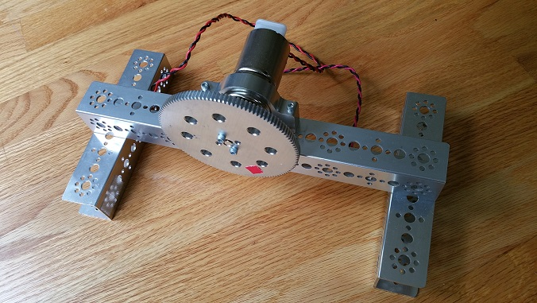
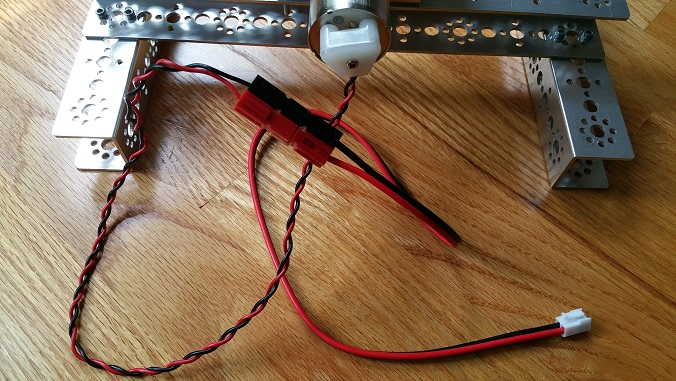
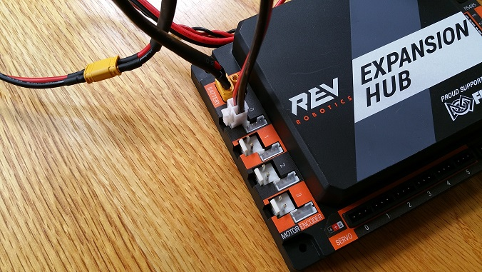

Connecting a Motor to the Hub
==============================

The Hub can drive up to four (4) 12V DC motors per Hub. The Hub uses a
type of electrical connector known as a 2-pin JST VH connector. Many of
the FIRST-approved 12V DC motors are equipped with Anderson Powerpole
connectors. An adapter cable can be used to connect the Anderson
Powerpole connectors to the Hub motor port (see `FIRST Tech Challenge
Robot Wiring
Guide <https://www.firstinspires.org/sites/default/files/uploads/resource_library/ftc/robot-wiring-guide.pdf>`__
for more information).

|

For the examples in this tutorial, *FIRST* recommends that the user build a
simple rig to secure the motor in place and prevent it from moving about
during the test runs. The image above shows a Tetrix motor installed in
a rig built with a Tetrix motor mount and some Tetrix C-channels. A gear
was mounted on the motor shaft to make it easier for the user to see the
rotation of the shaft.

Note that it will take an estimated 2.5 minutes to complete this task.

Connecting a 12V Motor to the Hub Instructions
----------------------------------------------

1. Connect the Anderson Powerpole end of the motor's power cable to   
the Powerpole end of the Anderson to JST VH adapter cable.            

|

2. Connect the other end of the Anderson to JST VH adapter cable into 
the motor port labeled "0" on the Hub.                                

|