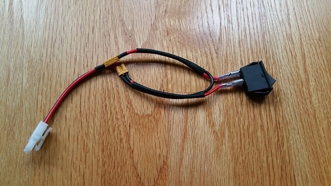
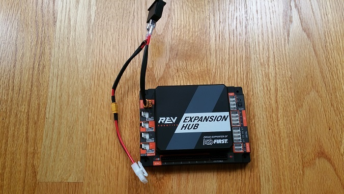
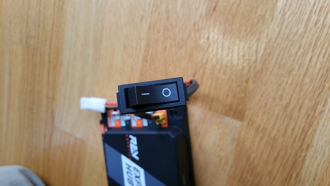
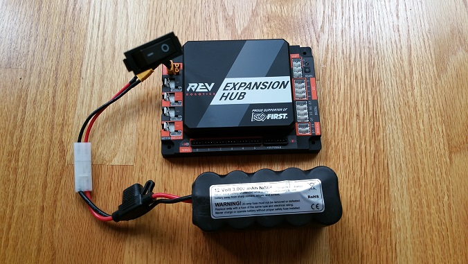
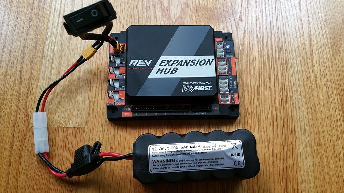

Connecting 12V Power to the Hub
================================

The Hub draws power from a 12V rechargeable battery. For safety reasons,
the battery has a 20A fuse built in. A mechanical switch is used to turn
on/turn off the power.

Note that it will take an estimated 5 minutes to complete this task.

Connecting 12V Power to the Hub Instructions
--------------------------------------------

1. If your 12V battery has a Tamiya style connector, connect the      
Tamiya to XT30 adapter cable to the matching end of the switch cable. 

|

.. note:: Do not connect the 12V battery to the Tamiya adapter yet.  We will connect the battery during a later step.

2. Connect the other end of the switch cable to a matching XT30 port  
on the Hub.                                                           

|

3. Verify that the switch is in the OFF position.     

|   

4. Connect the 12V battery to the Tamiya to XT30 cable.

|

5. Turn on the switch and verify that the Hub is drawing power from   
the battery. Note that the Hub's LED should be illuminated (notice    
the blue LED in upper right-hand corner of the Hub in the image       
below).                             

|

6. Turn off the switch and verify that the Hub is off. Note that the  
Hub's LED should not be illuminated.

.. image:: images/Connecting12VStep6.jpg
   :align: center

|