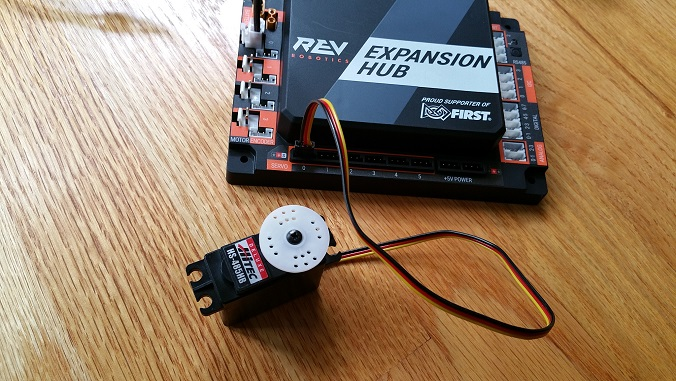
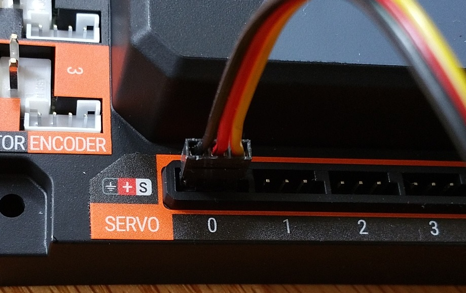

Connecting a Servo to the Hub
==============================

The Hub has 6 built-in servo ports. The servo ports accept the standard
3-wire header style connectors commonly found on servos. Note that
ground pin is on the left side of the servo port.

Note that it will take an estimated 2.5 minutes to complete this task.

Connecting a Servo to the Hub Instructions
------------------------------------------

1. Connect the servo cable to the servo port labeled "0" on the Hub.  
Note that the ground pin is on the left side of the servo port.       

|

2. Verify that the black ground wire of the servo cable matches the   
ground pin of the servo port (which is aligned on the left side of    
the port).                                                            

|