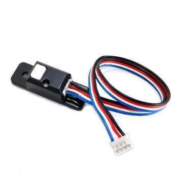
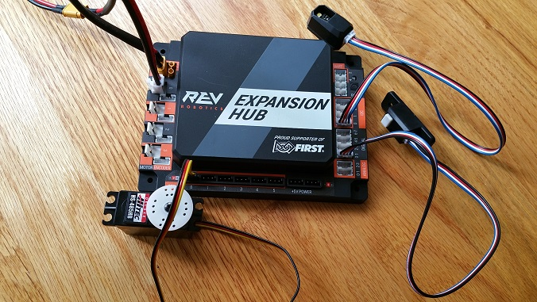

Connecting a Touch Sensor to the Hub
=====================================

The Hub has 4 independent digital input/output (I/O) ports. Each port
has two digital I/O pins for a total of 8 digital I/O pins on a Hub. You
will connect a REV Robotics Touch sensor to one of the digital I/O
ports.

Note that in the case of the REV Robotics Touch Sensor, the device has a
connector port for a 4-pin sensor cable. However, the device only needs
to connect to one of the two available digital I/O pins. For the REV
Robotics Touch Sensor, the second digital I/O pin in the port is the one
that gets connected when a standard REV Robotics 4-pin JST PH cable is
used. For the "0-1" port, it is the pin labeled "1" that gets connected
through the 4-pin cable. Similarly, for the "2-3" port, it is the pin
labeled "3" that gets connected through the 4-pin cable.

Note that it will take an estimated 2.5 minutes to complete this task.

Connecting a Touch Sensor to the Hub Instructions
-------------------------------------------------

1. Connect one end of the 4-pin JST PH cable to the REV Robotics  
Touch sensor.

|

2. Plug the other end of the 4-pin JST PH cable to digital I/O port   
labeled "0" on the Hub.

|

