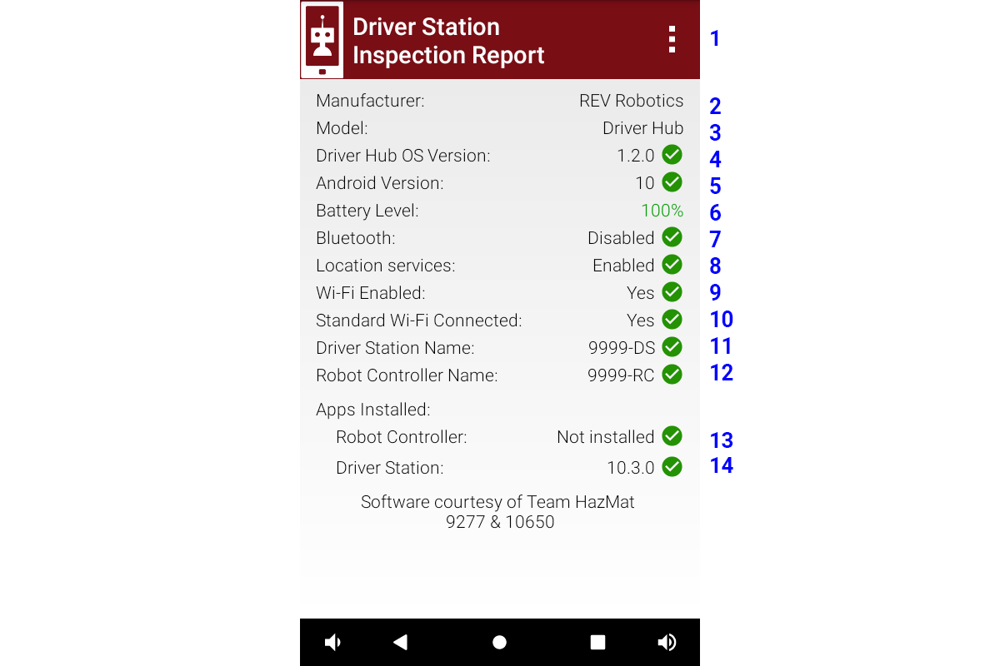
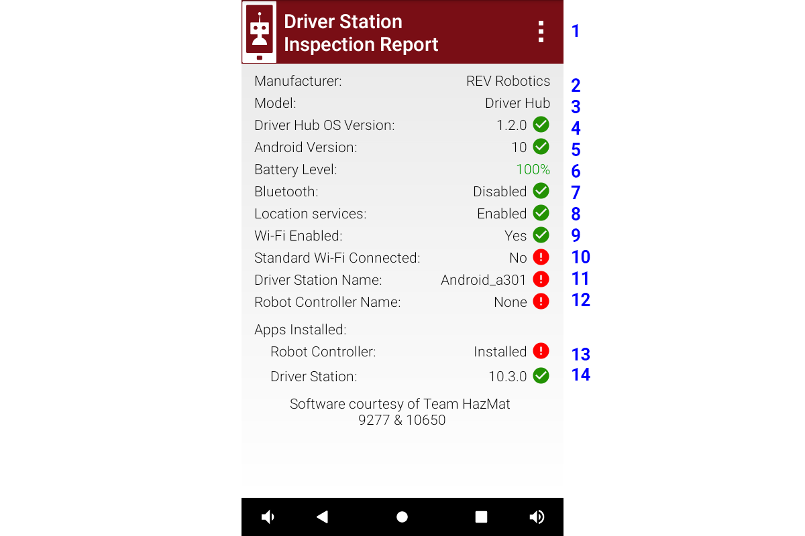
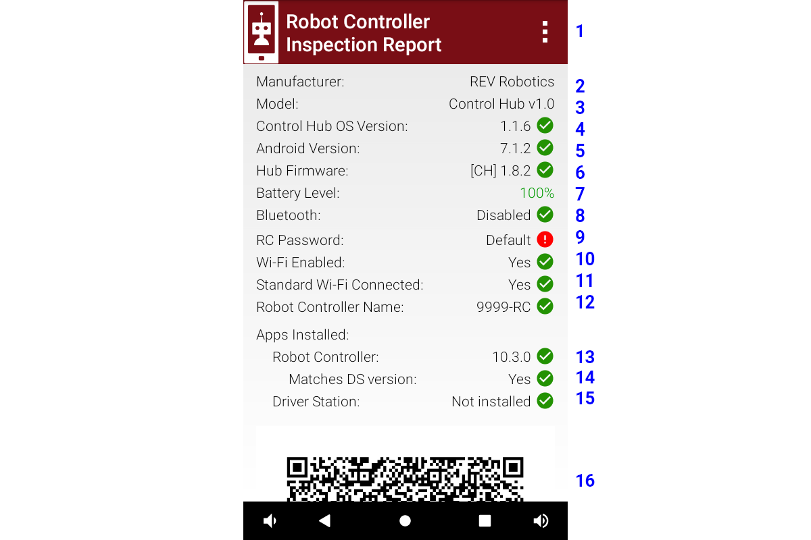
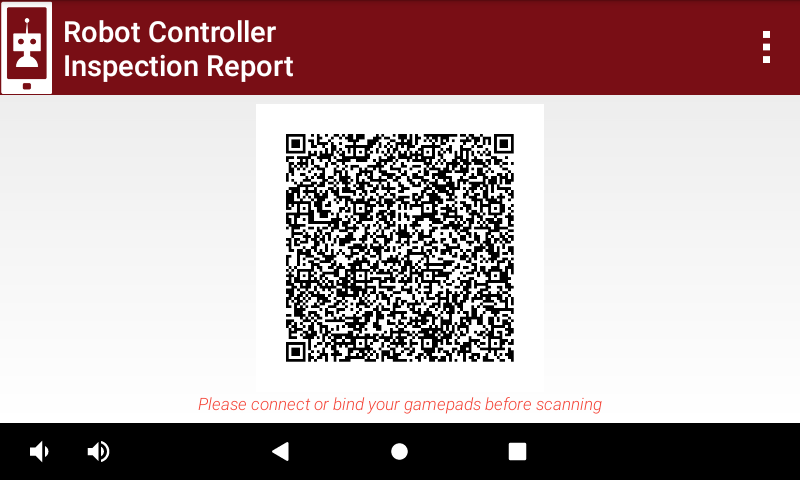

*FIRST* Tech Challenge Self-Inspect
===================================

Introduction
------------

This page describes the Self Inspect screens in the FTC Driver Station
(DS) app and the FTC Robot Controller (RC) app.

A Self Inspect screen provides a snapshot of device status, as it
relates to FTC rules for the control system. 
These rules are described in the Competition Manual which can be found on the
`Current Game and Season Materials page <https://ftc-resources.firstinspires.org/files/ftc/game>`_ on the *FIRST* Website.

.. tip:: An `Inspection Checklist (PDF) <https://ftc-resources.firstinspires.org/ftc/event/inspection-check>`_ 
   is available to help teams self-inspect their ROBOT before their event. Teams are strongly encouraged to self-inspect prior to their event.
   
   There is also a `Inspection Quick Reference (PDF) <https://ftc-resources.firstinspires.org/ftc/event/inspection-reference>`_ 
   with some examples of legal and illegal parts (though it is not a substitute for the Competition Manual).

The Self Inspect screen is provided only as a quick, handy reference to
help teams confirm that certain control system elements are up-to-date
and properly configured.

Each inspection screen updates automatically, with or without a Restart
Robot. This allows quick verification that issues have been resolved.

The challenge is to maximize useful information in a small screen. The
Self Inspect layout and graphics evolve with FTC requirements; this page
clarifies some of the brief but meaningful captions.

Robot Inspection
----------------

The Self Inspection reports may be reviewed in Robot Inspection at an FTC tournament, but is **not** a comprehensive or official standard of compliance with FTC rules.
With the robot and driver station turned on and connected the inspector may go through the **Inspection Checklist** form (on paper or a tablet).
They will check both the **Driver Station Inspection Report** and the **Robot Controller Inspection Report**, both of which can be displayed from the DS.
Many FTC events will scan the QR Code that is displayed on the RC Inspection Report.

Version Information
-------------------

The Competition Manual lists the minimum recommended versions of device firmware, Android operating system, and FTC Apps.
Teams may choose to run older versions without affecting their ROBOT inspection status.
This avoids the situation of trying to upgrade a device at a competition at the last minute where a mistake might leave the robot inoperable.

.. note::
  The images in this page show Version 10.3 or newer of the FTC apps.
  This page only shows a Driver Hub paired with a Control Hub, there may be slight differences if a phone is used as a driver station or robot controller.
  See the :doc:`old self-inspect<self-inspect>` page for screen images for app versions 10.2 or earlier.

*FIRST* recommends but does not require that teams use the most recent versions of firmware, Android Operating System, and FTC Apps.
Current versions have the latest bug fixes and enhancements. For example, version 1.1.6 of the **Control Hub Android OS** has a fix related to Wi-Fi.
 
Each FTC season new major versions the FTC Apps are released. The INTO THE DEEP major version is 10, and the DECODE major version is 11.
If the game has AprilTags, the SDK will include :doc:`localization<../../apriltag/vision_portal/apriltag_localization/apriltag-localization>` information for those tags that lets you determine the robot's position on the field.
As the season progresses, minor releases will include bug fixes and some enhancements. e.g. 11.1, 11.2, etc.
  
Regardless of the versions selected, it is highly recommended that the installed ROBOT CONTROLLER
App and DRIVER STATION App versions match major and minor values to ensure compatibility as not
all software versions are compatible with each other.

Teams may choose to run older versions without affecting their ROBOT inspection status. 

.. caution::
   Some FTC App versions have a different robot communication protocol and are unable to connect with each other.
   
   FIELD STAFF will not be able to provide comprehensive support to teams with software older than the recommended version. 

Driver Station Self Inspection Report
-------------------------------------

The following is a screen shot of a DS Self Inspection Report with the Driver Hub rotated so that the screen is in portrait mode so all items on the report are visible on one screen without scrolling.

   All items are good

-  Item 1 The three dots are a menu with two choices: ``Disconnect from Wi-Fi Direct`` and ``Disable Bluetooth``. 
   Neither is likely needed for a Driver Hub paired to a Control Hub, they are mostly for phones that could be used as a driver station or robot controller.
   ``Disconnect from Wi-Fi Direct`` does work, but sometimes the apps re-pair automatically.
   ``Disable Bluetooth`` shouldn't be needed unless Bluetooth was somehow enabled on the DS.
-  Item 2 ``Manufacturer`` should be **REV Robotics** for a REV Driver Hub. 
-  Item 3 ``Model`` should be **Driver Hub**.
-  Item 4 ``Driver Hub OS Version`` is probably 1.2.0.
-  Item 5 ``Android Version`` is probably 10 for a Driver Hub. 
-  Item 6 shows the ``Battery Level`` of the device being reported. Fun
   fact: the green color of the percentage value changes towards
   **orange** as the charge level goes down.
-  Item 7 ``Bluetooth`` should be **Disabled**.
-  Item 8 ``Location services`` should be **Enabled**, but appears only on devices running
   **Android 8** or higher. This is an SDK/Android technology requirement, not an FTC rule.
-  Item 9 ``Wi-Fi Enabled`` must be **Yes** as it means the DS device’s Wi-Fi radio is **ON**.
-  Item 10 ``Standard Wi-Fi Connected`` must be **Yes** to indicate the Driver Hub is connected to a standard Wi-Fi source, such as a Control Hub.
-  Item 11 shows the ``Driver Station Name`` meets FTC format requirements. It should be your team number plus -DS, example 99999-DS.
   If a spare device is configured, a letter designator may be added <team number>-<letter>-DS (e.g., 12345-A-DS, 12345-B-DS).
   See the Competition Manual for device naming rules.
-  Item 12 shows the ``Robot Controller Name``. It will show **None** if not connected. It will show an error if team number portion of the Robot Controller and Driver Station names do not match.
   It does not check whether the RC name matches FTC format requirements. See the Robot Controller Self Inspection Report.
-  Item 13 Apps Installed ``Robot Controller`` should be **Not installed**. This verifies that the Driver Station device does **not** also have a Robot Controller app
   installed. Only one FTC app should be installed on each device. It's possible to accidentally install both apps, but this usually causes the apps to not work properly.
-  Item 14 Apps Installed ``Driver Station`` should indicate the version number of the Driver Station App. *FIRST* recommends but does not require that teams use the currently available version.
   An invalid or future device system date can result in an invalid inspection item here with a message that "The Driver Station app is obsolete".
   Correcting the date on the device should fix the invalid inspection item.

==================================

Here’s a report from a Driver Station with some items **rejected** by Self Inspect.
Problems are indicated by a red circle exclamation mark icon, or an orange triangle exclamation mark icon.

This was a driver hub that was firmware reset. This reset the DS version to 7 and restored all system and DS app settings to defaults.
Then the `REV Hardware Client <https://docs.revrobotics.com/rev-hardware-client>`_ was used to update the DS version 10.3. 
Then the FTCRobotController app was also deployed to the DS device from Android Studio.
   

   Self Inspect with issues!

-  Item 10 rejects ``Standard Wi-Fi Connected`` for being **No**.
   The DS is not yet connected to a robot. You should fix the Driver Station Name before connecting the devices.
-  Item 11 rejects ``Driver Station Name`` for not meeting FTC format requirements. **Android_a301** is an example of a DS name for a brand new DS. 
   Go into the DS App Settings and set the Driver Station Name as per the rules in the Competition Manual. e.g. Team number plus -DS: **99999-DS**.
-  Item 12 rejects ``Robot Controller Name`` because it doesn't match with the DS Name. The value of **None** is because the DS is not connected to a RC.
   This item doesn't check the RC name format is valid, only that the team number portion of the RC Name matches the team number portion of the DS Name.
-  Item 13 rejects the presence of an RC app installed on this DS device. Uninstall the RC App from the driver station device.

As you correct each problem the inspection report should refresh and show the current status.

.. tip::
   Touching a red circle exclamation mark icon or an orange triangle exclamation mark icon on a self-inspect screen should temporarily display a message related to the problem.
   
Robot Controller Self Inspection Report
---------------------------------------

Now we change to **Robot Controller** Self Inspect report.
This is normally viewed from the Driver Station by selecting the **Inspect Robot Controller** menu option on the Inspection Reports DS screen.
FYI - if you connect an external monitor to the Control Hub's HDMI port and a mouse to a USB port you can view the RC Inspection report directly from the Control Hub.

   All items are good, except RC Password

-  Item 1 The three dots are a menu with one choice: ``Disable Bluetooth``. 
   It shouldn't be needed unless Bluetooth was somehow enabled on the Control Hub.
-  Item 2 ``Manufacturer`` should be **REV Robotics** for a REV Control Hub. 
-  Item 3 ``Model`` should be **Control Hub v1.0**.
-  Item 4 ``Control Hub OS Version`` should be at least 1.1.6. *FIRST* recommends but does not require that teams use the currently available version.
-  Item 5 ``Android Version`` is probably 7.1.2 for a Control Hub.
-  Item 6 ``Hub Firmware`` lists the hub addresses and firmware levels. This
   example shows one Control Hub, but an Expansion Hub can also be listed here. A
   check mark indicates all firmware is up-to-date based on the current version of the RC app. 
   *FIRST* recommends but does not require that teams use the currently available version.
-  Item 7 shows the ``Battery Level`` of the device being reported.
-  Item 8 ``Bluetooth`` should be **Disabled**.
-  Item 9 ``RC Password`` appears only in RC Self Inspect. This inspection item has failed the FTC requirement for a Control Hub
   password different than the factory default (“password”). Go to the Program and Manage page, select Manage and then update the RC password.
   You will have to re-pair the DS to the RC and enter the new password to reconnect.
-  Item 10 ``Wi-Fi Enabled`` must be **Yes** as it means the control hub’s Wi-Fi radio is **ON**.
-  Item 11 ``Standard Wi-Fi Connected`` must be **Yes**.
-  Item 12 shows the ``Robot Controller Name`` meets FTC format requirements. It should be your team number plus -RC, example 99999-RC.
   If a spare device is configured, a letter designator may be added <team number>-<letter>-RC (e.g., 12345-A-RC, 12345-B-RC).
   See the Competition Manual for device naming rules.
-  Item 13 Apps Installed ``Robot Controller`` should show the RC app version. *FIRST* recommends but does not require that teams use the currently available version.
-  Item 14 ``Matches DS Version`` should be **Yes**. A **No** can show up here and is likely due to a point mismatch e.g. 10.0 and 10.1, mismatches are now allowed, but not recommended.
-  Item 15 Apps Installed ``Driver Station`` should be **Not installed**, this verifies that the Robot Controller device does **not** also have a Driver Station app installed.
   Only one FTC app should be installed on each device. It's possible to accidentally install both apps, but this usually causes the apps to not work properly.
-  Item 16 At the bottom of the RC inspection report is a QR Code that can be scanned during inspection to fill in many of the inspection checklist items if the inspector is using a tablet.

   The robot inspector may scan the QR Code during inspection

Summary
-------

The Self Inspect screen is a quick, handy reference to help teams
confirm that certain control system elements are up-to-date and properly
configured.

Self Inspect may be reviewed in Robot Inspection at an FTC tournament,
but is **not** a comprehensive or official standard of compliance with
FTC rules.

Each inspection screen updates automatically, with or without a Restart
Robot. This allows quick verification that issues have been resolved.

