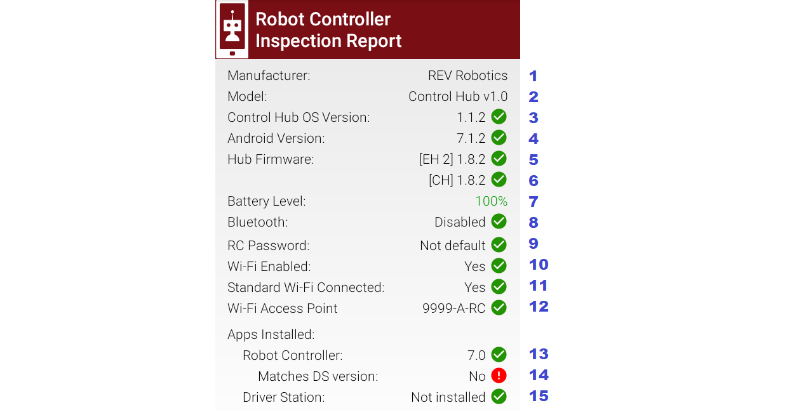

Old Self-Inspect
================

Introduction
------------

This page describes the older Self Inspect screens in the FTC Driver Station
(DS) app and the FTC Robot Controller (RC) app.
See the :doc:`new self-inspect<new-self-inspect>` page for screen images for version 10.3 or better.

A Self Inspect screen provides a snapshot of device status, as it
relates to FTC rules for the control system. 
These rules are described in the Competition Manual which can be found on the
`Current Game and Season Materials page <https://ftc-resources.firstinspires.org/files/ftc/game>`_ on the *FIRST* Website.

.. tip:: An `Inspection Checklist PDF <https://www.firstinspires.org/sites/default/files/uploads/resource_library/ftc/inspection-checklist.pdf>`_ 
   is available to help teams self-inspect their ROBOT before their event. Teams are strongly encouraged to self-inspect prior to their event.

The Self Inspect screen is provided only as a quick, handy reference to
help teams confirm that certain control system elements are up-to-date
and properly configured. Self Inspect may be reviewed in Field
Inspection at an FTC tournament, but is **not** a comprehensive or
official standard of compliance with FTC rules.

Each inspection screen updates automatically, with or without a Restart
Robot. This allows quick verification that issues have been resolved.

The challenge is to maximize useful information in a small screen. The
Self Inspect layout and graphics evolve with FTC requirements; this page
clarifies some of the brief but meaningful captions.

.. note::
  These images show Version 7.0 of the FTC apps. Please refer to Competition Manual 
  for allowed software system versions. These images are valid up to version 10.2 of the FTC apps.
  See the :doc:`new self-inspect<new-self-inspect>` page for screen images for version 10.3 or better.

Device Pairing
--------------

Pairing technology is a key aspect of Self Inspect reporting. Remember
that RC phones host via **Wi-Fi Direct**, while Control Hubs host via
**Standard, or ‘infrastructure’, Wi-Fi**.

In the DS app’s Settings, the selected Pairing Method (Wi-Fi Direct or
Control Hub) will influence acceptance/rejection in the DS Self Inspect
report, as described in examples below.

RC and DS phones must have Airplane Mode **ON**, and Wi-Fi **ON** but
not connected to any Standard/infra Wi-Fi host such as an internet
router or hotspot. Devices should be set to **Forget** any local Wi-Fi
networks.

FTC control devices may use these combinations: 

- DS phone, RC phone 
- DS phone, Control Hub 
- Driver Hub, RC phone 
- Driver Hub, Control Hub

A DS device (phone or Driver Hub) can display its own DS Self Inspect
**and** an RC Self Inspect (for paired RC phone or Control Hub). An RC
phone can display only its own RC Self Inspect.

This means that the Self Inspect screens can report as follows: 

**DRIVER STATION**

- `DS Self Inspect 1 <#ds-self-inspect-1-on-ds-phone-paired-to-rc-phone>`__, on
  DS phone paired to RC phone 
- `DS Self Inspect 2 <#ds-self-inspect-2-on-ds-phone-paired-to-control-hub>`__,
  on DS phone paired to Control Hub 
- `DS Self Inspect 3
  <#ds-self-inspect-3-on-driver-hub-paired-to-rc-phone>`__, on Driver Hub
  paired to RC phone 
- `DS Self Inspect 4
  <#ds-self-inspect-4-on-driver-hub-paired-to-control-hub>`__, on Driver Hub
  paired to Control Hub

**ROBOT CONTROLLER**

-  `RC Self Inspect
   1 <#rc-self-inspect-1-appearing-on-rc-phone-paired-with-ds-phone>`__,
   appearing on RC phone paired with DS phone
-  `RC Self Inspect
   2 <#rc-self-inspect-2-appearing-on-ds-phone-paired-to-rc-phone>`__,
   appearing on DS phone paired to RC phone
-  `RC Self Inspect
   3 <#rc-self-inspect-3-appearing-on-rc-phone-paired-with-driver-hub>`__,
   appearing on RC phone paired with Driver Hub
-  `RC Self Inspect
   4 <#rc-self-inspect-4-appearing-on-driver-hub-paired-to-rc-phone>`__,
   appearing on Driver Hub paired to RC phone
-  `RC Self Inspect
   5 <#rc-self-inspect-5-appearing-on-ds-phone-paired-to-control-hub>`__,
   appearing on DS phone paired to Control Hub
-  `RC Self Inspect
   6 <#rc-self-inspect-6-appearing-on-driver-hub-paired-to-control-hub>`__,
   appearing on Driver Hub paired to Control Hub

These combinations can display **slightly different** Self Inspect
categories, status phrases, and pass/fail results. They are described
below; click the **blue link** to explore the Self Inspect screen for
that device and combination.

DS Self Inspect 1, on DS phone paired to RC phone
-------------------------------------------------

.. figure:: images/nDS-1.png
   :align: center
   :width: 85%
   :alt: DS 1

   DS Self Inspect 1, on DS phone paired to RC phone

-  Item 1 is a menu with one choice: Disconnect from Wi-Fi Direct. It
   does work, but sometimes the apps re-pair automatically.
-  Item 5 shows the battery level of the device being reported. Fun
   fact: the green color of the percentage value changes towards
   **orange** as the charge level goes down.
-  Item 8 ``Location services`` appears only on devices running
   **Android 8** or higher. This is an SDK/Android technology
   requirement, not an FTC rule.
-  Items 9 and 10 here must be Yes and No. ``Wi-Fi Enabled`` means the
   DS device’s Wi-Fi radio is **ON**, to use Wi-Fi Direct. It must
   **not** be connected to a Standard/infrastructure Wi-Fi source, such
   as an internet router or a Control Hub, when intending to pair with
   an RC phone.
-  Item 11 indicates whether the **device’s Wi-Fi Direct name** meets
   FTC format requirements. It does not check whether the paired device
   has a matching RC name (team number). In this case, the phones are
   legally named 2468-A-DS and 2468-A-RC. DS Settings (Driver Station
   Name) allows only FTC-legal names, but any name can be entered in the
   DS phone’s Android Wi-Fi Direct settings.
-  Item 12 verifies that a DS device does **not** have an RC app
   installed.
-  Item 13 ensures the DS app meets the minimum version **for the
   current FTC season**, based on the device’s system date. An
   “incorrect” red mark here can be cleared by correcting the date in
   the **Android device Settings**.

Here’s a report from the same phone, with many items **rejected** by
Self Inspect.

.. figure:: images/tDS-1-BAD.png   
   :align: center
   :width: 85%
   :alt: DS 1 Bad

   DS Self Inspect 1, on DS phone – with issues!

-  Item 6 rejects ``Airplane Mode`` for being **OFF**; it must be on for
   FTC phones. This is an Android system setting, available at the
   phone’s Settings menu, or easily accessed by swiping down twice from
   the top of the screen. Turning on Airplane Mode automatically turns
   off the Wi-Fi radio, as an Android ‘convenience’. An FTC user will
   need to manually turn the Wi-Fi radio back on (although not connected
   to a local hotspot or internet router).
-  Item 7 rejects ``Bluetooth`` for being **ON**; it must be off for FTC
   use. This is also an Android system setting; swipe down twice or see
   Settings menu.
-  Item 8 rejects ``Location services`` for being **OFF**. For devices
   running **Android 8** or higher, the FTC apps require Location
   enabled. This is also an Android system setting; swipe down twice or
   see Settings menu.
-  Item 9 shows the DS phone’s Wi-Fi radio is **ON**, as required for
   Wi-Fi Direct **or** Standard Wi-Fi pairing to an RC device.
-  Item 10 rejects the DS phone’s connection via Standard/infrastructure
   Wi-Fi, because the DS Pairing Method is set to Wi-Fi Direct – thus
   intending to connect with an RC phone. In this case, the phone is
   connected to a home Wi-Fi network. This and other such networks must
   be set to **Forget**, in the device’s Android Wi-Fi menu. If
   temporary internet access is needed, ‘Forget’ that network
   afterwards. Also **Remove Account** for any Google or other accounts
   that may have been used during the internet session. Such accounts
   can cause background activity, notifications and updates – at the
   worst possible times.
-  Item 11 rejects the device’s **Wi-Fi Direct name** for not meeting
   FTC format requirements. The bad name shown here was created in the
   DS phone’s Android Wi-Fi Direct settings; not possible using the
   app’s DS Settings (Driver Station Name).
-  Item 12 rejects the presence of an RC app installed on this DS
   device. The rejection is not for the older version (6.2), but simply
   for being an RC app.

DS Self Inspect 2, on DS phone paired to Control Hub
----------------------------------------------------

   DS Self Inspect 2, on DS phone paired to Control Hub

The same points apply as for DS Self Inspect 1 (immediately above),
except: 

- Items 9 and 10 must now be Yes and Yes. The DS phone’s Wi-Fi radio is **ON**,
  and connected via Standard/infra Wi-Fi. It does not indicate **what** the DS
  phone is connected to; that’s covered by Item 11. 
- Item 10’s Yes would be **rejected** if the DS Pairing Method was set to Wi-Fi
  Direct – thus intending to connect with an RC phone. 
- Item 11 shows the Standard Wi-Fi **network name**, or Access Point (AP), that
  the DS phone is connected to. The check-mark indicates the AP is an FTC legal
  device (Control Hub) and has a correctly formatted name. This does **not**
  check that the DS and RC names match (team number). In fact, this phone is
  2468-A-DS and this Control Hub is 9999-A-RC, an **illegal combination** to be
  flagged by the FTC team or the Field Inspector.

DS Self Inspect 3, on Driver Hub paired to RC phone
---------------------------------------------------

   DS Self Inspect 3, on Driver Hub paired to RC phone

-  Item 4 appears only on the Driver Hub. The check-mark indicates the
   Operating System meets the minimum version requirement in the FTC
   Game Manual.
-  Note that ``Airplane Mode`` has been omitted from the DS inspection,
   only for Driver Hub. FTC rules exclude the Driver Hub and Control Hub
   from the Airplane Mode requirement.
-  Item 8 ``Location services`` appears only on devices running
   **Android 8** or higher. This is an SDK/Android technology
   requirement, not an FTC rule.
-  Items 9 and 10 must be Yes and No. ``Wi-Fi Enabled`` means the Driver
   Hub’s Wi-Fi radio is **ON**, to use Wi-Fi Direct for the RC phone.
   The Driver Hub is technically **able to also be connected** to a
   Standard/infrastructure Wi-Fi source, including an internet router or
   a Control Hub. Item 10 confirms this is not happening; see next
   example.
-  Item 10’s No would be **rejected** if the DS Pairing Method was set
   to Control Hub.
-  Item 11 indicates whether the **device name** meets FTC format
   requirements. It does not check whether the paired device has a
   matching RC name (team number).
-  Item 12 verifies that the Driver Hub does **not** have an RC app
   installed.
-  Item 13 ensures the DS app meets the minimum version **for the
   current FTC season**, based on the device’s system date. This
   particular version 7.0.1 does not exactly match the RC phone’s 7.0.
   Such a “Point mismatch” is allowed under updated FTC rules (was Q&A
   #176 for 2021-2022 season). Otherwise, an “incorrect” red mark here
   can be cleared by correcting the date in the **Android device
   Settings**.

.. figure:: images/tDS-3b.png   
   :align: center
   :width: 85%
   :alt: DS 3b

   DS Self Inspect 3, on Driver Hub paired to RC phone

This Self Inspect screen appeared while the Driver Hub was paired to an
RC phone, then was *also* connected to to a Control Hub via Standard
Wi-Fi. The DS home screen temporarily showed “Connected” (to RC phone)
and “No Heartbeat”, then recovered its pairing to the RC phone. 

- Item 10 shows the discrepancy. The DS app soon closes this Standard Wi-Fi
  connection, allowing the Driver Hub to remain paired only with the RC phone.

DS Self Inspect 4, on Driver Hub paired to Control Hub
------------------------------------------------------

   DS Self Inspect 4, on Driver Hub paired to Control Hub

-  Item 1 still offers one choice, “Disconnect from Wi-Fi Direct”. But
   now, touching that selection gives this message “There was an error
   disconnecting from Wi-Fi Direct”. That’s because the Driver Hub is
   paired to a Control Hub, thus **not** via Wi-Fi Direct.
-  Item 10’s Yes would be **rejected** if the DS Pairing Method was set
   to Wi-Fi Direct – thus intending to connect with an RC phone.
-  Item 11 shows the Standard Wi-Fi **network name**, or Access Point
   (AP), that the Driver Hub is connected to. The check-mark indicates
   the AP is an FTC legal device (Control Hub) and has a correctly
   formatted name. This does **not** check that the DS and RC names
   match (team number). In fact, this Driver Hub is 1234-A-DS and this
   Control Hub is 9999-A-RC, an **illegal combination** to be flagged by
   the FTC team or the Field Inspector.

   DS Self Inspect 4, on Driver Hub paired to Control Hub

This Self Inspect screen appeared after the Driver Hub was paired to a
Control Hub, then was connected to a Wi-Fi internet router. 

- Item 11 shows the error. The Driver Hub can connect via Standard Wi-Fi to
  only one AP at a time; this network is not an FTC RC device.

RC Self Inspect 1, appearing on RC phone paired with DS phone
-------------------------------------------------------------

Now we change to **Robot Controller** Self Inspect screens. Again, RC
screens can be viewed from the DS device **or** from an RC phone, with
slight differences.

.. figure:: images/tRC-1.png   
   :align: center
   :width: 85%
   :alt: RC 1

   RC Self Inspect 1, appearing on RC phone paired with DS phone

-  Item 5 lists the Expansion Hub addresses and firmware levels. This
   example shows one Expansion Hub, but two can be listed here. A
   check-mark indicates all firmware is up-to-date based on the current
   version of the RC app. This item shows “N/A” if no Hubs are
   connected.
-  Item 10 ``RC Password`` appears only in RC Self Inspect, not in DS
   Self Inspect. It checks the FTC requirement for a Control Hub
   password different than the factory default (“password”). Although
   aimed only at the Control Hub, this item does appear on RC phones (as
   here) which don’t have a default password and thus always get the
   check-mark.
-  Item 14 ensures the RC app meets the minimum version **for the
   current FTC season**, based on the device’s system date. It does not
   check for a match with the DS app version. An “incorrect” red mark
   here can be cleared by correcting the date in the **Android device
   Settings**.
-  Item 15 verifies that the RC device does **not** have an DS app
   installed.

RC Self Inspect 2, appearing on DS phone paired to RC phone
-----------------------------------------------------------

   RC Self Inspect 2, appearing on DS phone paired to RC phone

This RC Self Inspect screen displayed on the paired DS phone is the
“same” as the previous one on the RC phone, with two differences: 

- The 3-dots menu is missing from the header. This menu offered a single
  choice, to disconnect the Wi-Fi Direct. But this cannot be performed as an RC
  action, from a DS phone connected by that same Wi-Fi Direct. 
- Item 14 did not appear on the RC phone’s display of this RC Self Inspect.
  Here is the verification that the DS app and RC app have matching versions;
  in this case both apps are version 7.0. Any “Point mismatch” (e.g. 7.0
  vs. 7.0.1) is allowed under updated FTC rules (was Q&A #176 for 2021-2022
  season).

RC Self Inspect 3, appearing on RC phone paired with Driver Hub
---------------------------------------------------------------

   RC Self Inspect 3, appearing on RC phone paired with Driver Hub

The above screen is the same as RC Self Inspect 1, where the DS device
is a DS phone. See the notes there.

.. figure:: images/tRC-3b.png   
   :align: center
   :width: 85%
   :alt: RC 3b

   RC Self Inspect 3, appearing on RC phone paired with Driver Hub

This is also the same screen, except the RC phone was connected to an
internet router, while paired with a Driver Hub. The Standard Wi-Fi
connection caused the RC phone to temporarily lose that pairing, which
was able to be restored. 

- Item 12 shows the rejection: connected via Standard Wi-Fi, but **not** to an
  FTC DS device.

RC Self Inspect 4, appearing on Driver Hub paired to RC phone
-------------------------------------------------------------

   RC Self Inspect 4, appearing on Driver Hub paired to RC phone

This display on a paired Driver Hub is the “same” RC Self Inspect screen
as the one immediately above, but there are two differences: 

- The 3-dots menu is missing from the header. This menu offered a single
  choice, to disconnect the Wi-Fi Direct. But this cannot be performed as an RC
  action, from a Driver Hub connected by that same Wi-Fi Direct. 
- Item 14 did not appear on the RC phone’s display of this RC Self Inspect.
  Here is the check for matching versions of the DS app and RC app. In this
  case, the DS app is 7.0.1 and the RC app is 7.0, rejected here as a mismatch.
  Such a “Point mismatch” is allowed under updated FTC rules (was Q&A #176 for
  2021-2022 season).

RC Self Inspect 5, appearing on DS phone paired to Control Hub
--------------------------------------------------------------

Looking now at the **Control Hub**, the Self Inspect screen has a few
differences. In this example, the robot is configured with **two** Hubs.

.. figure:: images/tRC-5b.png   
   :align: center
   :width: 85%
   :alt: RC 5b

   RC Self Inspect 5, appearing on DS phone paired to Control Hub

-  Again the 3-dots menu is missing from the header. This menu offered a
   single choice, to disconnect the Wi-Fi Direct. But the Control Hub
   hosts with Standard Wi-Fi, not with Wi-Fi Direct. In any case, the
   connection cannot be managed as an RC action, from a DS phone using
   that same connection.
-  Item 3 appears only on RC Self Inspect screens for Control Hub. It
   verifies the Operating System is up-to-date for the current version
   of the RC app.
-  ``Location services`` does **not** appear here, since the Control
   Hub’s Android version (Item 4) is **lower** than Android 8.
-  Item 5 shows the firmware version of the Expansion Hub embedded in
   the Control Hub; it’s up-to-date for the current version of the RC
   app.
-  Item 6 shows the firmware version and address of the standalone
   Expansion Hub, also up-to-date.
-  Item 7 should always show a high battery charge here, indicating at
   least the nominal 12V charge level from the robot battery.
-  Note that ``Airplane Mode`` has been omitted from the RC inspection,
   only for Control Hub. FTC rules exclude the Driver Hub and Control
   Hub from the Airplane Mode requirement.
-  Item 9 does apply here to the Control Hub. Its password must be
   changed from the factory default (“password”).
-  Items 10 and 11 should be Yes and Yes for Control Hub, which uses
   only Standard/infra Wi-Fi. Item 11 does not indicate **what** the
   Control Hub is connected to (but it must be the DS phone displaying
   this screen).
-  Item 12 shows the Standard Wi-Fi **network name**, or Access Point
   (AP), that is broadcast by the Control Hub. The check-mark indicates
   the AP has a correctly formatted FTC name. This does **not** check
   that the DS and RC names match (team number). In fact, this DS phone
   is 2468-A-DS and this Control Hub is 9999-A-RC, an **illegal
   combination** to be flagged by the FTC team or the Field Inspector.
-  Item 14 appears only on DS displays of RC Self Inspect. Here is the
   check for matching versions of DS app and RC app; in this case both
   apps are version 7.0. Any “Point mismatch” (e.g. 7.0 vs. 7.0.1) is
   allowed under updated FTC rules (was Q&A #176 for 2021-2022 season).
-  Item 15 verifies that an RC device does **not** have an DS app
   installed. This would be quite a mistake for a Control Hub, lacking
   an onboard screen.

RC Self Inspect 6, appearing on Driver Hub paired to Control Hub
----------------------------------------------------------------

For a Control Hub, the Self Inspect categories displayed on Driver Hub
are the same as on DS phone, immediately above.

   RC Self Inspect 6, appearing on Driver Hub paired to Control Hub

The only reporting difference here is the ‘mismatch’ between the Driver
Hub’s DS app version of 7.0.1 and the Control Hub’s 7.0. This is likely
to happen since Driver Hubs are typically auto-updated, in this case to
a DS version intended only for old Android 6 phones. Such a “Point
mismatch” is allowed under updated FTC rules (was Q&A #176 for 2021-2022
season).

.. figure:: images/tRC-6a.png   
   :align: center
   :width: 85%
   :alt: RC 6a

   RC Self Inspect 6, appearing on Driver Hub previously paired to Control Hub

Lastly… with no active connection, a DS device cannot display any
information about the RC device status.

Summary
-------

The Self Inspect screen is a quick, handy reference to help teams
confirm that certain control system elements are up-to-date and properly
configured.

Self Inspect may be reviewed in Field Inspection at an FTC tournament,
but is **not** a comprehensive or official standard of compliance with
FTC rules.

Each inspection screen updates automatically, with or without a Restart
Robot. This allows quick verification that issues have been resolved.

=============

Questions, comments and corrections to westsiderobotics@verizon.net
