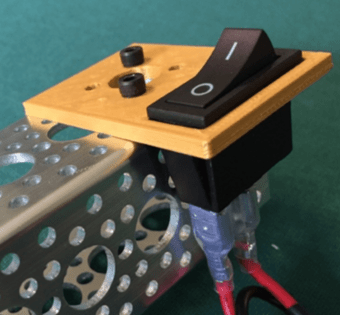
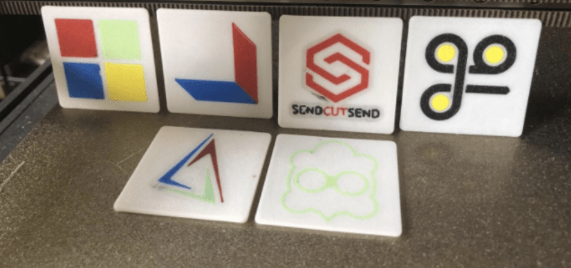

Example 3d Printed Parts
========================

Here are some example parts that your team could make with a 3d printer to either save funds or improve on customizability.

Mounting Brackets
-----------------

One of the most common uses, 3D Prints can be used to make mounting brackets for motors, servos, 
electrical parts, bearings, and various other objects. This provides teams with a great control 
of precision over how they mount things, and a decreased part count over commercial parts.

  A Power Switch Mounting Bracket.

Pulleys and Gears
-----------------

3D Prints can also be used to make your own pulleys and gears. Not only is this a great option 
for achieving optimal speed and torque ratios, but they save cost as well! A metal pulley 
typically costs around $10, while a printed one can be as low as 20 cents.

.. figure:: images/deadaxlemecanum.png
  :align: center
  :width: 55%
  :alt: 3d printed Pulley with a custom bearing mount on a mecanum wheel

  An example Deadaxle Mecanum setup with a custom 3d printed pulley.

Spacers and Shims
-----------------

Another common way to utilize 3D prints is to create spacers and shims to constrain objects on 
your robot, this is both lighter, simpler, and most cost effective (although not always 
preferred!) than using collars or clamping mounts.

.. figure:: images/intakespacers.png
  :align: center
  :width: 55%
  :alt: An Intake with example 3d printed spacers

  An FTC FREIGHT FRENZY intake utilizing 3d printed spacers to space out intake wheels.
    
    

Scoring Mechanisms
------------------

Teams also often use 3D Prints to precisely grip and control each year's game elements. 
A common way to do this is a custom shaped claw.

.. figure:: images/wobblegoalclaw.png
  :align: center
  :width: 55%
  :alt: An render of a 3d printed claw.

  Rendered FTC ULTIMATE GOAL Wobble Goal arm with 3d printed claw parts.

Another common method of using 3D Prints is for creating custom intakes, primarily surgical tubing.  

  Rendered example surgical tubing mounts for an FTC FREIGHT FRENZY intake.

Robot Aesthetics
----------------

3D Prints can do a whole ton for a robot's aesthetics as well. While it's more advanced,
multicolor printing like shown below is a great option for teams that like making their 
robots look good! 

  This FTC Team printed their sponsors logos in multiple colors to represent them!