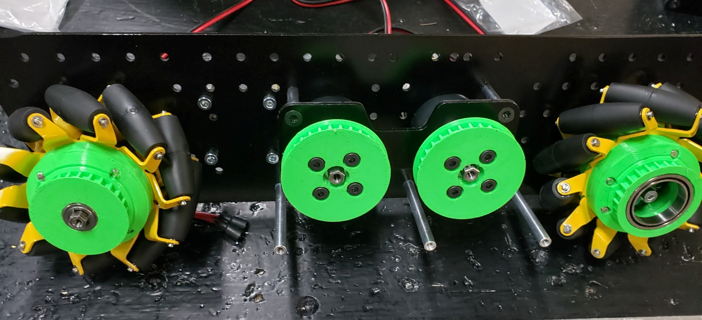
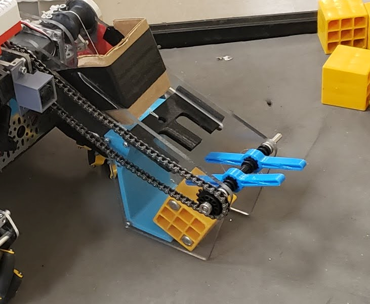

3D Printing Filaments
=====================

There are many different materials that can be used for 3D printing, but for FTC there are only a few that are
of practical use for most teams. Since this guide is currently only addressing FDM (Fused Deposition Modeling)
printing, materials like resin (used in SLA printing) will not be discussed.

Currently, the majority of commercial 3D printers use a **1.75mm diameter filament**, so when shopping filaments,
teams should take care to avoid other diameters, such as 2.85mm, as these will not work with most printers. Filaments are also
sometimes sold in different amounts, with the most common being 1kg (some expensive filaments are sold in smaller
quantities such as 500g).

Almost all of the filaments discussed here will be sold with differing additives and
varieties, often with names like "PLA+" or "PETG Pro". These filaments are often slightly more expensive, but
can be a good choice for teams that want to get the most out of their parts. Additionally, many filaments are
available in a wide variety of colors.

.. tip:: Printing parts in colors that match a team's brand is an easy way to customize a robot!

.. warning:: If your printer's hotend (the part that melts the filament) has a PTFE (Teflon) lining where the
    PTFE tube goes all the way down to the heat block (common in lower price printers like the base Ender 3),
    then you **should not be printing at or above 250° C**. Doing so will cause the PTFE tube to degrade and melt,
    potentially releasing toxic fumes. If you need to print at these temperatures (not usually a requirement for PLA,
    PETG, or TPU), and you have a PTFE lined hotend, you can look at upgrading to an all-metal hotend.

    If you are unsure if your hotend is PTFE lined, you can look up your printer's specifications online,
    or ask the manufacturer. More modern printers are less likely to have PTFE lined hotends, but if you aren't
    sure, it is best to check if you need to print at higher temperatures.

Common 3D Printing Filaments
----------------------------

This page will go through the most common filaments and their properties. While
each filament has advantages and disadvantages, **most teams will find that PLA (Polylactic Acid) or
PETG (Polyethylene Terephthalate Glycol) will be the best choice for strength, durability, and aesthetics.**

These filaments are the easiest to print with, and are available from many different manufacturers at a low cost.
Many other filaments that will be discussed add some specific property (ex: TPU/TPE for flexibility), but are
more difficult to print with, and are often more expensive.

The temperatures listed here are simply a range of the common temperatures for that filament,
and may vary depending on the specific filament.

PLA (Polylactic Acid)
^^^^^^^^^^^^^^^^^^^^^

Polylactic Acid, or PLA, is the most common 3D printing filament used today. It is made from biological sources such
as corn starch or sugar cane. PLA is easy to print with, and is usually the best choice for most robot parts. It
prints at a low temperature, and tends to warp very little. PLA is very stiff, but can be brittle, especially under
shock loads (impacts), and parts should be designed with this in mind.

    Drive train parts printed in PLA

- PLA hotend temperatures: 190-230° C
- PLA bed temperatures:20-60° C; PLA does not require a heated bed, but it is recommended.

.. tip:: Due to the relatively low melting point of PLA, it is not advisable to leave PLA parts in locations such
    as a hot car, as this can produce severe warping in those parts.

PLA is sold in a massive number of variations from different manufacturers, like PLA+ or PLA Pro. These filaments
contain different additives to improve the properties of the filament, such as increased strength or better
printability. While more expensive, these filaments can be a great option that make PLA much more capable.

PETG (Polyethylene Terephthalate Glycol)
^^^^^^^^^^^^^^^^^^^^^^^^^^^^^^^^^^^^^^^^

PETG is another very common filament that can be considered as an upgrade to PLA. While not difficult to print with,
PETG often has more stringing and other artifacts on parts. PETG's tensile strength is a technically lower than that of PLA,
however it is much more flexible and less brittle. Because of this, PETG is more resistant to shock loads
than PLA, and is a good choice for parts that may be impacted. PETG is also more resistant to heat than PLA, and
is unlikely to warp when left in a hot location.

.. figure:: images/petg_part_example.png
    :width: 55%
    :align: center
    :alt: PETG Part

    Linear slide insert printed in PETG

.. warning:: PETG is well known for bonding extremely well to print beds, **especially those made out of glass and
    PEI**, to the point of tearing chunks out of the print surface. If you are printing with PETG, it may be a good
    idea to apply some glue stick or hairspray to the surface to prevent this.

* PETG hotend temperatures: 230-250° C
* PETG bed temperatures: 60-80° C

Less Common 3D Printing Filaments
---------------------------------

These filaments are less common than those above, but can be useful for specific applications in FTC, often due
to specific material properties like ductility or flexibility. These filaments are more difficult to print with,
coming with significant challenges that prevent some printers from being able to print them out of the box.

ABS (Acrylonitrile Butadiene Styrene)
^^^^^^^^^^^^^^^^^^^^^^^^^^^^^^^^^^^^^

Before PLA became readily available, ABS was the most common filament used for 3D printing. ABS is very strong,
having a high ductility and able to withstand shock loads well. These strengths come with major difficulties,
however, as an enclosure is often needed to increase the ambient temperature in order to prevent severe
part warping. Due to these challenges, the strength of ABS parts is often not worth the effort required to print
them, and PETG is a better choice for those applications. Despite this, ABS can be inexpensive and often found
near the same price as PLA.

.. figure:: images/abs_part_example.png
    :width: 60%
    :align: center
    :alt: ABS Part

    Linkage parts printed in ABS

* ABS hotend temperatures: 230-250° C
* ABS bed temperatures: 100-120° C
* Enclosure highly recommended to prevent warping

Due to the difficulties presented by ABS, some teams may want to look at a similar material known as ASA, which
is easier to print with and has similar properties to ABS, but is more expensive.

TPU/TPE (Thermoplastic Polyurethane/Elastomer)
^^^^^^^^^^^^^^^^^^^^^^^^^^^^^^^^^^^^^^^^^^^^^^

TPU and TPE are flexible filaments that can be used to create parts that are flexible and can bend. These filaments
are sold under a variety of different durometers (a measure of a material's hardness). TPU/TPE's flexibility grants
it an extremely high impact resistance, making it very durable as well. In FTC, TPU/TPE is often used to make
flexible components such as intake rollers, wheel bumpers, and occasionally low-load toothed belts.

    A TPU intake roller

.. tip:: Since TPU/TPE is very flexible, printers with a Bowden extrusion system, where the extruder motor and gear
    is not located near the hotend, will have a very difficult time printing with it.

* TPU/TPE hotend temperatures: 210-250° C
* TPU/TPE does not usually need a heated bed, but if one is used care should be taken to not allow the bed to
  exceed 60° C, as this can cause the filament to fuse to the bed.
* TPU/TPE is quite hydrophilic, and will absorb moisture from the air, which will likely require drying before and
  possibly during printing.
* Direct drive extrusion system highly recommended

