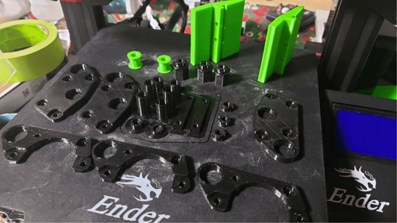

3D Printing Introduction
========================

   3D printed dead wheel odometry parts

3D Printing Methods
-------------------

There are numerous kinds of 3D printing, but for FTC there are only a few that are practical. The most common is
**Fused Deposition Modeling (FDM)**. FDM printers melt a plastic filament
and extrude it through a nozzle, which moves around to create the part. FDM printers are the most common
type of printer used, and the most practical for robotics teams, so this guide will focus on them.

   FDM printer printing a part

Other types of printers include SLA (Stereolithography)
and SLS (Selective Laser Sintering), however these are often more expensive, difficult to use, and have less
use in FTC, although they have a few specific niches, such as very high precision details.

   SLA Resin printed lift string spools

3D Printing Pros
----------------

* 3D printed parts can be infinitely customized and optimized for a specific purpose. This can be used to create
  pulleys or gears with a specific number of teeth, or a part that fits perfectly in a specific place.
* 3D printing can be used to create parts that adapt between different build systems or standards. Many build systems
  contain their own standards for mounting holes, shaft sizes, or other dimensions. 3D printing can be used to create
  parts that adapt between these standards.
* 3D printing can be used to make parts relatively quickly and cheaply. This is especially useful for prototyping
  new designs, or iterating on a design to make it better at little cost and in a short amount of time.

3D Printing Cons
----------------

* 3D printed parts are often not as strong as machined or cut parts. This is especially true for FDM printers, which
  have a layer-by-layer structure that can be a weak point if the part is loaded in a certain way. If consideration
  is given to this weakness when designing the part, however, the result can be made very strong.
* Depending on the material, 3D printed parts can be weak to shock loads, such as impacts.
* A 3D printed part can only be as large as the print bed it is printed on. This means that large parts may need to
  be printed in multiple pieces and assembled later.
* 3D printing can be slow, especially for large parts. Longer prints can take hours or even days to complete, raising
  the risk of a print failing and wasting time and material.
* 3D printing can be expensive. The cost of a printer, filament, and other materials can add up quickly. However,
  the cost of a 3D printer has been decreasing rapidly, and filament is relatively cheap.

