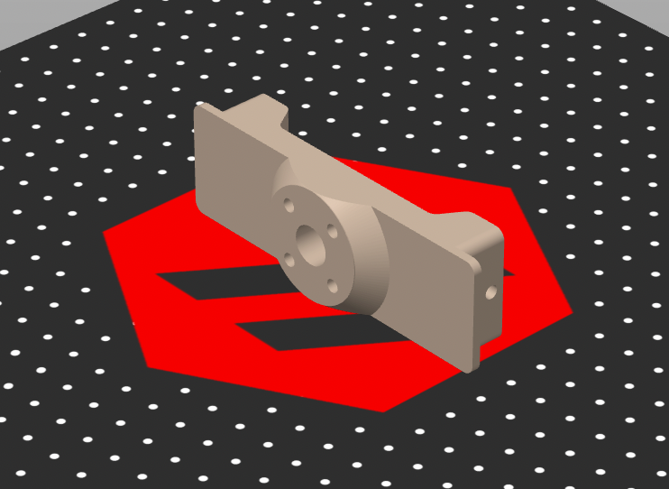
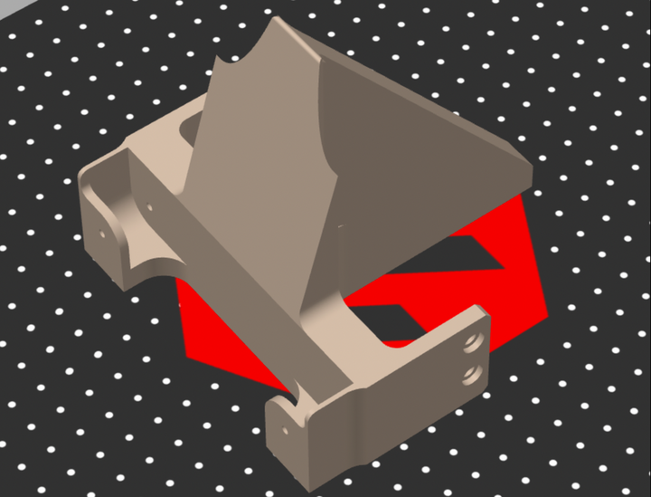
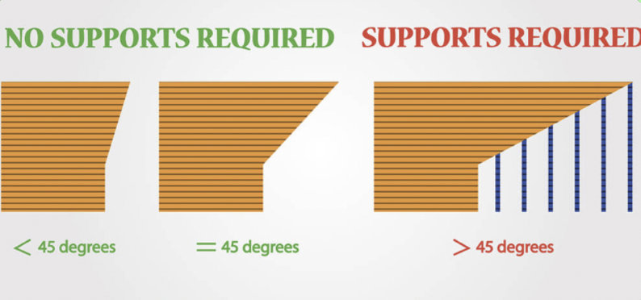
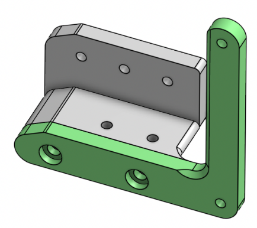
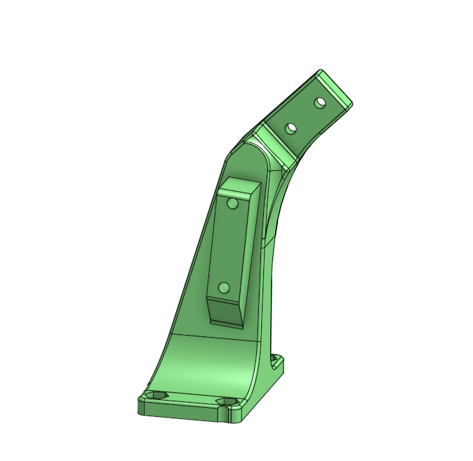
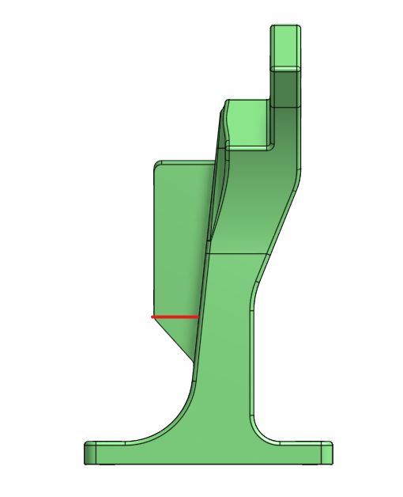

Design to Make Easy-To-Print Parts
==================================

A major problem teams sometimes encounter is that their parts are difficult to print without extreme amounts of supports or precarious overhangs. 
This issue can and should be solved during the design process in a practice sometimes called DFAM (Designing for Additive Manufacturing). 3d Printers
have limits, and these can be taken into account while initially creating a part, making those manufacturing limitations just as much of a consideration
as what the function of the part you're creating is.

Printing Face
-------------
When you first conceptualize a part you plan to print, immediately consider what face will lie on the built plate for it to print safely on. In general 
the more area touching the plate, the better, as it provides more adhesion. Always design with creating large flat surfaces for printing in mind.

  A part with a slightly concerning contact with the bed. This part could have been designed to rest another, larger face on the bed.

|

  
  A part with much better contact with the bed. This part looks great to print.

|

Overhang Angles
---------------

Supports should only be used if absolutely necessary. In almost all parts, you can find some way to create angles or adjust geometry to avoid support usage.
Supports lengthen post-processing time, are generally difficult to tune, leave less clean surfaces, and are more prone to failure. 

  
|

After you determine your printing face for a part, look at it closely and determine whether there's any areas with over a ~45 degree overhang. Then, try and 
mitigate those areas using chamfers, fillets, and adding material. If mitigation isn't possible, consider splitting the part into multiple pieces and securing
them together with fasteners.

Overhang Angles Case Study #1
^^^^^^^^^^^^^^^^^^^^^^^^^^^^^

The part you see below would have been very frustrating to print in any orientation without the use of supports, so it was opted to split it in two and use M3 
screws to attach the pieces instead. This provided two very easy to print parts.

  
|

Overhang Angles Case Study #2
^^^^^^^^^^^^^^^^^^^^^^^^^^^^^

The part you see below is an arm hardstop for a robot, eventually printed with no supports despite its complex geometry. In particular, pay attention to the 
second picture. The part could have been designed to stop at the red line but was extended to a 45 degree overhang to ensure the printer wasn't printing in midair.

  
|

  
|