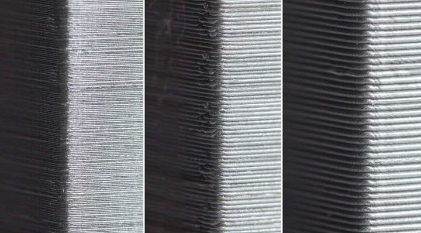
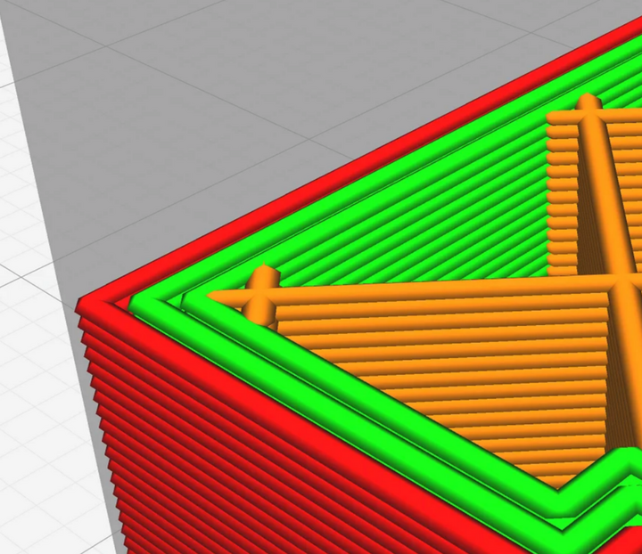
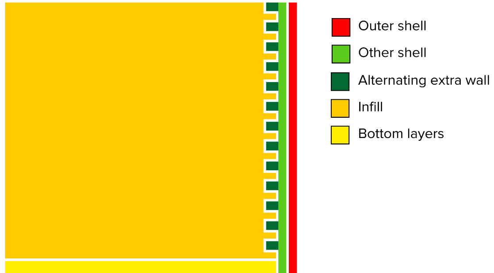
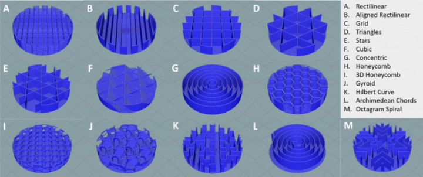
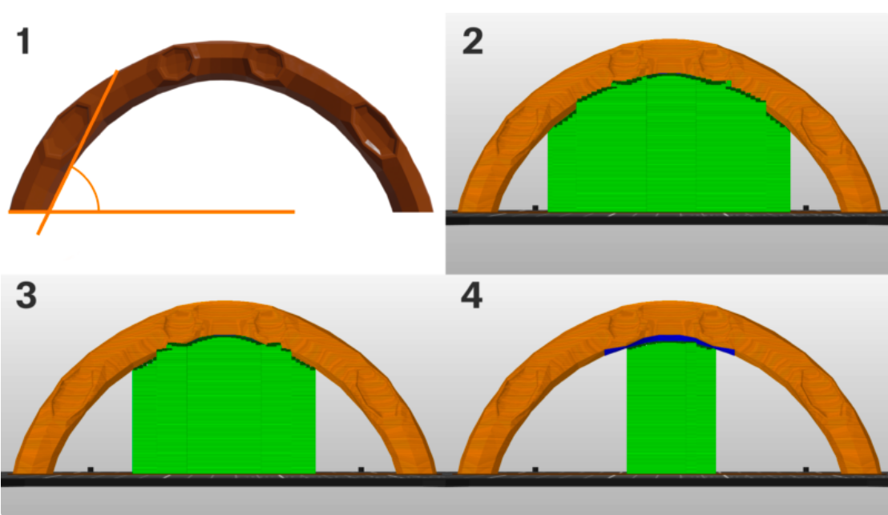

Explanation of Slicer Settings
==============================

Layer Height
------------

Layer height is the biggest factor affecting quality, speed, and (somewhat) strength, if you are concerned about tolerances and quality, 
a good starting point is 50% of your nozzle width (typically 0.4mm, so a 0.2mm width at 50%). On the other hand if you want more speed, 
at the cost of some strength, opt for up to 75% of your nozzle width instead (up to 0.32mm for a 0.4mm nozzle).

|

Walls
-----

Walls refer to how many solid "outer" layers a print has a we'd recommend anywhere from 3-5 walls for strong prints. Additionally, its a good 
idea for all prints is to turn on an alternating extra shell. This interlocks the walls with the infill more, making the infill stronger.

|

  While sometimes a tough setting to find, this alternating extra shell interlocks with infill and considerably impacts strength.

|

Infill
------
Infill is a measure of how solid your part is. This can vary based on desired strength. Infill patterns are the pattern taken by the percentage of infill
that you specify. For Infill patterns it is recommended to use **3D infill patterns** such as "Cubic" and "Gyroid". 2D infill patterns such as "Grid" don't 
have uniform stability in all directions.

|

Supports
--------

3D Printers are amazing, but all machines unfortunately, have limitations, and with 3D printers that means, you can't print melted plastic in midair and 
expect it to stay there. This is where supports come in. Supports are excess printed material designed to be broken away after the print. Generally, we 
want to avoid support material by designing around it. But if not possible, it's a good idea to use "Support Enforcers"/"Paint On Supports" to closely 
control what areas you know need support. This makes cleanup after a print a lot easier. 

If you want more info on supports, check out Prusa's guide `here!
<https://help.prusa3d.com/article/support-material_1698>`_

|

Recommended Wall and Infill Settings
------------------------------------

While not applicable for all situations, this is some general guidance on wall and infill strength for PLA parts.

* **Purely Aesthetic Parts**: 5-10% Infill, 2 alternating 3 Walls
* **Typical Use Parts**: 10-20% Infill, 3 alternating 4 Walls
* **Load Bearing and Structural Parts**: 40-60% Infill, 4 alternating 5 Walls
* **Fully Structural and Integral Parts (Take Shocks when Robot is dropped)**: 80-100% Infill, 4 alternating 5 Walls

.. note:: Depending on how well your printer is tuned, 100% infill can be weaker than slightly lower infill. 90% infill is a recommended maximum to leave space for overextrusion.