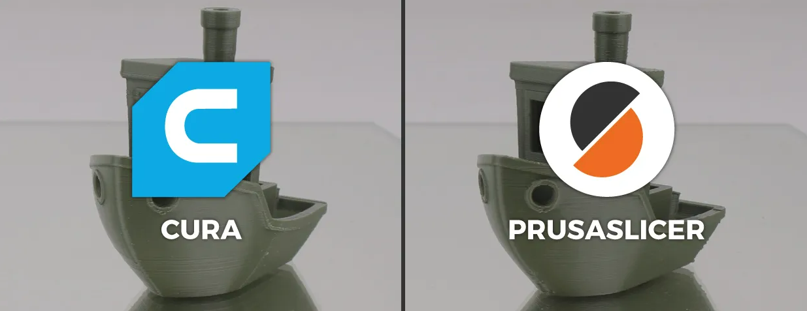

Slicer Software Choices
=======================

There's a variety of slicing software available for use, either community or company maintained. Preference plays a large factor in choosing
software, so it's recommended to see what software you like best.

If you are using a Prusa, BambuLab, or AnkerMake printer, your first consideration should be these companies respective softwares. PrusaSlicer is 
built to work well with Prusa machines, BambuStudio with BambuLab machines, and AnkerMake's slicer for Anker machines.

If you are using any other printer or the proprietary software for your printer doesn't fit well with you, Ultimaker Cura and PrusaSlicer are both
amazing options. Both with almost every modern slicer feature, these are great options. Cura is great if you want a clean UI with minimal settings,
while PrusaSlicer may enable more powerful control of your printer with more customizable settings and a larger open source community.

  The two most popular slicer softwares with the most community support, Ultimaker Cura and PrusaSlicer.

|

Both PrusaSlicer and Cura have lists and lists of printers they have prebuilt slicer profiles for, but in case your printer isn't on those lists, you
should search up the slicer you are using and your printers name. If the printer is relatively popular, there will be slicer profiles posted online 
that you can import into these slicer softwares.