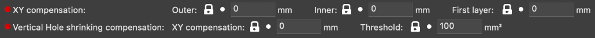

Tolerancing Prints
==================

Tolerances are everything when it comes to 3D printing- we're not precision machining parts here, we're laying down plastic and hoping it forms a shape. 
Differences in temperature, nozzle quality, and airflow can vastly change the size a hole actually is despite what the printers instructions tell it to 
do. A 4mm hole when printed could end up as actually being 3.6mm. Below are detailed two ways to deal with these tolerance issues for 3D printing.

Designing Tolerances
--------------------
A common way for teams to deal with prints interacting with each other and hardware is to form a table with a list of commonly used hole sizes for your various 
applications and then use these hole sizes in their CAD. Numbers depend on your printer and nozzle size, so we would recommend making test prints to see 
how hardware can fit best in order to form this table. An example test print would be a print with a 2.8mm, 2.9mm, 3.0mm, 3.1mm, and 3.2mm hole to see which best
creates an M3 through hole.

This method is generally acceptable if kept well maintained and updated per printer, but it does mean that you have inconsistent hole sizes in CAD that would seem 
arbitrary to anyone looking at your team's CAD.

Slicer Horizontal Expansion
---------------------------
The technically proper way to deal with tolerances- horizontal expansion compensation. All slicers have horizontal expansion settings to make it so that you can 
have a 4mm hole turn out as precisely 4mm.

  Example horizontal compensation setting names.

|

When tuning these, a good starting point is half your nozzle size- if you're using a 0.4mm nozzle, assume 0.2mm expansion and make the compensation numbers -0.2mm.

You will still have to use different numbers for pressfit vs slipfit in cad for this however, so this is not a catch-all method of making it so you can cad parts 
perfectly to the size you'd like them to be. Constant thoughts about what size something should be to fit hardware properly should always be considered when designing
parts.

